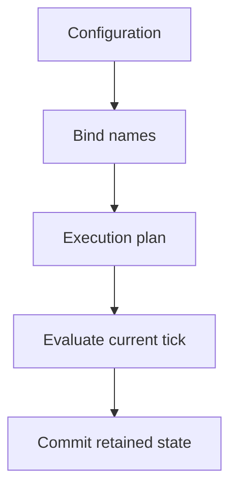
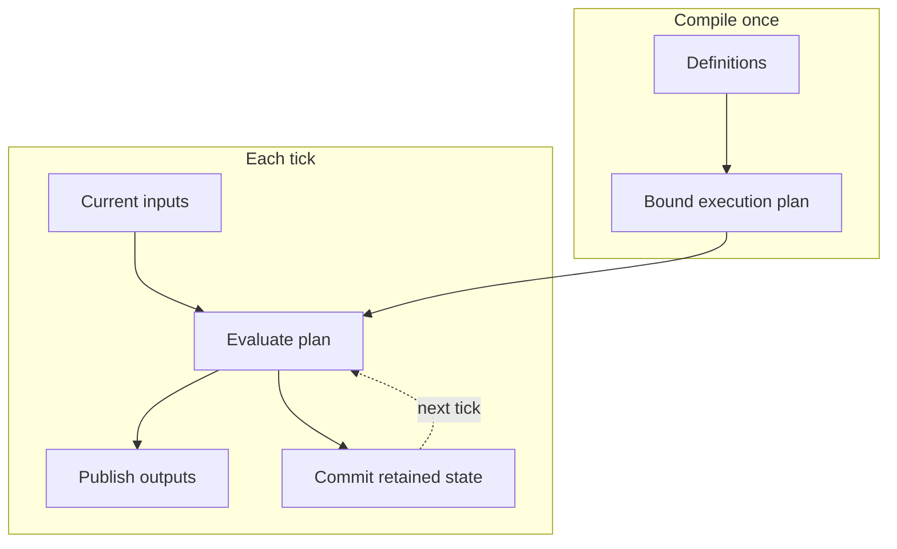
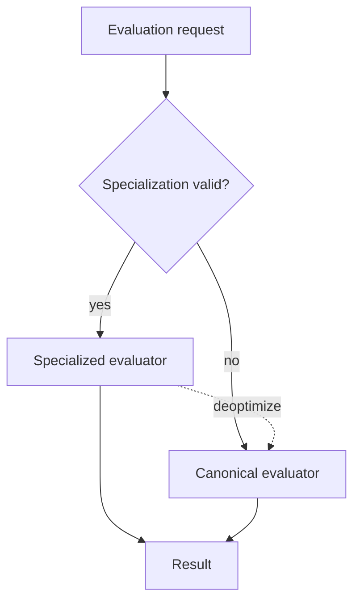
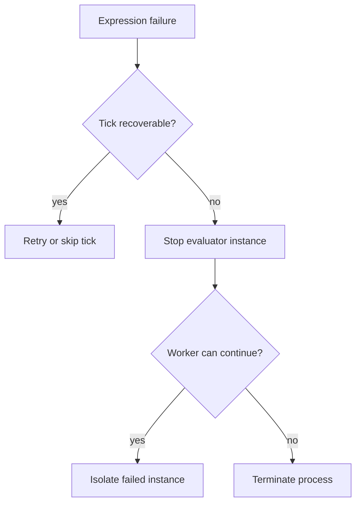
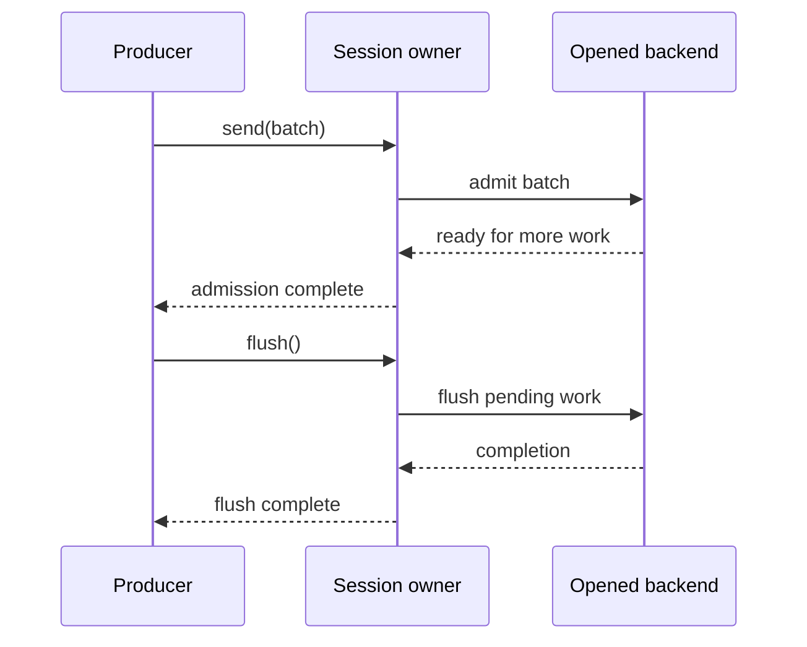

# Zed-native Mermaid architecture style

Use this visual language for Mermaid diagrams embedded in Markdown rendered by Zed and `mdbook-mermaid`. It derives the semantic discipline of the dataflow SVG figures from theme-native Mermaid primitives, so the same source remains legible on dark and light backgrounds.

## Theme contract

Let the host renderer—Zed during authoring and mdBook in the published site—own presentation. Do not include:

- `%%{init}%%` directives;
- `theme`, `themeVariables`, or hardcoded color values;
- `style`, `linkStyle`, or `classDef` statements;
- HTML elements, inline CSS, external fonts, icons, or images;
- assumptions that a node has a particular fill or text color.

Zed automatically applies its active theme and accent palette. The mdBook Mermaid initializer must select a Mermaid theme compatible with the active book theme. Diagram source should encode meaning through topology, labels, shapes, grouping, order, and line style, so theme changes cannot alter the claim.

## Default composition

Use `flowchart TB` unless a short flow is inherently horizontal. Tall diagrams fit Zed's narrow rendered pane better and preserve readable labels.

Use `flowchart LR` only for roughly two to five short nodes. Split a wide diagram before reducing its labels or combining unrelated phases.

Mermaid is not mandatory for every figure. Use custom SVG for matrices combined with runtime snapshots, crossed projection mappings, exact activation timelines, fixed physical layouts, and `rustdoc`-inlined assets. See [rendering-strategy.md](rendering-strategy.md).

## Semantic vocabulary

Use a small, stable set of Mermaid forms:

| Meaning | Mermaid form | Example |
|---|---|---|
| Stage or component | rectangle | `evaluate["Evaluate plan"]` |
| State or retained artifact | rounded node | `history(["Committed history"])` |
| Guard or branch | decision diamond | `guard{"Guard matches?"}` |
| External input or output | asymmetric/parallelogram only when useful | `input[/"External input"/]` |
| Real boundary | named `subgraph` | `subgraph tick["Each tick"]` |
| Current flow or normal execution | solid arrow | `a --> b` |
| Alternate, retained, inactive, or fallback relation | dashed arrow | `a -.-> b` |
| Condition or transferred artifact | edge label | `a -->|"bound plan"| b` |

A dashed edge has no global meaning. Assign it one meaning per figure and state that meaning in the reading-rule paragraph.

Do not use shape variety decoratively. If all nodes are stages, keep all nodes rectangular. A cylinder implies storage, a diamond implies a branch, and nested subgraphs imply actual containment.

## Labels

- Put stable, semantic source IDs before labels: `committed_history(["Committed history"])`.
- Quote reader-facing labels to avoid parser ambiguity.
- Use exact implementation terms and running-example identifiers.
- Prefer verb phrases for work: “Bind names,” “Evaluate plan,” “Commit history.”
- Prefer noun phrases for artifacts and state: “Execution plan,” “Current inputs.”
- Keep labels short enough to scan; explain caveats in prose.
- Label boundary-crossing edges with the artifact, condition, or temporal rule.
- Avoid raw file paths, generic “Manager” nodes, and sentence-length labels.

Do not put Markdown tables, HTML, or manual line-break tags inside labels. If a label needs multiple clauses, split the node or move detail to prose.

## Grouping

Use subgraphs only when the boundary is architectural:

- compile once versus run each tick;
- owner versus borrower;
- trusted versus untrusted region;
- recoverable versus terminal failure scope;
- canonical execution versus optional optimization;
- activation-local versus retained state.

Give every subgraph a concrete label. Set `direction TB` inside a subgraph only when its local direction would otherwise be ambiguous. Do not nest more than two levels; use another figure for deeper containment.

## Architecture patterns

### Compile once, execute repeatedly

**Reading rule.** Solid edges carry current-tick work or values. The dashed edge crosses the commit boundary and supplies retained state to the next tick.

### Canonical path with optimization fallback

**Reading rule.** Solid edges are selected execution paths. The dashed edge is deoptimization: it transfers authority back to the canonical evaluator rather than defining separate semantics.

### Failure containment

**Reading rule.** The diagram moves from the smallest failure scope to the process boundary. Decision labels state where recovery remains legal; surrounding prose must name the concrete error variants and state consequences.

## Participant interaction sequences

Use `sequenceDiagram` when message causality across named participants is the claim. Keep participants few enough that labels remain readable at normal page width; split setup, steady-state work, and teardown when they compete for horizontal space.

**Reading rule.** Solid arrows are calls or delivered work. Dashed arrows are returns or completion signals. Admission transfers work into the opened owner but does not imply the later flush completion.

Sequence-diagram rules:

- declare every participant explicitly and give implementation aliases readable labels;
- arrange lifelines from initiator to the deepest owner or visible effect;
- use `->>` for calls, deliveries, and requests, and `-->>` for returns, yielded values, acknowledgements, and completion;
- put method names, values, barriers, or outcomes on messages rather than generic verbs such as “process”;
- use `alt` only for mutually exclusive branches, `opt` for conditional work, and `loop` for verified repeated owners or items;
- keep notes short and use them only for a boundary fact that cannot be attached to one message;
- use activation bars sparingly; an `await` alone does not prove that a component owns a separate worker or thread;
- omit hardcoded colors and diagram-local styling exactly as for flowcharts;
- explain errors in an `alt` branch only when the point is what completed before failure; keep exhaustive error variants in prose or a table.

Do not use a sequence diagram to restate a phase table. It must expose interaction information the table cannot: caller/callee identity, a returned artifact, an awaited completion, a loop across owners, an acknowledgement, or partial effects before failure. Sequence lifeline spacing is not logical time and cannot replace the project’s talk-style tick SVGs.

## Other Mermaid families

Use another supported family when it expresses the question more directly:

- `sequenceDiagram` for request/response order across named participants;
- `stateDiagram-v2` for legal lifecycle transitions and terminal states;
- `classDiagram` for stable type relationships, not runtime call flow;
- `erDiagram` for persisted data relationships;
- `timeline` for coarse chronological milestones;
- `flowchart` for pipelines, ownership, containment, mapping, and dataflow.

Do not choose a diagram family merely for visual novelty. Flowcharts remain the default for implementation architecture.

## Caption and accessibility contract

Mermaid source remains readable text, but the rendered graphic still needs equivalent surrounding prose. Introduce the question before the block and follow it with a bold **Reading rule.** paragraph that:

1. defines solid and dashed edges;
2. states the main temporal, ownership, or containment consequence;
3. names any canonical authority or recovery boundary;
4. points to prose for omitted conditions and bounds.

Do not use color names in the reading rule because Zed's palette and the mdBook light/dark palette can differ.

## Density limits

Split the diagram when:

- it has more than about eight primary nodes without meaningful grouping;
- it needs more than two nested subgraph levels;
- edge crossings obscure direction;
- dashed edges need multiple meanings;
- labels become sentences;
- the rendered result is wider than a normal Zed pane;
- lifecycle, ownership, and optimization compete for attention.

A sequence of two focused diagrams is better than one complete but unreadable overview.
