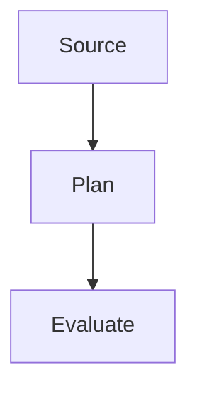

# Mermaid and custom SVG rendering strategy

Use a hybrid documentation pipeline. Mermaid handles standard architecture relationships and renders in Zed and the online mdBook. Custom SVG remains authoritative where exact geometry or a standalone asset carries meaning.

## Route each figure

Choose **Mermaid rendered by `mdbook-mermaid`** for:

- short and medium pipelines;
- compile-once versus run-repeatedly groups;
- lifecycle state transitions;
- request/response sequences;
- simple ownership or containment trees;
- failure ladders;
- canonical execution with a guarded optimization and fallback;
- type or persisted-data relationships suited to Mermaid's class or ER families.

Choose **custom SVG** for:

- graph, permission matrix, and aligned runtime snapshots in one figure;
- crossed logical-to-physical projection mappings;
- dense timelines with several synchronized value lanes;
- physical execution layouts with stable IDs or arena positions;
- repeated panels whose exact coordinates make comparison possible;
- diagrams that need manually routed edges to avoid false relationships;
- assets inlined into Rust module documentation with `include_str!`;
- figures whose accessibility description or element IDs require direct SVG control.

Do not judge by node count alone. Choose the format that preserves the semantic question with the least ambiguity.

## How mdBook rendering works

`mdbook-mermaid` is an mdBook preprocessor plus local browser assets. Authors commit a fenced Mermaid block:

````markdown

````

During `mdbook build`, the preprocessor prepares the block for Mermaid. In the published page, the bundled Mermaid JavaScript renders the block into inline SVG. This is runtime browser rendering, not a generated `.svg` file in `docs/src/assets`.

That distinction matters:

- the online mdBook can use Mermaid blocks directly;
- Zed can render the same blocks during authoring;
- Rust module documentation cannot consume those blocks through `include_str!` as SVG;
- custom SVG assets used by both mdBook and `rustdoc` remain committed files.

## Repository integration

For this repository, install the preprocessor into the `docs` book and keep the generated JavaScript local rather than loading a CDN:

```sh
cargo install mdbook --version 0.4.52 --locked
cargo install mdbook-mermaid --version 0.16.2 --locked
mdbook-mermaid install docs
cd docs && mdbook build
```

The installer adds the preprocessor configuration and local Mermaid scripts required by the HTML output. Inspect its changes before committing. This repository pins `mdbook 0.4.52` and `mdbook-mermaid 0.16.2`; the latter depends on `mdbook ^0.4.36`. `mdbook-mermaid 0.17` uses the mdBook 0.5 preprocessor API and must not be introduced without upgrading and validating the book toolchain together.

A configured book should have the equivalent of:

```toml
[preprocessor.mermaid]
command = "mdbook-mermaid"

[output.html]
additional-js = ["mermaid.min.js", "mermaid-init.js", "theme/diagram-fullscreen.js"]
additional-css = ["theme/diagram-fullscreen.css"]
```

Merge `additional-js` with any existing entries rather than creating a second `[output.html]` table.

The deployment workflow installs the same pinned preprocessor version and runs `mdbook-mermaid install docs` before `mdbook build`. The generated `docs/mermaid.min.js` and `docs/mermaid-init.js` files are ignored rather than committed; they remain local to the build and are never loaded from a CDN. Repository-owned CSS and JavaScript may extend the rendered diagrams centrally; this project uses `docs/theme/diagram-fullscreen.css` and `docs/theme/diagram-fullscreen.js` to give every Mermaid figure an accessible full-screen viewer with pointer-centered mouse-wheel zoom, primary- or middle-button drag panning, and keyboard-operable zoom/reset controls. Zoom and pan change the rendered SVG's `viewBox`; do not scale the SVG with CSS transforms, because browser compositing can rasterize text and strokes into a blurry texture. After upgrading `mdbook-mermaid`, rerun its installer locally, confirm that it preserved those `additional-js` and `additional-css` entries, inspect the generated initializer, then validate light/dark and full-screen behavior before updating the pinned workflow version.

## Theme behavior

Keep Mermaid source theme-neutral. Do not embed `init`, colors, style rules, or classes in individual diagrams. The local `mermaid-init.js` should choose a Mermaid theme compatible with the active mdBook theme and account for the book's preferred dark theme.

Validate at least:

- Zed with a dark editor theme;
- mdBook's default theme;
- mdBook's preferred dark theme;
- a theme switch after page load, if the initializer supports switching;
- the full-screen control, native full-screen exit, Escape behavior, and the no-Fullscreen-API fallback;
- pointer-centered mouse-wheel zoom, primary- and middle-button drag panning, zoom bounds, and reset behavior;
- sharp vector text and strokes at several zoom levels, with no CSS transform on the rendered SVG.

If the installed initializer does not react to mdBook theme changes, either adapt the local initializer centrally or document that diagrams use the theme selected at page load. Do not patch every diagram with its own palette.

## Custom SVG coexistence

Keep custom SVG references as ordinary Markdown images. In an architecture page, use descriptive alt text such as “Stable environment slots projected into API output order” and point it to the appropriate asset under `docs/src/assets/dataflow/`.

Custom SVGs should follow [visual-grammar.md](visual-grammar.md) and [svg-review-checklist.md](svg-review-checklist.md). A self-contained light canvas remains legible on a dark page; a dark-safe transparent asset must provide sufficient contrast in both book themes.

Do not convert an existing custom SVG to Mermaid unless the new source preserves every semantic distinction and remains readable at the actual documentation width.

## Build validation

A documentation change that adds Mermaid should run the configured book build, then inspect the rendered page in both light and dark themes at normal width and in full-screen mode. In full-screen mode, verify pointer-centered mouse-wheel zoom, drag panning, and the zoom/reset controls. Confirm that the central full-screen assets are present in the built page rather than adding controls to individual Mermaid blocks. A change to custom SVG should parse and render the asset and build the book page that embeds it.

Report browser-rendering limitations accurately: a successful `mdbook build` proves preprocessing and asset inclusion, but visual Mermaid rendering occurs in the browser and still needs an actual page review or browser test.
