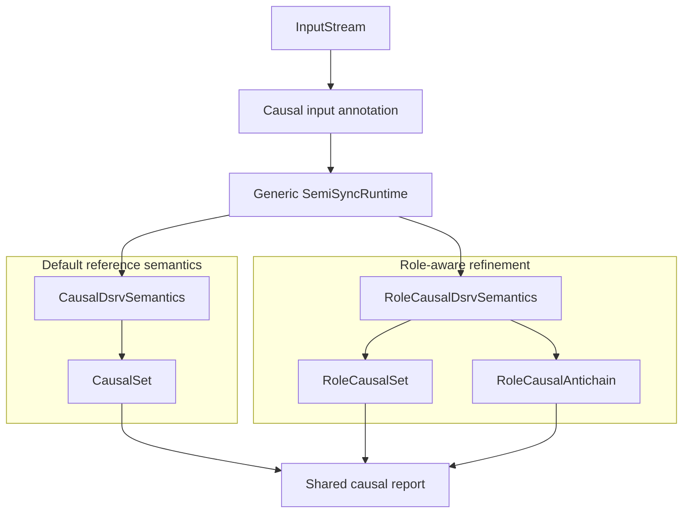

# Causal DSRV semantics

The causal pipeline annotates external inputs before they enter the generic
semi-synchronous runtime:



The default reference question is: **which external observations support this
result?** `CausalSet` records that support as one deduplicated `AtomSet`.
Strict operands, selected values, guards, property history, state-selection
evidence, and relevant absence observations are all included as ordinary
support. Alternatives intentionally collapse into one support set.

The role-aware question is: **in which role did each observation support this
result?** `RoleCausalSet` stores one compact explanation and
`RoleCausalAntichain` stores inclusion-minimal alternative explanations.
`Direct` identifies evidence that contributes to an emitted value or truth
result. `Selection` identifies evidence that chooses a branch or fallback.
`Retention` identifies absence evidence that keeps an earlier value active.
`Initialization` identifies evidence that supplies an initial value, and
`Activation` identifies evidence that installs or activates a runtime property.

Roles annotate occurrences in an explanation, not `TimedAtom` globally. A
single atom can therefore have different roles on different paths; joining
those paths keeps all roles on one normalized `RoleCause`. Antichain
minimization treats `(TimedAtom, CausalRole)` as the requirements: one
explanation dominates another when every atom-role occurrence in the first is
contained in the second. Thus direct-only dominates direct-plus-selection,
while direct-only and selection-only are incomparable.

## Rust construction

The simplest construction selects the reference pair. Runtimes receive an
already-open `OutputWriter`; open that writer from the public channel transport
before building the runtime. The channel sender emits one row per logical
output tick to the caller:

```rust,ignore
use trustworthiness_checker::causal::{CausalSet, CausalValue};
use trustworthiness_checker::core::OutputInterface;
use trustworthiness_checker::io::channel::{open_output, output};
use trustworthiness_checker::semantics::CausalRuntimeBuilder;

let (sender, mut causal_rows) = output::<CausalValue<CausalSet>>(16);
let output_writer = open_output(
    sender,
    OutputInterface::outputs(spec.output_vars().iter().cloned())?,
).await?;

let runtime = CausalRuntimeBuilder::<CausalSet>::new()
    .executor(executor)
    .model(spec)
    .input(ordinary_input)
    .output_writer(output_writer)
    .build()
    .await?;
```

`causal_rows` receives one `BTreeMap<VarName, CausalValue<CausalSet>>` per
logical output tick. Other native destination openers can be used when they
accept the selected causal value type; the runtime-facing output is always the
resulting `OutputWriter`. Channel `send` is an admission operation, while the
writer's `flush` and `close` provide the corresponding completion and cleanup
boundaries.

`CausalJsonlOutputHandler` is retained as a compatibility name for the
standalone adapter that writes named causal streams to JSONL. It is not passed to
the runtime builder; use `.output_writer(...)` with a writer opened from a
backend as above.

Role-aware construction uses `CausalRuntimeBuilder::<RoleCausalSet>::role_new()`
or `CausalRuntimeBuilder::<RoleCausalAntichain>::role_new()`. The checked
builder provides the equivalent checked combinations through
`CheckedCausalRuntimeBuilder::<D>::role_new()` and retains checked expression
metadata for runtime-installed `dynamic` and `defer` expressions.

`CausalDsrvSemantics` is the reference monitoring semantics and is only paired
with `CausalSet`. `RoleCausalDsrvSemantics<D>` requires
`D: RoleCausalDomain`, so it can only run with `RoleCausalSet` or
`RoleCausalAntichain`. The evaluator shares stream lifting, value computation,
temporal buffering, and dynamic subcontexts. Each operator labels contextual
evidence with a `CausalRole`; the selected domain maps those roles to its own
`Annotation` type. `CausalSet` maps every role to unclassified support, while
the role-aware domains use `CausalRole` as their annotation type.

## Input boundary and generic runtime

The causal input adapter owns declared-input discovery, logical input-tick
numbering, tick boundaries, `TimedAtom` construction, and atom-bearing
`NoVal` values for sparse inputs. `TimedAtom` remains only:

```rust
pub struct TimedAtom {
    pub input: VarName,
    pub logical_tick: u64,
}
```

It has no role field. `SemiSyncRuntime` remains responsible only for generic
input scheduling, fan-out, missing-value placeholders, retained history,
expression scheduling, and output coordination. It has no causal imports,
metadata, roles, domains, or reporting knowledge. `src/runtime/semi_sync.rs`
is intentionally unchanged.

## Canonical selectors

| Selector | Monitoring semantics | Domain |
| --- | --- | --- |
| `causal` | Reference | `CausalSet` |
| `causal-set` | Reference | `CausalSet` |
| `role-causal-set` | Role-aware | `RoleCausalSet` |
| `role-causal-antichain` | Role-aware | `RoleCausalAntichain` |

`causal-set` is the FMU default. There are no obsolete selector aliases.

## Shared report

The common external shape separates values from causal metadata:

```json
{
  "values": {
    "verdict": false
  },
  "causality": {
    "verdict": {
      "alternatives": [
        {
          "causes": [
            {
              "input": "guard",
              "logical_tick": 3,
              "roles": ["selection"]
            },
            {
              "input": "x",
              "logical_tick": 3,
              "roles": ["direct"]
            }
          ]
        }
      ]
    }
  }
}
```

`CausalSet` reports exactly one alternative and every cause has an empty role
list, meaning unclassified support. Role-aware sets report one alternative
with role lists; role-aware antichains retain role annotations independently in
each alternative. Cause, role, and alternative ordering is deterministic.
`Deferred` and `NoVal` are represented by the value states
`{"state":"deferred"}` and `{"state":"no_val"}`.
For lossless serialization of reports containing non-finite floats, use
`report_batch_json` or `report_batch_json_line`; direct `serde_json`
serialization only supports the strict-JSON subset.

The JSONL adapter has an equal-row contract: every declared causal stream must
yield exactly one value for each report row and all streams must end together.
If one stream reaches EOF while another stream has already completed the row or
is still pending, the adapter returns an actionable error naming the EOF,
completed, and pending variables. It does not write a partial row, and pending
sibling `next()` operations are cancelled rather than awaited indefinitely.

The scalar fragment includes Boolean, integer, floating-point, string, and unit
values; scalar operators; `if`, `sindex`, `default`, `init`, `update`,
`is_defined`, `when`, `latch`, `dynamic`, and `defer`. Collection,
higher-order, object, and distributed expressions remain unsupported.
Malformed runtime properties and unsupported expression forms retain their
existing `expect`/panic behavior as a known limitation of this in-development
feature.
