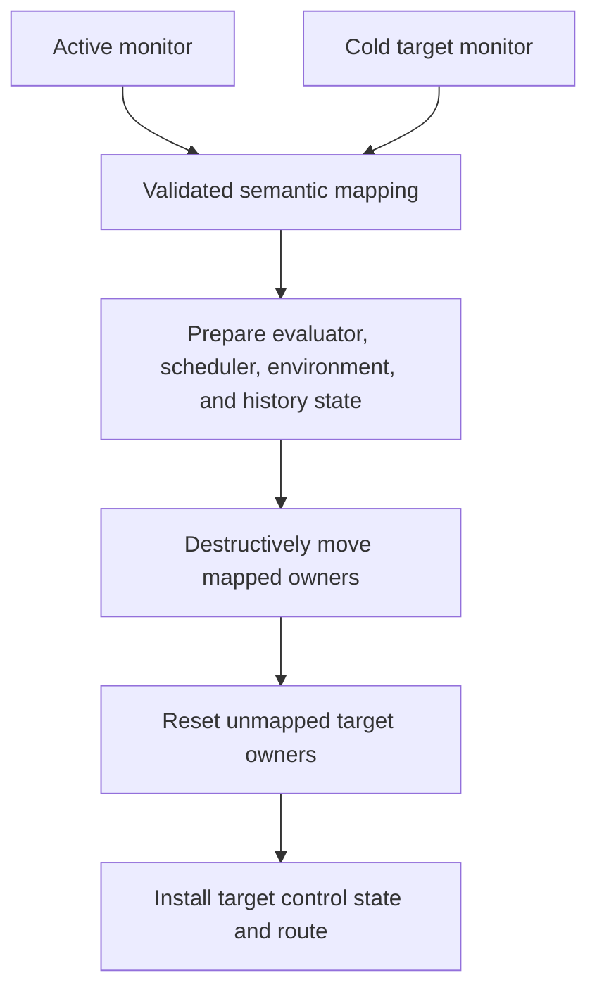

# Context transfer

Context transfer moves compatible semantic state from an active `DataflowMonitor` into a prepared target `DataflowMonitor`. Validation and target construction happen first; state movement is destructive and has no rollback path.

**Reading rule.** Nothing moves before preparation succeeds. After destructive movement begins, the architecture provides no reverse transfer to reconstruct the donor.

## Preparation

Preparation requires both monitors to be outside a tick. It validates execution structure, stream and environment mappings, target `Evaluator` compatibility, dynamic-expression projections, candidate `Scheduler` viability, retained-environment layout, and effective history requirements.

A preparation failure leaves the donor's semantic owners intact. In the root runtime, earlier input or output cutover effects may already have occurred because monitor application is later in the overall sequence.

## Application

Application materializes optimized/native state where necessary, moves exact evaluator owners, resets unmapped target evaluators, transfers compatible retained-environment values, recomputes history requirements, transfers matching variable histories, installs prepared scheduling and nested-reconfiguration state, clears the target current row, and selects its execution route.

With `ContextTransferPolicy::None`, the target uses initialized evaluator state and empty target histories.

**Reading rule.** The shared time axis contains two old logical ticks and the first target tick; the dashed replacement interval is physical application work, not another tick. The compact mapping rows show a compatible `Evaluator` moving with its `DelayState` and monitor history being restricted to the target-required suffix. An unmapped target owner starts cold. The completed old current row does not cross the interval—the target row is cleared before its first evaluation.

## State categories

| State | Transfer rule |
|---|---|
| evaluator node and operator state | moved with mapped compatible stream owner |
| delay rings and call state | part of evaluator owner; otherwise cold |
| monitor variable history | transferred for matching compatible variables and target requirements |
| retained sparse environment | transferred through compatible environment mapping |
| current row | not transferred; target row is cleared |
| scheduler and nested control | prepared for the target definition |
| quickened/native representation | materialized or transferred with its semantic owner |
| schedule route/cache entry | selected or rebuilt; not semantic context |

The retained sparse environment is not temporal history and does not seed a newly created delay ring.

## Nested transfer

A changed `dynamic` body can transfer compatible state only from the immediately previous active evaluator. Unchanged source text keeps the evaluator directly. Returning to an older body does not revive its former state. The first `defer` activation has no donor; after sealing, its evaluator remains active.

**Reading rule.** The local `DelayState` ring belongs to the nested activation and can transfer only from the immediately previous compatible evaluator; otherwise it starts cold and yields `Value::Deferred` while filling. The direct downstream `z[1]` read uses monitor `HistoryStore`, which survives because the enclosing monitor owner did not change.

## Semisynchronous transfer

The separate `ReconfSemiSyncRuntime` transfers variable histories rather than dataflow evaluator owners. It filters by variables in the target, gives missing variables empty history, and left-pads retained histories with `NoVal` to align lengths before starting the replacement generation.

## Implementation mapping

The implementation mapping leads through the monitor and evaluator reconfiguration modules, `src/dataflow/reconfiguration_mapping.rs`, monitor history code, and `src/runtime/reconfigurable_semi_sync.rs`.

Continue with [failure and termination](failure-model.md).
