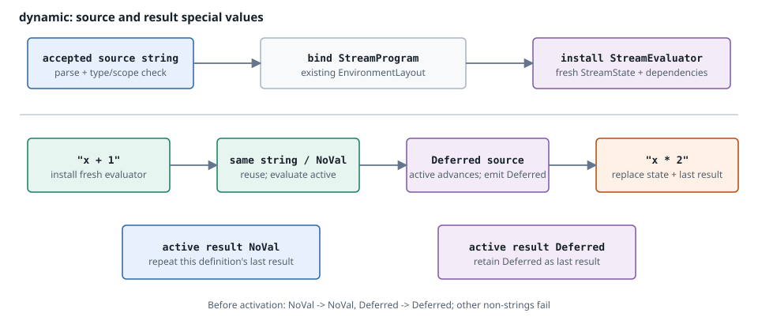
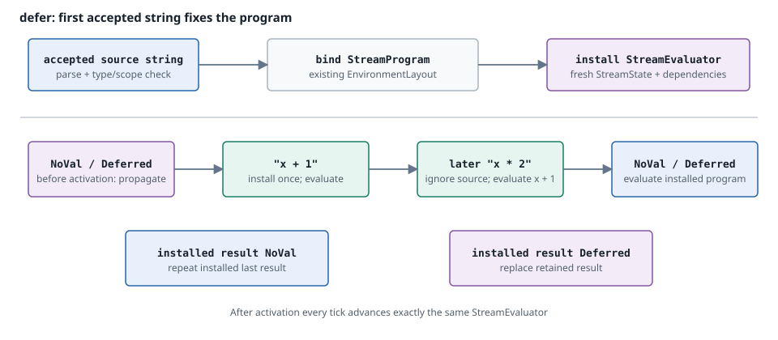

# Dynamic properties

[← Previous: Language state](language-state.md) · [Next: Execution tiers](execution-tiers.md) →

A dynamic property is a small stream program whose source text arrives as data. The outer monitor remains fixed: its streams, environment slots, evaluator identities, and temporal commit boundary do not change. What changes is the program nested at a `dynamic` or `defer` node and the exact same-tick dependency edges needed to schedule its containing stream.

## The two forms

| Form | Effective string source | Effective `Deferred` source | Before any string is accepted |
|---|---|---|---|
| `dynamic(source: T)` | Activate initially, then replace the active expression when the text changes; unchanged text preserves evaluator state. | The active evaluator still advances, but the node emits `Deferred`. | Effective `NoVal` emits `NoVal`; effective `Deferred` emits `Deferred`. |
| `defer(source: T)` | Accept the first valid string and seal the point; later strings do not replace the installed definition. The accepted body still advances every tick. | After activation, advance the accepted body and apply its outer result lifting; before activation, emit `Deferred`. | Effective `NoVal` emits `NoVal`; effective `Deferred` emits `Deferred`. |

The source operand is stream-lifted before these rules apply. A raw `NoVal` reuses the last non-`NoVal` source when one exists. `Deferred` is itself a retained effective source value, not absence. After a string has activated `defer`, that string remains the source definition: later strings and special source values do not install another body, but they also do not pause the installed body.

These rules involve four independent kinds of state:

- **Retained source definition.** `defer` keeps the first accepted string as its installed body. Source lifting decides which source value is effective on a tick, but it does not make a later string replace that body.
- **Retained outer environment inputs.** A reconfigurable monitor keeps a current row and a retained row for the outer variables read by the active body. A current non-`NoVal` value wins; current `NoVal` falls back to the retained value, while `Deferred` is retained as a value. See [Retained outer environment](#retained-outer-environment).
- **Temporal body state.** The installed evaluator owns its lifting state, delay rings, and other temporal state. It is advanced and committed on every tick after activation, including ticks whose effective source is `Deferred` or whose source string is ignored. See [Temporal state](temporal-state.md).
- **Retained published result.** An active `defer` body follows the semisync-compatible outer lifting rule: a body `NoVal` republishes the last non-`NoVal` body result when one exists; before any such result, it remains `NoVal`. `Deferred` is a value and can itself become the retained result. This result slot is separate from the source definition, outer environment row, and temporal body state, so `NoVal` is interpreted by the retained-result rule rather than as a new unconditional absence.

A failed first `defer` definition does not mark the point sealed, but parse, type, scope, and binding failures are terminal once monitor tick execution has begun. The same monitor therefore cannot retry with a later source under the current failure policy.

## One tick, two disjoint ranges

A reconfigurable monitor divides every scheduled plan into two ranges:

1. **Source range.** Evaluate only the currently required computed prerequisites of expression-source values.
2. **Resolution barrier.** Read each unsealed `defer` source and every `dynamic` source, activate or replace nested programs, and update exact dynamic dependencies.
3. **Main range.** Evaluate every stream not in the source range, in dependency-valid order.
4. **Commit and sealing.** Commit temporal state once, then apply pending `defer` releases for the next tick.

The ranges are disjoint and together contain every logical stream exactly once. A source-producing stream is not evaluated again in the main range. If dependency repair changes the order, it happens before the main range, so stateful streams do not advance twice during reconfiguration.

### Source prerequisites

The source range exists because a source string may itself be computed by a stream. Compilation records the source operand of each reconfiguration point:

- A constant source needs no prerequisite stream.
- An input slot is already loaded and needs no prerequisite stream.
- A computed-stream slot contributes that producer and its transitive **static same-tick dependency closure**.

These prerequisites let the runtime know the source text before it schedules the property that uses it. They are not the dependencies of the runtime-compiled expression; those become known only after the string is compiled.

For early resolution to be safe, a source operand must be a constant or an environment value that is available outside a fallible lazy branch. A node-local source is rejected. Streams in a source-prerequisite closure must be infallible and cannot themselves contain reconfiguration points.

### The source barrier is semantic

The boundary between ranges is not just a batching choice. Dependency discovery occurs there. Quickened scalar publication may flow from an earlier source-range stream to a later main-range stream, but a `ScalarRun` never crosses the barrier, and whole-plan fused JIT execution is unavailable while the source range is non-empty. See [Execution tiers](execution-tiers.md#the-source-barrier).

## Exact active dependencies

Every compiled template records two different slot sets:

- `environment_slots`: all free variables read by the nested program, including historical reads;
- `dependency_slots`: `same_tick_free_vars`, the exact immediate reads that require their producers to run first on this tick.

A direct positive historical read such as `x[1]` therefore requires `x` in the nested evaluator's environment but does not create a same-tick scheduling edge. A compound delay operand may still have immediate dependencies needed to compute the value captured at commit.

For a stream containing multiple reconfiguration points, the scheduler uses the union of every point's currently active `dependency_slots`. That union is rebuilt only when activation reports that a point's dependency slot list changed. The scheduler then:

1. sorts and deduplicates the pending producer set;
2. compares it with the active set;
3. marks the order dirty only when a newly added edge is not already satisfied by the cached order;
4. repairs the order with static and active dynamic edges together; and
5. rejects a runtime same-tick cycle.

This is deliberately exact. The allowed scope is an authorization boundary, not an over-approximation of active dependencies.

## Immutable templates, fresh evaluator state

Each dynamic node owns a `DynamicExpressionState` with a **four-entry linear LRU** of immutable `DynamicExpressionTemplate` values. The cache is local to that node and keyed by exact source text within the same compiled outer layout. A root transfer may keep an active old-layout template through its explicit projection, but a later activation does not treat that template as a cache hit in the new layout.

A template contains:

- the source text;
- an `Rc<StreamProgram>`;
- exact same-tick `dependency_slots`; and
- all `environment_slots` needed to evaluate it.

The most recently used template is at the end. A hit moves the entry to the end. A miss parses, optionally runtime-type-checks, validates the scope, binds a new program, appends it, and evicts the oldest entry when necessary.

Templates contain no mutable language state. Every activation—even a cache hit after another source was active—constructs a **fresh target `Evaluator`**. Template reuse therefore never resumes the evaluator from an earlier activation. The current active body may instead donate exact or uniquely matched state owners under `Compatible` or `Strict`; unmatched owners remain freshly initialized, and `None` keeps the whole target cold. Repeating the text that is already active is `Unchanged` and keeps the existing evaluator directly.

## `defer` sealing and reference counts

`defer` can permanently stop observing its source for definition changes after successful activation. Sealing stops source resolution and prerequisite tracking; it does not stop the installed body from advancing or its retained published result from being lifted. The runtime separates that decision from the activation tick:

1. Activation marks the point sealed and queues a pending release.
2. The main range still runs under the current two-range plan.
3. Temporal state commits at the normal end-of-tick boundary.
4. Pending releases decrement reference counts and update the ranges for the next tick.

Two reference-count families make shared cases precise:

- `source_user_refcounts[stream]` counts unsealed points whose source-prerequisite closure contains the stream. A prerequisite leaves the source range only when this count reaches zero.
- `live_expression_refcounts[stream]` counts unresolved expressions in a containing stream. That stream leaves the resolution set only after all of its `defer` points are sealed; a `dynamic` point remains live.

Consequently, sealing one `defer` cannot remove a source stream still needed by another `defer` or `dynamic`. Released prerequisite streams are not deleted: they move into the next plan's main range, preserving the invariant that every logical stream evaluates once per tick.

## Retained outer environment

Reconfigurable monitors maintain two environment rows:

- the **current row**, cleared to `NoVal` before loading each tick; and
- a **retained row**, updated whenever an input or stream publishes a value other than `NoVal`.

`Deferred` is a value and is retained; only `NoVal` means “do not replace the retained entry.” Static monitors do not allocate this second row.

Before a nested expression `Evaluator` runs or commits, its environment shadow is updated only through the active body's `EnvironmentProjection`. Each compact binding contains a nested compiled slot and its current outer slot. The current outer value wins unless it is `NoVal`; in that case the retained outer value is copied into the nested slot. Normal ticks therefore perform only indexed copies and never resolve variable names.

The same projection stores dependency slots and history requirements in the current outer layout. On root transfer, preparation rebuilds it by variable identity before the old nested evaluator is moved; scheduler repair and history sizing consume those projected slots. This lets a body compiled against an old dense layout continue unchanged after inputs or computed streams move.

Retained environment values, the installed source definition, evaluator-local temporal state, monitor context history, and an active `defer`'s retained published result are different mechanisms. A runtime-defined body's delays remain local to its nested evaluator. New delay owners start cold, while owners matched to the immediately preceding active body may move into the fresh target evaluator under the selected transfer policy. Projected history requirements additionally tell the outer monitor which bounded variable history to retain for a later specification-level context transfer; multiple bodies can contribute to one retained bound without reading one another's evaluator-local delay state.

## Restrictions and failure model

Dynamic compilation intentionally has a narrower contract than top-level compilation:

- The source value must be a string, `NoVal`, or `Deferred`; another value is an evaluation error.
- Runtime free variables must be within the resolved scope and present in the outer `EnvironmentLayout`.
- Automatic top-level scope includes available inputs and streams except the containing stream itself. Explicit scopes restrict that set further.
- A runtime-compiled program may not contain another `dynamic` or `defer` reconfiguration point.
- Persistent temporal function bodies and recursive function bodies reject `dynamic`/`defer`; nested function execution does not expose the fallible runtime-compilation path.
- Source expressions must satisfy the early-resolution rules described above.
- Runtime same-tick dependency cycles are rejected.
- There is no complete trace archive and no language option to declare or reuse a retained history depth.
- Delay offsets and dynamic source size currently have no configurable resource budget; untrusted source strings require an external policy boundary.

Once tick execution has begun, parse, type, scope, source, nested-reconfiguration, or cycle errors end the monitor. The failed tick commits no temporal state and projects no outputs, but evaluator state that already advanced stays advanced.

## Continue reading

Expression reconfiguration is one half of a shared mechanism. [The reconfigurable runtime](reconfigurable-runtime.md) covers the other half — replacing the whole definition — and [The replacement contract](replacement-contract.md) defines the activation frontier both paths validate against.

- [Execution model](model.md) defines ticks, dependency order, stable slots, and evaluator identity.
- [Temporal state](temporal-state.md) explains staging, commit, delay rings, and history ownership.
- [Language state](language-state.md) covers conditionals, functions, and recursion.
- [Execution tiers](execution-tiers.md) explains how the two ranges interact with canonical, quickened, and JIT execution.
- [Concept-to-code map](implementation-guide.md) maps these concepts to concrete files and types.

[← Previous: Language state](language-state.md) · [Next: Execution tiers](execution-tiers.md) →
