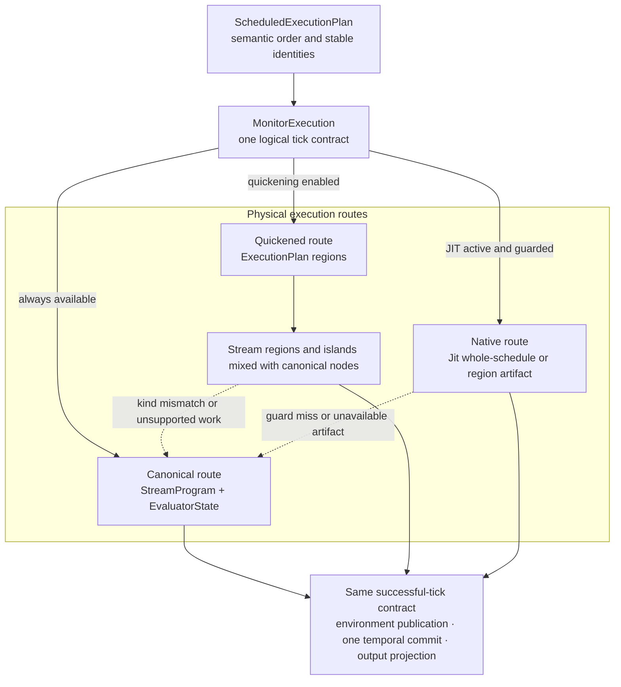

# Execution tiers

Canonical graph evaluation defines dataflow semantics. Quickened and native execution are replaceable physical routes that must preserve the same stable state owners, publication order, [source and tick barriers](tick-execution.md#tick-and-source-barriers), errors, and fallback behavior.

**Reading rule.** Solid arrows show available execution paths to the same successful-tick contract, not a required sequence through every tier. The quickened route is deliberately mixed: scalar regions handle eligible stream runs while graph steps interleave islands with canonical nodes. Dashed arrows are local fallback to canonical evaluation. `ScheduledExecutionPlan` and canonical evaluator state remain the semantic reference regardless of the selected route.

## Principal entities

| Entity | Responsibility |
|---|---|
| semantic scheduled plan (`ScheduledExecutionPlan`) | Records dependency-valid stream order, stable value/state identities, temporal effects, and commit streams without owning mutable evaluator state or a backend artifact. |
| execution owner (`MonitorExecution`) | Activates tiers, executes the selected source and main ranges, publishes stream results, and preserves the one-tick commit boundary. |
| physical plan (`ExecutionPlan`) | Partitions one semantic plan into `ExecutionStep::ScalarRegion` and `ExecutionStep::Graph` work, splitting each graph step into scalar islands and canonical node runs. |
| persistent stream evaluator (`Evaluator`) | Owns the bound `StreamProgram` and the canonical `EvaluatorState`. It holds no accelerator state: quickened and native state belong to the execution plan's regions. |
| native coordinator (`Jit`) | Activates and guards fused or per-stream native artifacts, reports outcomes, and materializes native-owned state when canonical ownership must be restored. |
| region authority (`RegionAuthority`) | Which executor currently owns the semantic state of one region: `Canonical`, `Quickened`, or `Native`. |
| monitor authority (`AuthoritativeTier`) | Which tier last mutated state for the monitor as a whole: `Canonical`, `Regions(PlanIdentity)`, or `WholeNative`. |

## Canonical authority

The bound `StreamProgram`, canonical `EvaluatorState`, environment row, and monitor phase order are the semantic authority. Every operation kind has a canonical path capable of representing special values and language errors.

Optimization is enabled only after that model exists. It cannot define a second interpretation of a tick.

## Quickening

Quickening executes a scalar region as an ordered list of members over one register file. The two region scopes, what an island is, and why the scopes decline a row differently are defined in [scalar IR and regions](scalar-ir.md); this page is about who owns their state and when.

A region therefore holds no canonical escape hatch. Every instruction in it is executable by the scalar engine, so an operation the engine does not implement keeps its nodes canonical when the plan is built rather than causing a bail-out later. Whole-stream regions preflight together; graph regions preflight each member as its boundary values become available.

## Who owns a region's state

Exactly one executor owns a region's semantic state at any moment, and `RegionAuthority` records which. This is the rule that makes three routes safe over one set of language state, and it is enforced by two operations that are mirror images:

- **`synchronize`** pulls state *into* an executor from the canonical arena. It is fallible: a region whose temporal nodes hold state outside the scalar domain declines, and canonical stays authoritative.
- **`materialize`** writes state *back out* to the canonical arena. It is infallible, and it is what every other part of the system depends on.

Nothing may change executor while a different executor still owns its state. `materialize_authoritative_state` is the single funnel enforcing that: every schedule repair, context transfer, and tier activation calls it first, so whichever tier last mutated state has written it back before the route changes underneath it.

A [context transfer](context-transfer.md) materializes both donor and target before checking their state representations and moving canonical state. A fresh target can already hold promoted scalar temporal nodes. After the move, the target synchronizes its own regions; register files are not transferred between monitors.

{{#include ../../assets/dataflow/region-authority.svg}}

**Reading rule.** The arrows record changes in authority. Synchronization and materialization may copy or convert retained values; only the authoritative representation is current. Quickened operands and conditional branch state live in region storage, while quickened temporal nodes live in the borrowed evaluator arena in scalar form. Whole-native temporal execution can own a separate state allocation. Materialization reconciles these representations before another owner uses them.

## Schedule-level routing

A dependency-valid schedule from [`Scheduler`](scheduling.md) is lowered to a `ScheduledExecutionPlan`; the execution engine partitions it into an `ExecutionPlan`. Contiguous eligible streams become scalar regions; other streams remain graph steps, whose graphs are themselves split into islands and canonical node runs. Dynamic schedule repair selects or creates a plan for the new order.

Plans are cacheable and disposable, which is safe only because a plan holds no language state — see [runtime ownership](runtime-ownership.md#replaceable-routing).

### Tier selection for the running example

The [running example](index.md#the-running-example) compiles to three streams. Partitioning walks them in scheduler order and asks of each whether it may join a stream region:

| Stream | Body | May join a stream region | Becomes |
|---|---|---|---|
| `scaled` | `x * 2` | yes — static, non-temporal, scalar | a stream region |
| `total` | `default(total[1], 0) + scaled` | no — it carries temporal state | a graph step, whose interior is a single island |
| `alert` | `total > 20` | yes | a *second* stream region |

`scaled` and `alert` do not share a region. A stream region is a maximal contiguous run in scheduler order, and the graph step for `total` sits between them, so the plan is a stream region, a graph step, then another stream region.

The graph step still runs scalar code. `Delay`, `Default` and the arithmetic around them are all island operations, so `total`'s whole graph forms one island; it is a graph step because a temporal stream cannot publish to an environment slot as part of a preflighted unit, not because its contents defeated the scalar engine. Every member of all three regions is scalar, so quickening owns the row and the authoritative tier is `Regions` rather than `Canonical`.

This partition is pinned by `documented_running_example_partitions_into_two_stream_regions_around_a_graph_step` in `src/dataflow/execution/monitor_execution/tests.rs`.

## Native execution

JIT coordination builds guarded native artifacts for eligible work and retains a canonical fallback. Before fallback, transfer, or route replacement, native-owned mutable state is materialized into the evaluator's authoritative state representation.

### Whole-schedule kernels

A *whole-schedule kernel* is one generated function that evaluates the entire scheduled row, in place of one artifact per region. Compiling the schedule as a unit lets cross-stream publications stay in SSA values instead of being materialised as `Value`s in the environment between streams, which is the saving a per-region artifact cannot make.

`Jit::activate` tries three things and takes the first that compiles:

| Selected | What the artifact covers | Reported as |
|---|---|---|
| `WholeScalar` | the complete static row, in one call | `JitPlan::WholeSchedule`, one artifact |
| `WholeTemporal` | the same, **and** commits the plan's temporal state | `JitPlan::WholeSchedule`, one artifact, with the plan's commit streams recorded |
| `Regions` | the eligible regions only, the rest interpreted | `JitPlan::Regions`, one artifact per compiled region |

The order matters. A schedule with no temporal commit lands on `WholeScalar`; adding one delay moves it to `WholeTemporal` rather than dropping it to `Regions`. If the whole-schedule attempts fail, their errors are carried into the report of whatever is selected instead, so a `Regions` outcome still says why the kernel was not built.

`WholeTemporal`'s outcome is `WholeTickOutcome::CompletedAndCommitted`, and `MonitorExecution` returns directly rather than running a second commit loop.

Two consequences follow from a kernel covering the whole row. It is the only form that offers a direct typed entry, which is why [typed monitors](typed-monitors.md#controlling-native-compilation) promote to a `Value`-free path under `WholeSchedule` and not under `Regions`. And it is the only form that owns temporal state, because `Regions` compiles whole-stream programs and a stream carrying a delay is not currently a stream-region member.

### Conditionals under quickening

An `EagerSelect` holds a program per branch, so quickening executes both branch programs with separate retained operands and results. Each branch has its own node identities, and materialization writes each branch's state back into the corresponding canonical branch arena. Which sparse value the selection then produces is [language semantics](language-state.md#conditional-timelines), unchanged by the tier that ran it.

### Getting state back out

Native artifacts hold no canonical retention while they are being built — compilation reads nothing from the evaluator arena — but a running `WholeTemporal` kernel does own the temporal state it commits. Materialization therefore differs by mode:

- `Regions` writes each compiled region's state back through `materialize_into`.
- `WholeTemporal` writes its retained state back with `snapshot_into`, then replays a canonical snapshot.
- `WholeScalar` has no temporal state of its own and only replays.

The replay is what reconstructs interpreted retention for the canonical evaluators, which is why a fallback after a run of native rows does not lose history.

The commit still happens at the logical barrier, after every stream output has been computed. A native kernel changes who performs the commit, never when it becomes visible.

A whole-schedule scalar kernel declines a row containing `NoVal` or `Deferred` without disabling itself. The last native row is replayed once to reconstruct interpreted retention, then the current sparse row runs through the fallback. Consecutive sparse rows keep that updated interpreted state. A later concrete row can use the same native artifact again.

Unlike the quickened route, native execution *can* miss a guard mid-tick. When it does, it falls back within the same logical tick contract: it must not publish a partial row, commit temporal state twice, or suppress a language error visible on the canonical path.

Function bodies and active dynamic/defer bodies currently use canonical nested evaluators. Top-level region selection does not give those nested graphs their own quickened plans.

## Equivalence and failure

All tiers preserve:

- one evaluation per logical stream per tick;
- stable environment and evaluator identities;
- exact current dependency order;
- one temporal commit after the row;
- one output projection;
- terminal monitor failure on an unrecovered evaluation error.

Tier-local compilation failure or guard failure can be contained by canonical fallback when the implementation reports it as recoverable. A canonical evaluation failure remains a monitor failure.

## Implementation mapping

- tier selection, the authority funnel, and step execution: `src/dataflow/execution/monitor_execution/tiers.rs`;
- physical partition and the plan cache: `src/dataflow/execution/monitor_execution/plan.rs`;
- register plan, `synchronize`, and `materialize`: `src/dataflow/execution/quickening/region.rs`;
- semantic plan and temporal effects: `src/dataflow/execution/scheduled_plan.rs`;
- native activation, artifacts, and outcomes: `src/dataflow/execution/jit/`.

Differential tests in `src/dataflow/execution/monitor_execution/tests.rs` compare optimized routes against canonical evaluation, including state materialization across a context transfer.

Continue with [typed monitors](typed-monitors.md) for the caller-side path a whole-schedule artifact enables, the [runtime adapter](runtime-adapter.md) for asynchronous driving, or [failure containment](failure-model.md) for the complete ladder.
