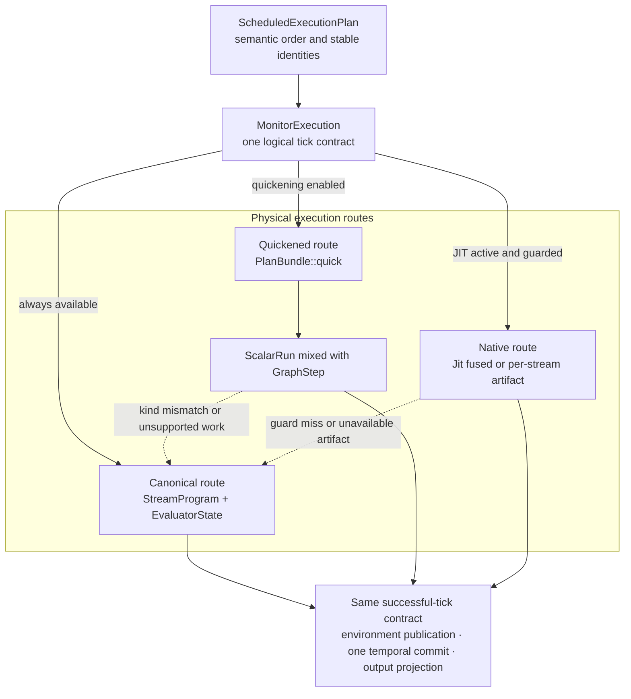

# Execution tiers

Canonical graph evaluation defines dataflow semantics. Quickened and native execution are replaceable physical routes that must preserve the same stable state owners, publication order, [source and tick barriers](tick-execution.md#tick-and-source-barriers), errors, and fallback behavior.

**Reading rule.** Solid arrows show available execution paths to the same successful-tick contract, not a required sequence through every tier. The quickened route is deliberately mixed: `ScalarRun` handles eligible streams while `GraphStep` retains quickened or canonical graph evaluation. Dashed arrows are local fallback to canonical evaluation. `ScheduledExecutionPlan` and canonical evaluator state remain the semantic reference regardless of the selected route.

## Principal entities

| Entity | Responsibility |
|---|---|
| semantic scheduled plan (`ScheduledExecutionPlan`) | Records dependency-valid stream order, stable value/state identities, temporal effects, and commit streams without owning mutable evaluator state or a backend artifact. |
| execution owner (`MonitorExecution`) | Activates tiers, executes the selected source and main ranges, publishes stream results, and preserves the one-tick commit boundary. |
| mixed route (`PlanBundle::quick`) | Lowers one semantic plan into `QuickStep::ScalarRun` and `QuickStep::Graph` work while retaining canonical handling for unsupported or fallible operations. |
| persistent stream evaluator (`Evaluator`) | Owns the bound `StreamProgram`, canonical `EvaluatorState`, and evaluator-local quickened or per-stream native state. |
| native coordinator (`Jit`) | Activates and guards fused or per-stream native artifacts, reports fallback outcomes, and materializes native-owned state when canonical ownership must be restored. |

## Canonical authority

The bound `StreamProgram`, canonical `EvaluatorState`, environment row, and monitor phase order are the semantic authority. Every operation kind has a canonical path capable of representing special values and language errors.

Optimization is enabled only after that model exists. It cannot define a second interpretation of a tick.

## Quickening

Quickening observes eligible scalar operations and builds a mixed `QuickPlan` inside the active `PlanBundle`, containing scalar and canonical instructions. Scalar results are mirrored to canonical `Value` locations so neighboring canonical work and fallback see one coherent row.

**Reading rule.** The canonical graph and state remain underneath the overlay. A runtime kind mismatch materializes retained lifting state and permanently deoptimizes only the affected operation; neighboring scalar operations may continue.

Evaluator-local adaptive state belongs to the same owner as canonical state. Exact context transfer therefore cannot separate an optimized representation from the evaluator whose semantics it represents.

## Schedule-level routing

A dependency-valid schedule from [`Scheduler`](scheduling.md) is lowered to a `ScheduledExecutionPlan`; the execution engine packages its mixed route in a `PlanBundle`. Contiguous eligible work may become scalar runs; other streams remain graph steps. Dynamic schedule repair selects or creates a route for the new order.

Routes are cacheable and disposable. `PlanId` identifies a route, not monitor state. Cache eviction or route replacement cannot reset delay rings, function frames, nested evaluators, or deoptimization decisions attached to stable owners.

## Native execution

JIT coordination builds guarded native artifacts for eligible work and retains a canonical fallback. Before fallback, transfer, or route replacement, native-owned mutable state is materialized into the evaluator's authoritative state representation as required.

A native guard miss or unsupported case falls back within the same logical tick contract. It must not publish a partial row, commit temporal state twice, or suppress a language error visible on the canonical path.

## Equivalence and failure

All tiers preserve:

- one evaluation per logical stream per tick;
- stable environment and evaluator identities;
- exact current dependency order;
- one temporal commit after the row;
- one output projection;
- terminal monitor failure on an unrecovered evaluation error.

Tier-local compilation failure or guard failure can be contained by canonical fallback when the implementation reports it as recoverable. A canonical evaluation failure remains a monitor failure.

## Implementation mapping

The implementation mapping leads through `src/dataflow/execution/quickening/`, `src/dataflow/execution/jit/`, `src/dataflow/execution/scheduled_plan.rs`, and monitor execution tier code. Differential and focused tests compare optimized routes with canonical evaluation.

Continue with the [runtime adapter](runtime-adapter.md) for asynchronous driving or [failure containment](failure-model.md) for the complete ladder.
