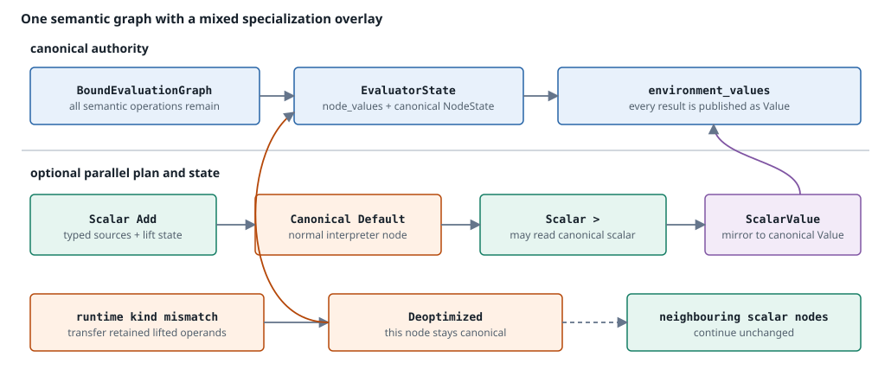

# Execution tiers

[← Previous: Dynamic properties](dynamic-properties.md) · [Next: Runtime adapter](runtime-adapter.md) →

The dataflow runtime has one semantic machine and several physical executors. Bound graphs, stable environment slots, evaluator-owned state, dependency order, and the end-of-tick temporal commit define correctness. Quickening and JIT compilation accelerate eligible work without replacing that model.

## The architecture in one sentence

A backend-neutral `ScheduledExecutionPlan` orders stable logical streams; a `PlanBundle` derives schedule-specific `QuickPlan` and `QuickStep` routing; each `Evaluator` owns `EvaluatorTierStates`; and `Jit` may execute all or part of the same plan while preserving canonical fallback.

## Tier 0: canonical execution

Canonical execution is the reference implementation and the universal fallback.

Each `Evaluator` owns an `Rc<StreamProgram>` and `Evaluator.tier_states` (`EvaluatorTierStates`), whose canonical state is `EvaluatorState`. The graph is evaluated in node order, stream results are published as `Value` into stable environment slots, recursive writes are staged, and the monitor commits temporal state only after the logical row is complete.

Canonical state is authoritative even when another tier is active. Replacing a schedule does not move evaluators or reset delay rings, branch state, function state, active dynamic expressions, or prior deoptimization decisions.

## Tier 1: quickening

Checked lowering may attach `ScalarSignature` metadata to supported unary and binary nodes. A quickening `Plan` overlays one instruction on every canonical graph node:

- supported scalar operations get typed scalar instructions;
- eligible `if` nodes may have quickened branch plans;
- every unsupported node remains `Canonical`.

The canonical graph is never removed. Quickened nodes publish canonical node values, but compact lifting state may temporarily be the newest physical representation of the operator state. Before that overlay is discarded or a compatible owner is rewritten, it is materialized back into `EvaluatorState`.

Unchecked, infallible one-node unary and binary graphs can also quicken adaptively. Their first concrete canonical evaluation derives an observed scalar plan and seeds its compact lifting state from the canonical owner. Type changes deoptimize through the same path as statically planned instructions. Adaptive planning is disabled for history-aware execution and whenever quickening is disabled.

### Per-node deoptimization

Quickening deoptimizes at node granularity. If a scalar instruction cannot read an operand with its planned kind, that node:

1. changes its quickening state to `Deoptimized`;
2. restores its lifting state to the matching canonical node state;
3. evaluates canonically for the current tick; and
4. remains canonical on later ticks.

Other nodes in the graph remain quickened. `NoVal` and `Deferred` are represented directly by `ScalarValue`; an incompatible concrete value is what generally forces deoptimization.

## `PlanBundle`: one schedule, multiple views

A `PlanBundle` pairs:

- a semantic `ScheduledExecutionPlan`; and
- a derived `QuickPlan`.

The semantic plan records a unique `PlanId`, the source/main boundary, ordered `PlannedStream` entries, stable output and state identities, per-stream effects, temporal operations, and the monitor's commit set. It owns immutable program references but no evaluator state or backend artifact.

The quick plan has separate source and main step arrays. Each `QuickStep` is one of:

- **`ScalarRun`** — a maximal consecutive run of streams whose entire graph is exactly one supported unary or binary output node;
- **`Graph`** — entry to the general evaluator, optionally with a mixed per-node quickening plan.

Every stream still has an individual publication boundary. A scalar result is published both as a canonical environment `Value` and, when possible, as a compact value for later streams. A rich `Graph` step may therefore end a scalar run and still feed a later one.

The execution engine keeps one active bundle and at most four previous bundles. A matching source/main order can be swapped back without rebuilding its quick plan. Bundle replacement changes routing only; mutable state remains in the fixed evaluator arena.

## Tier 2: native JIT

JIT activation is disabled, eager, or delayed by a hotness threshold. Hotness advances once at the beginning of a logical tick, not once per source/main range. On activation, selection proceeds in strict order:

| Attempt | Artifact | Selection requirements | Success behavior |
|---|---|---|---|
| 1 | **Fused scalar run** (`JittedRunEvaluator`) | No source barrier; every stream lowers to scalar native code without canonical boundary nodes. | One artifact computes the complete plan and publishes all stream outputs. |
| 2 | **Fused temporal run** (`JittedTemporalRunEvaluator`) | No source barrier; the plan is infallible and temporal; every stream and every commit stream has supported scheduled temporal lowering. | One artifact computes the complete plan and performs the logical temporal commit at its end. |
| 3 | **Per-stream graphs** (`JittedGraphEvaluator` in `Evaluator.tier_states`) | Each stream is considered independently. | Supported streams run native regions; unsupported streams use quickened or canonical execution. |

`ExecutionEngine` and its JIT coordinator still own activation, execution-mode selection, fused scalar/temporal artifacts, and schedule-wide replay state. Each per-stream `JittedGraphEvaluator` instead lives in its owning `Evaluator.tier_states`; `NativeExecution::PerStream` is only the mode marker, not a boxed artifact array.

A backend error or unsupported shape falls through to the next attempt. `JitReport` reports `Fused`, `PerStream`, or `Unavailable` plus artifact and temporal coverage details.

### Fused scalar

The fused scalar artifact keeps a packed raw environment between streams, avoiding repeated graph dispatch and native boundary crossings. It materializes canonical stream outputs after a successful tick. Because it has no canonical boundary inputs, every graph in the plan must be fully lowerable.

### Fused temporal

The fused temporal artifact additionally owns packed temporal state. Temporal reads happen during stream computation, but generated writes are sunk past every checked operation in the complete plan. A checked-arithmetic side exit therefore observes pre-tick temporal state; only a successful artifact reaches its native commit sequence.

### Per-stream graphs

The evaluator arena's stable `StreamId` index selects the owning evaluator, so per-stream artifacts do not follow current schedule position. A graph may combine canonical or scheduled temporal boundary nodes with a native scalar region. Temporal evaluation remains in `ScheduledTemporalPlan`, and its writes commit through the monitor's shared end-of-tick traversal; a per-stream artifact never owns a complete internal commit.

Presence failures (`NoVal` or `Deferred`) can fall back for the current tick without necessarily disabling an ordinary per-stream scalar artifact. A concrete type mismatch or native checked-operation failure permanently disables that artifact. Fallback and deoptimization occur per stream; unrelated artifacts continue to run.

## The source barrier

A non-empty source range creates `ScheduledExecutionPlan::has_source_barrier()` because dynamic dependencies must be resolved between the source and main ranges.

The barrier has three consequences:

1. Whole-plan fused scalar and fused temporal compilation are rejected.
2. Quickening plans remain separate by range; a `ScalarRun` cannot span the barrier.
3. Compact values published by source-range streams remain available to main-range steps.

Per-stream `JittedGraphEvaluator` tiers are reached through stable stream identities and can be used on either side of the barrier. Their scheduled temporal operations only stage state, so the shared commit still occurs after both ranges. If `defer` sealing removes the last source prerequisite, the next plan has no source barrier and JIT selection may promote the monitor to a fused artifact.

For the dynamic scheduling model itself, see [Dynamic properties](dynamic-properties.md#one-tick-two-disjoint-ranges).

## Artifact and state lifetime

The ownership boundaries are intentional:

| Object | Owns mutable language state? | Lifetime / invalidation |
|---|---:|---|
| `StreamProgram` | No | Shared by `Rc`; stable across schedules. |
| `Evaluator` / `EvaluatorTierStates` | **Yes** | One per logical stream; holds canonical `EvaluatorState`, optional quickening/`quick_plan`, and the JIT per-stream native tier. |
| `PlanBundle` | No | Active or in the four-entry previous-plan cache. |
| Fused native artifact | Native scratch/state only | Tied to the `PlanId`; rebuilt when the active schedule or source boundary changes. |
| Per-stream `JittedGraphEvaluator` | Evaluator-local native state/artifact | Held by the owning `Evaluator.tier_states`; retained across schedule changes. |
| `CompiledGraph` module | Executable code | Kept alive by the artifact's `Rc`; multiple graph functions may share one finalized module. |

Schedule-independent evaluator-local per-stream artifacts survive `defer` sealing and dynamic order repair. Whole-plan artifacts cannot: their stream order and source boundary are part of their identity.

A root reconfiguration follows its `MonitorReconfigurationPlan`. `RetainExact` keeps the live monitor and its existing execution artifacts. `InstallCold` and `Transfer` materialize a monitor from the target `DataflowProgram`, so their plans and compiled artifacts are built for that new machine; `Transfer` carries semantic owners and evaluator-local tier states accepted by `context_transfer_from`. Required fused/native representations are materialized before transfer. Exact mappings move canonical and quickening state together while retaining native artifacts bound to each target program and environment ABI. Compatible mappings rewrite canonical owners and rebuild or synchronize derived tiers. JIT coordinator state and fused artifacts remain target-owned; see [Context transfer](context-transfer.md#destructive-handoff).

## Temporal promotion and deoptimization

Native temporal execution maps canonical node identities onto scalar or packed physical state rather than creating an independent history model.

1. `ScheduledTemporalPlan` identifies supported `Delay`, `RecursiveDelay`, and `Default` nodes from stable `(stream, node)` plan slots.
2. Promotion converts canonical `NodeState::Delay` / `Default` values to scalar forms when every retained value is representable.
3. A fused temporal artifact may pack those scalar forms into `NativeTemporalState`; per-stream artifacts leave scalar temporal state in the evaluator.
4. On deoptimization, packed fused state is materialized back into evaluator-owned state and scalar node variants are converted back to canonical variants.

Promotion is all-or-safe-fallback. Partial promotion is explicitly reversed. The canonical evaluator always regains a complete state representation before canonical execution resumes.

## Side exits and non-committing replay

Native execution can advance compact lifting state without updating the canonical lifting state on every successful row. On a later side exit, canonical execution must first reconstruct the state that corresponds to the last successful native row.

### Whole-plan replay

The JIT coordinator keeps schedule-wide replay state for fused execution, while fused evaluators retain the previous successful raw input environment. On fallback:

1. A fused temporal evaluator materializes packed temporal state into the evaluator arena and deoptimizes its temporal nodes.
2. If a prior native row exists, `EvaluatorArena::replay_canonical` evaluates that row through canonical evaluators to reconstruct lifting state.
3. Before replaying each stream, it snapshots every temporal node state from the semantic `TemporalPlan`.
4. After replay, it restores those snapshots. Replay therefore **does not stage or commit temporal writes** for a row already represented by materialized native state.
5. The current row is evaluated canonically and the monitor commits it exactly once.

That snapshot/restore step is the fused replay correctness fix: without it, replay could stage the previous row again and shift temporal history.

### Per-stream replay

A per-stream artifact retains its previous encoded inputs. Fallback materializes any scheduled scalar boundary values, replays only non-boundary nodes to reconstruct lifting state, and preserves the current boundary values. A permanent failure deoptimizes the scheduled scalar temporal state before the shared canonical tier continues. Temporal writes still use the monitor's ordinary commit traversal, so the side exit cannot expose a partial commit.

## What every tier preserves

A tier may change dispatch, state representation, and instruction selection. These observations it may not change:

- every logical stream publishes once per tick;
- same-tick consumers observe producers from the active schedule;
- historical reads observe only committed earlier ticks;
- temporal writes become visible only at the logical commit boundary;
- canonical environment slots and `(stream, node)` state identities remain stable;
- fallback reconstructs canonical state before canonical execution continues;
- replay of an already successful native row never commits or stages its temporal writes again; and
- changing execution tier cannot change `NoVal`, `Deferred`, lifting, or dynamic-property semantics.

## Continue reading

- [Execution model](model.md) defines the semantic machine shared by every tier.
- [Temporal state](temporal-state.md) details the canonical stage/commit contract that native temporal execution preserves.
- [Language state](language-state.md) describes the evaluator-owned state reconstructed during fallback.
- [Dynamic properties](dynamic-properties.md) explains why plans may have a source barrier and how schedule ranges change.
- [Concept-to-code map](implementation-guide.md) maps each tier to the files that implement it.

[← Previous: Dynamic properties](dynamic-properties.md) · [Next: Runtime adapter](runtime-adapter.md) →
