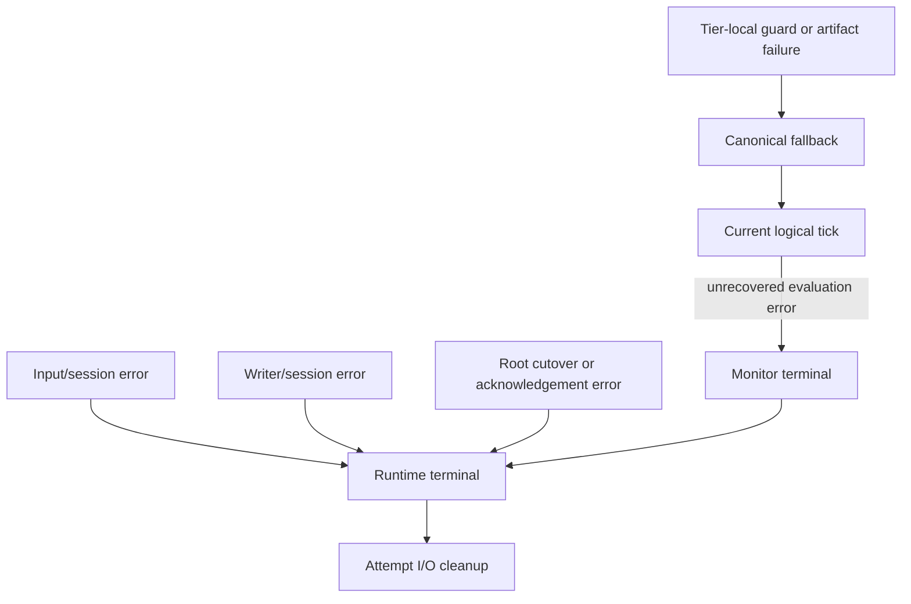

# Failure and termination

Failures are contained at different scopes. Recoverable execution-tier failures fall back within one tick; a canonical failure makes the `DataflowMonitor` terminal; input, output, cutover, or acknowledgement failures terminate the `DataflowRuntime` owner loop.

**Reading rule.** Downward movement widens the failed ownership scope. Cleanup releases or drains resources; it does not restore a failed monitor, undo external delivery, or roll back a partially applied cutover.

## Tier-local containment

A quickened kind mismatch, native guard miss, or recoverable artifact failure can materialize required state and continue through a canonical path. The logical stream still evaluates once and uses the common commit boundary.

If canonical evaluation returns an error, the tick fails. No output row or monitor-history entry is published for that tick, and the monitor records terminal failure. It rejects subsequent evaluations.

## Runtime data path

An input error stops further ticks. A monitor error discards output rows accumulated since the previous completed adapter flush. An output send, flush, or close error terminates the runtime. `OutputWriter` keeps the first operation error sticky while close continues through all stages and destinations.

Normal input end is not failure: the runtime sends a final non-empty partial batch, flushes, and closes. It does not create extra ticks to drain temporal operators.

## Root cutover

Planning failures occur before new resources or active monitor state are mutated, but the owner loop still terminates. Once application starts, failure may leave earlier steps applied:

| Failure point | Possible remaining effect |
|---|---|
| removed-source drain | input owners already detached |
| addition open | detached owners not restored; opened additions dropped |
| output flush/update | output session sticky-failed; earlier destination updates may remain |
| monitor preparation/application | I/O changes may already be active |
| destructive state movement | donor cannot be reconstructed by rollback |
| acknowledgement delivery | complete local cutover may already be active |

The runtime runs cleanup after such failure and does not resume processing from partial state.

## External containment

Output delivery has no transaction across destinations. One destination can observe a batch before another fails. Input composition has no total order across independent transports. A reconfiguration acknowledgement records local cutover completion, not remote producer quiescence or destination persistence.

## Separate semisynchronous boundary

The semisynchronous implementation ends the complete old generation before opening the replacement. Replacement input/output opening failures therefore occur after old-generation teardown and do not use the in-place dataflow acknowledgement/revision protocol.

## Implementation mapping

The implementation mapping spans `src/dataflow/error.rs`, `DataflowMonitor` evaluation, execution-tier outcome handling, `DataflowRuntime`, `InputStream` and `InputPipelineSession`, `OutputWriter` and `OutputPipelineSession`, and runtime integration tests.

Continue with the [implementation mapping](implementation-guide.md) for exact locations.
