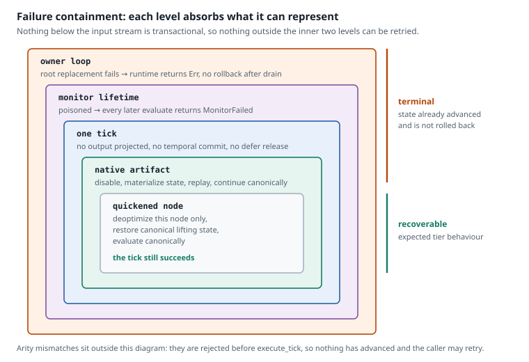

# Failure and termination

[← Previous: Context transfer](context-transfer.md) · [Next: Concept-to-code map](implementation-guide.md) →

The subsystem makes one simplifying choice about failure:

> **A failure that escapes a tick ends the monitor. A failure that escapes a replacement ends the runtime.**

That is the whole rule. This page covers what it buys and the one ordering detail that does not follow from it, then stops — the boundaries are not subtle enough to be worth enumerating on every page.

## The one distinction that matters

**What to notice.** The two innermost levels are not failures in the semantic sense at all — they are how the acceleration tiers stay honest, and the tick still succeeds. Everything outside them is terminal.

| Level | Trigger | Effect |
|---|---|---|
| Node | Quickened operand kind mismatch | Deoptimize that node, restore canonical lifting state, continue. |
| Artifact | Native presence failure, type mismatch, or checked-operation failure | Fall back with replay; type and checked failures disable the artifact permanently. |
| Call shape | Input or output slice length mismatch | Rejected before `execute_tick`; nothing advanced, so the caller may retry. |
| Tick | Any error escaping `execute_tick` | Monitor poisoned; every later `evaluate` returns `MonitorFailed`. |
| Replacement | Any failure in the root cutover | Owner loop terminates. |

Only the call-shape row is a real exception, and only because it is caught before any state moves.

## What the choice buys

Temporal writes are staged and become visible together at the commit boundary, so a failed tick commits none of them. If history were the only mutable state, the row could simply be dropped and evaluated again.

It is not. Streams advance as they run: by the time an error surfaces, lifting state, branch timelines, call evaluators, and active dynamic expressions may already hold values for the current row. Restoring them would mean copying the evaluator arena every tick, or recording every state change so it could be reversed. Both were refused on the hot path.

Ending the monitor instead keeps the machine small. There are no per-tick copies to make, no change log to maintain, no partially recovered state to define, and no rules about what a second attempt may observe. A failed tick has exactly one successor state, and it is the same one every time.

The costs are correspondingly narrow. Outputs are not projected, temporal writes are not committed, pending `defer` releases are not applied, and the monitor does not recover. A caller that needs to continue constructs a new monitor.

A runtime dependency cycle ends the monitor under the same rule even though it is detected before main-range execution, because the source range has already advanced.

## The ordering that is worth knowing

One operational detail does not follow from the rule and is easy to get wrong.

A terminating reconfigurable owner loop **drains its output first**. Before returning any error — malformed command, input-stream error, failed replacement, or a later output send failure — it submits pending `DirectDataflowEngine` rows where possible, then calls `OutputWriter::flush` and `OutputWriter::close` for the active generation.

The rows the old definition already computed are correct, and a later invalid command does not retroactively invalidate them. `terminate_after_output_drain` keeps the original error primary and attaches any flush or close failure as context. Rows already accepted by the writer are drained where the backend permits; rows still unsent in the engine buffer are not silently retried as a new generation.

A non-closed failure from `OutputWriter::send`, `flush`, or `close` is terminal. The writer retains its first operation failure, so later sends cannot turn a failed generation back into a successful one; cleanup still attempts the close path.

This is the boundary that governs the whole cutover sequence: **everything before the old writer drain can fail without discarding its interface; after the writer has been flushed and closed, the old interface is gone.** The drain is a runtime handoff barrier, not a promise that future remote transport publishes cannot fail. See [The reconfigurable runtime](reconfigurable-runtime.md#root-cutover).

## Two consequences, not two extra rules

- **Identity advances are checked.** `checked_next` on `RevisionId` and `InterfaceEpoch` returns `Option`; overflow terminates rather than reusing `u64::MAX`, which would let a stale replacement compare as current.
- **Revisions already advanced stay advanced.** If several nested bodies install before a later failure, `RevisionId` keeps recording what was installed. It is a history of installations, not a position to return to.

[← Previous: Context transfer](context-transfer.md) · [Next: Concept-to-code map](implementation-guide.md) →
