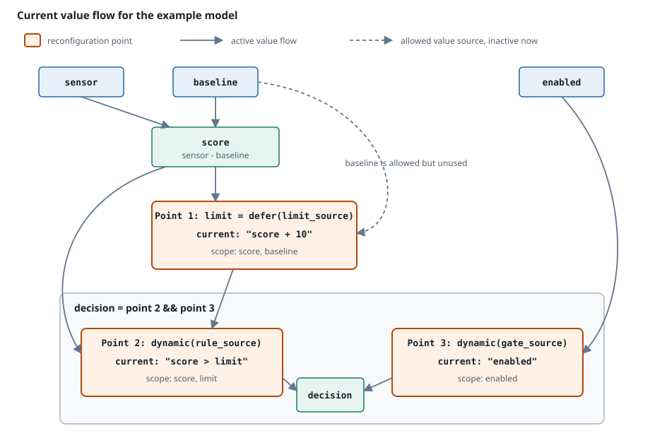

# Concept-to-code map

[← Previous: Failure and termination](failure-model.md)

The preceding pages describe the architecture. This one connects it to the source: which files implement each concept, a reading order for following one tick through them, and the properties that hold across the whole subsystem.

## Mental model

Keep five layers separate while reading or changing the runtime:

1. **Semantic program:** bound graphs, slots, operator effects, and canonical evaluator state.
2. **Dependency control:** static edges, runtime dynamic edges, source prerequisites, and the source/main split.
3. **Scheduled execution:** backend-neutral ordered plans and schedule-specific quickening steps.
4. **Physical acceleration:** compact scalar state and optional Cranelift artifacts with explicit fallback.
5. **Runtime orchestration:** asynchronous input acquisition, tick driving, output buffering, and — for the reconfigurable variant — replacement.

Most correctness bugs come from letting a lower layer silently redefine a higher one. In particular, plans do not own language state, scopes are not dependencies, and native temporal storage is only a physical representation of evaluator-owned history.

Layer 5 has the opposite failure mode: it must not redefine anything below it. Batching, buffering, windowing, and cutover change *when* work happens, never what a tick means.

## Concept-to-code map

### Compilation and semantic IR

| Concept | Primary files | Important types / functions |
|---|---|---|
| AST lowering and dynamic/defer nodes | `src/dataflow/compiler/lower.rs` | `lower_expression`, `lower_dynamic_expression`, `UnboundDynamicExpressionSpec` |
| Scope resolution, binding, nested restrictions | `src/dataflow/compiler/bind.rs` | `resolve_automatic_reconfigurable_scopes`, `restrict_reconfigurable_scopes`, `bind_graph`, `validate_persistent_function` |
| Compilation pipeline and static dependencies | `src/dataflow/compiler/pipeline.rs` | `DataflowProgram::{compile_checked, compile_untyped}`, `LoweredDataflow`, `NamedDependencies`, `build`, `into_program` |
| Bound graph and program semantics | `src/dataflow/ir.rs` | `EvaluationGraph`, `BoundEvaluationGraph`, `StreamOp`, `StreamProgram`, `ReconfigurableExpressionScope`, `ReconfigurableExpressionTyping`, `ReconfigurableExpressionKind`, `ScalarSignature` |
| Stable variable storage | `src/dataflow/environment.rs` | `EnvironmentLayout`, `EnvironmentSlot` |
| Compilation/evaluation failures | `src/dataflow/error.rs` | `DataflowCompilationError`, `DataflowEvaluationError` |

`EvaluationGraph` node order and `NodeId` identity are canonical. Optimizers may derive instructions or SSA, but they must continue to map results and state back to those identities.

### Monitor planning and dynamic control

| Concept | Primary file | Important types / functions |
|---|---|---|
| Stable stream IDs and slots | `src/dataflow/execution_plan.rs` | `StreamId`, `StreamSlots`, `StreamSet` |
| Static dependency graph | `src/dataflow/execution_plan.rs` | `DependencyGraph` |
| Source prerequisites and early-resolution validation | `src/dataflow/execution_plan.rs` | `ReconfigurableExpression`, `ExpressionSource`, `source_prerequisite_closure`, `ReconfigurableExpressionPlan::build` |
| `defer` sealing and prerequisite ownership | `src/dataflow/execution_plan.rs` | `ReconfigurableExpressionState`, `mark_deferred_activated`, `apply_pending_releases`, `source_user_refcounts`, `live_expression_refcounts` |
| Exact active dynamic edges and order repair | `src/dataflow/scheduler.rs` | `DynamicDependencyCollector`, `Scheduler`, `repair_scheduled_order`, `build_execution_schedule` |
| Tick orchestration | `src/dataflow/monitor/evaluation.rs`, `monitor/reconfiguration.rs` | `DataflowMonitor::evaluate`, `execute_tick`, `resolve_reconfigurable_expressions`, `apply_defer_sealing` |

`DataflowMonitor::execute_tick` is the best place to verify phase order. `ReconfigurableExpressionPlan` describes what can be resolved early; `ReconfigurableExpressionState` describes which expressions and prerequisite streams remain live; `Scheduler` merges static and active same-tick dependencies.

### Dynamic-expression state

| Concept | Primary file | Important types / functions |
|---|---|---|
| Runtime parse/type/scope/bind | `src/dataflow/execution/dynamic_expressions.rs` | `compile_dynamic_expression` |
| Activation and reconfiguration | `src/dataflow/execution/dynamic_expressions.rs` | `DynamicExpressionActivation`, `prepare_active_expression_with_change`, `update_active_expression_with_change` |
| Exact slot classification | `src/dataflow/execution/dynamic_expressions.rs` | `CompiledDynamicExpression::{nested_dependency_slots, nested_environment_slots, nested_history_requirements}` |
| Four-entry immutable template LRU | `src/dataflow/execution/evaluator_state.rs` | `DYNAMIC_EXPRESSION_CACHE_CAPACITY`, `DynamicExpressionState::cache_template`, `DynamicExpressionTemplate` |
| Fresh target and prepared donor transfer | `src/dataflow/execution/evaluator/reconfiguration.rs` | `PreparedNestedBodyTransfer`, `Evaluator::reconfigure_expression` |
| Retained environment merge | `src/dataflow/execution/evaluator_state.rs` | `DynamicExpressionState::update_environment` |
| Point resolution without evaluating the nested expression | `src/dataflow/execution/monitor_execution/reconfiguration.rs` | `validate_expression_location`, `expression_dependency_slots`, `reconfigure_expression` |

The important split is `free_vars` versus `same_tick_free_vars`: the first populates the nested environment, while the second controls outer stream ordering.

### Canonical state and temporal semantics

| Concept | Primary files | Important types / functions |
|---|---|---|
| Per-stream ownership and tier state | `src/dataflow/execution/evaluator.rs`, `src/dataflow/execution/evaluator/tier_states.rs` | `Evaluator`, `EvaluatorTierStates`, `Evaluator.tier_states`, `EvaluationEnvironment` |
| Node values and persistent state | `src/dataflow/execution/evaluator_state.rs` | `EvaluatorState`, `NodeState`, `DelayState`, `ScalarDelayState` |
| Named history ownership | `src/dataflow/history.rs` | `HistoryStore`, `HistoryAccess`, `ValueHistory` |
| Canonical evaluation | `src/dataflow/execution/evaluator/canonical.rs`, `src/dataflow/execution/interpreter.rs` | `evaluate_canonical_infallible`, `evaluate_nodes`, `try_evaluate_nodes`, `evaluate_node` |
| Stage/commit boundary | `src/dataflow/execution/interpreter.rs` | `stage_recursive_delays`, `commit_staged_temporal_state` |
| Retained top-level row | `src/dataflow/monitor.rs`, `src/dataflow/monitor/evaluation.rs` | `environment_values`, `retained_environment_values`, `load_reconfigurable_inputs` |

State must stay with evaluators and `HistoryStore`, not schedules. Nested schedule changes can replace a `PlanBundle`, while the monitor's evaluators, history bindings, and stable environment slots remain in place. A root reconfiguration creates a new monitor only for `InstallCold` or `Transfer`.

### Scheduled plans and quickening

| Concept | Primary file | Important types / functions |
|---|---|---|
| Backend-neutral plan contract | `src/dataflow/execution/scheduled_plan.rs` | `ScheduledExecutionPlan`, `PlanId`, `PlannedStream`, `PlanValueSlot`, `PlanStateSlot`, `PlanEffects`, `TemporalPlan` |
| Plan cache and range execution | `src/dataflow/execution/monitor_execution.rs`, `src/dataflow/execution/monitor_execution/plan.rs` | `MonitorExecution`, `ExecutionEngine`, `PlanBundle`, `select_schedule_ranges` |
| Quick step partitioning | `src/dataflow/execution/monitor_execution/plan.rs` | `QuickPlan`, `QuickStep::{ScalarRun, Graph}`, `PlanBundle::build_quick_range` |
| Quick instruction selection | `src/dataflow/execution/quickening/plan.rs` | `Plan`, `SingleScalarPlan`, `Instruction`, `Source` |
| Observed one-node specialization | `src/dataflow/execution/quickening/adaptive.rs` | `plan_from_observed_single` |
| Quick execution and per-node deopt | `src/dataflow/execution/quickening/interpreter.rs` | `execute_plan`, `execute_direct_scalar`, `deopt_single` |
| Compact values and state | `src/dataflow/execution/quickening/scalar.rs`, `state.rs` | `ScalarValue`, quickening `State`, quickening `NodeState`, `materialize_into`, `synchronize_from` |

A top-level evaluator's owned `quick_plan` is detached because `PlanBundle` owns schedule-specific published-source routing. Nested evaluators retain their `quick_plan` because they execute outside the monitor's `QuickStep`s. Unchecked infallible one-node graphs may derive a plan after their first concrete canonical row. Compact lifting state is initialized from canonical state, materialized before compatible transfer, and synchronized in the target after owner rewriting.

### Native execution and replay

| Concept | Primary file | Important types / functions |
|---|---|---|
| Tier selection and schedule-wide artifact ownership | `src/dataflow/execution/jit/coordinator.rs`, `jit/outcomes.rs` | `Jit`, `Activation`, `NativeExecution`, `FusedTickOutcome`, `GraphTickOutcome` |
| Evaluator-local per-stream native tier | `src/dataflow/execution/evaluator/tier_states.rs`, `src/dataflow/execution/jit/runtime.rs` | `EvaluatorTierStates::native`, `JittedGraphEvaluator` |
| Fused/per-stream runtime bridge | `src/dataflow/execution/jit/runtime.rs` | `JittedRunEvaluator`, `JittedTemporalRunEvaluator`, `JittedGraphEvaluator`, `NativeRunOutcome` |
| Temporal promotion and packed state | `src/dataflow/execution/jit/runtime.rs` | `NativeTemporalState::{promote, materialize}` |
| Scheduled scalar temporal operations | `src/dataflow/execution/jit/scheduled_state.rs` | `ScheduledTemporalPlan::{promote, evaluate, commit, materialize, deopt}` |
| Cranelift lowering and side-exit placement | `src/dataflow/execution/jit/backend.rs` | `Lowering::{lower_scalar, lower_temporal_run}`, `compile_run`, `compile_temporal_run`, `compile_scalar_graphs` |
| Whole-plan non-committing replay | `src/dataflow/execution/monitor_execution/tiers.rs` | `EvaluatorArena::replay_canonical`, `evaluate_canonical_run` |
| Per-stream replay | `src/dataflow/execution/jit/runtime.rs` | `fallback_current`, `replay_previous`, `evaluate_non_boundary` |

The JIT coordinator owns activation, execution-mode selection, fused scalar/temporal artifacts, and schedule-wide replay state. Each evaluator owns its optional per-stream `JittedGraphEvaluator` in `Evaluator.tier_states`. `MonitorExecution` sees only outcome enums and decides whether to return, replay, run canonically, or commit.

### Runtime orchestration and I/O

| Concept | Primary file | Important types / functions |
|---|---|---|
| Ordinary runtime and tick driver | `src/runtime/dataflow.rs` | `DataflowRuntime`, `DataflowRuntimeBuilder`, `run_direct_dataflow_engine`, `DirectDataflowEngine` |
| Input row assembly and packed output batches | `src/runtime/dataflow.rs` | `evaluate_tick`, `select_packed_layout`, `evaluate_packed_row`, `push_output_row`, `flush` |
| Flush policy and batch threshold | `src/runtime/dataflow.rs` | `ExecutionPolicy`, `DATAFLOW_RUNTIME_BATCH_SIZE`, `DirectDataflowEngine::flush` |
| Reconfigurable owner loop and cutover | `src/runtime/dataflow.rs` | `run_reconfigurable_dataflow`, `plan_runtime_reconfiguration`, `apply_runtime_reconfiguration`, `ActiveRuntime` |
| Output resolution and opening | `src/io/builders/output_backend_builder.rs`, `src/io/output/pipeline.rs`, `src/core/output.rs` | `OutputBackendBuilder`, `ResolvedOutput`, `OutputInterface`, `OutputBackendBuilder::{resolve, open, open_session}` |
| Output flush, replacement, and terminal cleanup | `src/runtime/dataflow.rs`, `src/runtime/output.rs` | `flush_reconfiguration_barrier`, `finish_dataflow_output`, `reconfiguration_failure`, `finish_writer`, `OutputWriter::{flush, close}` |
| Acknowledgement barrier | `src/runtime/dataflow.rs` | `ReconfigurationAck`, `ReconfigurationAckSink`, `acknowledge_reconfiguration` |
| Typed control items and input sessions | `src/io/reconfigurable_input.rs` | `ReconfigurableInputItem`, `ReconfigurableInput::open_session`, `InputPipelineSession`, `apply_barrier_stage` |
| Route resolution and single-source contract | `src/io/builders/input_stream_factory.rs` | `InputPipeline::resolve`, `resolve_reconfiguration_source`, `open_reconfigurable` |
| Window stages | `src/io/aggregation.rs` | `WindowEvent`, `drive_window`, `InputTimer` |
| Output backend construction | `src/io/builders/output_backend_builder.rs` | `OutputBackendBuilder`, `OutputPipeline`, `OutputDestination`, `try_build` |
| Runtime selection | `src/runtime/builder.rs`, `src/cli/args.rs` | `RuntimeSpec::{Dataflow, ReconfDataflow}`, `GeneralRuntimeBuilder::acknowledgements` |

The adapter owns no semantics. If a change here alters which values appear on an output stream or in what order, it is in the wrong layer.

### Replacement, transfer, and identity

| Concept | Primary file | Important types / functions |
|---|---|---|
| Shared reconfiguration identities | `src/dataflow/reconfiguration.rs` | `DefinitionKey`, `StreamStateKey`, and the `FingerprintBuilder` behind them |
| Semantic and interface history | `src/dataflow/reconfiguration.rs` | `MonitorRevision`, `InterfaceRevision`, `checked_next` |
| Monitor plan selection | `src/dataflow/monitor/reconfiguration.rs` | `MonitorReconfigurationPlan`, `DataflowMonitor::{plan_reconfiguration, apply_reconfiguration_plan, reconfigure}` |
| Program correspondence | `src/dataflow/reconfiguration_mapping.rs` | `ReconfigurationMapping`, `StreamMapping` |
| Prepared root context transfer | `src/dataflow/monitor/reconfiguration.rs` | `PreparedContextTransfer`, `prepare_context_transfer`, `context_transfer_from`, `ContextTransferReport` |
| Active-body outer binding | `src/dataflow/execution/environment_projection.rs` | `EnvironmentProjection`, `EnvironmentBinding` |
| Live bounded history | `src/dataflow/history.rs`, `src/dataflow/monitor/history.rs` | `HistoryStore`, `recompute_history_requirements`, `transfer_histories_from` |
| Nested-body transfer mechanics | `src/dataflow/execution/evaluator/reconfiguration.rs` | `reconfigure_expression`, `rewrite_exact_nested_from` |
| Transfer policy and reporting | `src/dataflow/reconfiguration.rs` | `ContextTransferPolicy`, `ContextTransferReport`, `StreamStateTransfer`, `StreamStateTransferOutcome` |
| Effective interface comparison | `src/runtime/dataflow.rs` | `plan_runtime_reconfiguration` compares the resolved active and target input/output plans. |

`plan_runtime_reconfiguration` creates the immutable-program monitor plan and the complete resolved input/output. `RetainExact` keeps the active monitor; `InstallCold` materializes a fresh monitor without monitor mapping; `Transfer` constructs `ReconfigurationMapping` before target construction and then performs the destructive `context_transfer_from` handoff.

## Reading the code

To follow one tick from semantics down to optimization:

0. **`src/runtime/dataflow.rs` module docs** — read the module header to see who calls the monitor, then skim `DirectDataflowEngine` to see what the adapter does and does not own.
1. **Architecture guide and `src/dataflow/mod.rs`** — read [the architecture overview](index.md) and [execution model](model.md), then use the concise module Rustdoc for the public API contract.
2. **`src/dataflow/monitor.rs`** then **`src/dataflow/monitor/evaluation.rs`** — inspect monitor ownership and construction first, then trace `evaluate` and `execute_tick`; write down the phase ordering.
3. **`src/dataflow/execution_plan.rs`** — inspect expression identities, source-prerequisite closure construction, and `ReconfigurableExpressionState` reference counts.
4. **`src/dataflow/scheduler.rs`** — follow an active dependency update through dirty detection and iterative topological repair.
5. **`src/dataflow/execution/dynamic_expressions.rs`**, **`environment_projection.rs`**, and **`evaluator_state.rs`** — follow source text through cache lookup, compilation, activation, fresh evaluator creation, projected outer binding, and retained-environment update.
6. **`src/dataflow/execution/scheduled_plan.rs`** — identify the backend-neutral contract and temporal state slots.
7. **`src/dataflow/execution/monitor_execution.rs`**, **`src/dataflow/execution/monitor_execution/tick.rs`**, **`plan.rs`**, then **`tiers.rs`** — inspect ownership, logical tick phases, derived quick plans, and finally quick/JIT routing and replay.
8. **`src/dataflow/execution/quickening/plan.rs`** then **`quickening/interpreter.rs`** — compare instruction selection with per-node deoptimization.
9. **`src/dataflow/execution/jit/coordinator.rs`** then **`jit/outcomes.rs`** — verify selection order, artifact invalidation, and the outcomes exposed to tier routing.
10. **`src/dataflow/execution/jit/runtime.rs`**, **`scheduled_state.rs`**, then **`backend.rs`** — trace promotion, native execution, side exits, replay, and generated commit placement.
11. **Collocated tests** plus `src/dataflow/tests.rs` — use differential and lifecycle tests to verify the inferred contract.
12. **`src/dataflow/reconfiguration.rs`**, **`src/dataflow/reconfiguration_mapping.rs`**, and **`src/dataflow/monitor/reconfiguration.rs`** — read stable identities and reporting, target-indexed correspondence, then the prepared destructive `context_transfer_from` handoff.
13. **`src/runtime/dataflow.rs` owner loop** — trace `plan_runtime_reconfiguration` and `apply_runtime_reconfiguration`, noting that resource-free planning precedes pending-row submission, and that the concrete input/output plans update only the resources they own.

Shorter routes: steps 2–7 cover `dynamic` and `defer`; steps 6–10 cover fused replay and the temporal JIT; steps 0, 2, 12, and 13 cover reconfiguration.

## Verification architecture

Tests in this subsystem are organised around the fact that canonical execution is the oracle for everything else.

| Test group | Location | Verifies |
|---|---|---|
| Differential compilation proptest | `src/dataflow/tests.rs` | Untyped, checked, recompiled, and stream-augmented monitors produce identical `(ok, output)` traces for the same generated rows, and both arity mismatches are reported before state advances. |
| Collocated tier tests | alongside each execution module | Quickened and native results match canonical results for the same programs and state progression. |
| Lifecycle tests | `src/dataflow/tests.rs` | Activation, replacement, template-cache reuse, `defer` sealing, and post-release schedule changes. |
| Reconfigurable dataflow tests | `src/runtime/dataflow.rs` tests | Focused coverage includes strict nested-transfer rejection and replacement behavior, including inheritance of the quickening setting. |
| Builder/manual transport tests | `tests/runtime_tests.rs` | Cover reconfigurable dataflow construction and the acknowledgement barrier, especially `test_general_builder_constructs_reconf_dataflow_for_supported_semantics`. |
| Transport integration tests | `tests/` | MQTT, ROS, Redis, and CLI behaviour against real transports, behind their features. |

These are focused tests rather than a reusable reconfiguration harness. The builder test uses manual transports and waits for a `ReconfigurationAck` before sending the next data row, exercising the producer acknowledgement barrier directly.

When adding a tier or an orchestration path, prefer extending the differential tests over writing a bespoke expected-output test. A hand-written expectation records what the new path does; a differential test records that it agrees with the oracle.

## Load-bearing invariants

Most of the detail in this guide follows from eight properties. If a change breaks one of these, it breaks the model rather than one path through it.

**Identity.** Every logical stream has one stable `StreamId`, one environment output slot, and one persistent evaluator. `NodeId` indexes the matching operation, value, and state. Semantic plans, quick plans, and compiled artifacts own no canonical language state, so a schedule-cache hit or rebuild cannot reset it.

**Dependency order.** Static and active dynamic same-tick dependencies both order producer before consumer. A historical read creates no same-tick edge.

**One evaluation per stream.** Source and main ranges are disjoint and cover every logical stream exactly once. Reconfiguration resolves between them, after source publication and before any main-range state advances.

**One commit per row.** Evaluation reads only history committed before the current tick. Ordinary and recursive writes stage until the shared commit boundary, which a failed tick never reaches — unless a complete native artifact implements that same boundary internally.

**The two slot sets.** `environment_slots` holds all free variables; `dependency_slots` holds exactly the same-tick ones. The first populates a nested environment, the second orders outer streams. Conflating them either under-orders the schedule or over-approximates it.

**Tiers are unobservable.** `NoVal`, `Deferred`, lifting, and output publication agree across canonical, quickened, and native execution. Compact lifting state is seeded from canonical owners and materialized before it is discarded or rewritten; canonical state is complete before canonical execution resumes. Replay of an already successful native row neither stages nor commits its temporal writes again.

**One tick in, one row out.** One logical input tick produces exactly one `evaluate` call. A successful evaluation contributes exactly one value to every output stream; a failed one contributes to none. Flush policy changes timing only.

**One live definition.** The reconfigurable owner loop holds one monitor, one `InputPipelineSession`, and one `OutputPipelineSession`; the reusable `InputPipeline` and `OutputBackendBuilder` are configuration. Pure resolution creates owned candidate plans first. The input plan reopens a changed source, while the output plan flushes and updates only changed existing destination owners. Unsupported updates terminate the owner loop rather than triggering a hidden replacement.

## Continue reading

- [Execution model](model.md) for ticks, dependency order, environments, and stable evaluator identity.
- [Temporal state](temporal-state.md) for staging, commit, history ownership, and delay semantics.
- [Language state](language-state.md) for conditionals, functions, captures, calls, and recursion.
- [Dynamic properties](dynamic-properties.md) for activation, exact dependencies, template caching, sealing, and retained values.
- [Execution tiers](execution-tiers.md) for `PlanBundle`, quickening, JIT selection, artifact lifetime, temporal promotion, and replay.
- [Runtime adapter](runtime-adapter.md) for tick driving, packed output batches, writer backpressure, and shutdown.
- [Input and output boundary](runtime-io.md) for input sessions, resolved output interfaces, request-specific writers, and the flush/close handoff barrier.
- [The reconfigurable runtime](reconfigurable-runtime.md) for the owner loop and root cutover.
- [The replacement contract](replacement-contract.md) and [Context transfer](context-transfer.md) for safe activation points and surviving state.
- [Failure and termination](failure-model.md) for the containment ladder shared by every layer.

[← Previous: Failure and termination](failure-model.md)
