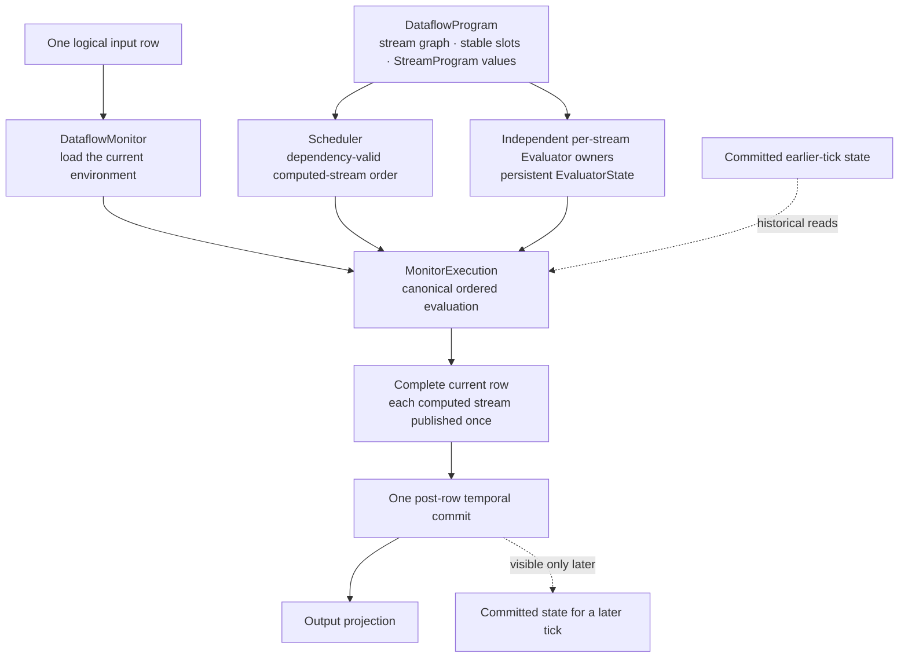
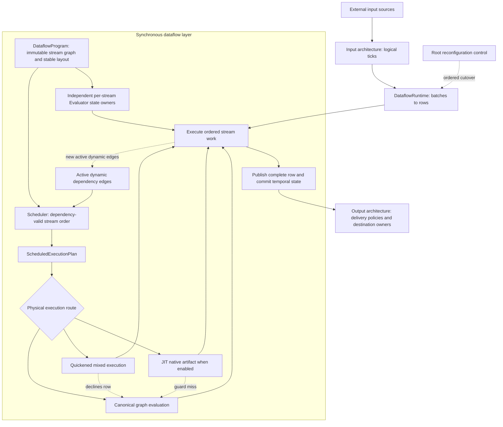

# Dataflow architecture

The dataflow layer gives DSRV stream equations their synchronous execution model. Its organising model follows the synchronous dataflow tradition exemplified by Lustre: equations define streams, current data dependencies form a graph, and one logical tick evaluates that graph in a dependency-valid order before state becomes visible to the next tick ([Halbwachs et al., 1991](https://doi.org/10.1109/5.97300)). DSRV adds sparse/special values, runtime-defined properties, and live replacement to that foundation.

## Layer responsibility

A **dataflow graph** is a directed graph of computed streams. Each node is one stream equation; a current edge `a → b` means that `b` needs `a`'s value from the same logical tick. Current edges determine execution order and must be acyclic. A positive historical read such as `a[1]` observes committed state from an earlier tick, so it crosses time rather than adding a current graph edge.

The layer compiles that graph once, schedules its currently active edges, evaluates each computed stream through an independent persistent state owner, commits temporal effects once, and projects one complete output row. It does not own input transports, output destinations, or asynchronous driving; `DataflowRuntime` adapts those external concerns to the synchronous row interface.

## Canonical execution

The canonical view removes asynchronous adapters, runtime-defined dependency changes, execution-tier selection, and root replacement. It shows the synchronous machine that those mechanisms must preserve.



**Reading rule.** Solid arrows are the canonical path through one logical tick. Inputs are loaded before scheduled work and are not computed-stream schedule entries. The evaluator-owner node is separate from `Scheduler` because persistent language state does not belong to an order position. Dashed arrows cross tick boundaries: only committed state can satisfy a later historical read.

## Full dataflow architecture

The full view restores the surrounding runtime, active dynamic dependencies, replaceable quickened and native routes, accelerator fallback, and root reconfiguration control. Each added path remains constrained by the canonical model above.



**Reading rule.** Solid arrows show graph definition, scheduling, alternative physical routes, evaluation, and complete-row flow. The evaluator-owner node is separate from the schedule because language state does not move when order or execution tier changes. Dashed edges show dynamic schedule feedback, the two different ways work returns to canonical semantics, and root control rather than ordinary row data. The quickened route has no mid-execution escape: a region checks its inputs and declines the whole row before running any of it, so canonical evaluation is the only thing that ever partially executes.

## Organising concepts

| Concept | Meaning in this layer | Rust names and deeper explanation |
|---|---|---|
| dataflow graph | Computed streams are nodes; producer-to-consumer current dependencies are directed edges. Historical reads are retained state across ticks, not current edges. | `DataflowProgram`, `StreamProgram`; [execution model](model.md) and [compilation](compilation.md) |
| scheduling | Convert the active current-dependency graph into an order where every producer runs before its consumers. Runtime-defined expressions may change active edges and require repair. | `Scheduler`, `ScheduledExecutionPlan`; [scheduling](scheduling.md) |
| independent stream evaluators | Each computed stream has its own `Evaluator` and persistent operation state, keyed by stable stream identity rather than schedule position. | `MonitorExecution`, `Evaluator`; [runtime ownership](runtime-ownership.md), [temporal state](temporal-state.md), and [language state](language-state.md) |
| canonical execution | The graph interpreter and evaluator state define language meaning, special values, errors, publication, and temporal commit. | `DataflowMonitor`, `EvaluatorState`; [tick execution](tick-execution.md) |
| scalar regions | Compilation records a scalar signature for every eligible node, so region boundaries are decided from checked types rather than discovered by observing values. | `ScalarProgram`, `ScalarRegion`; [scalar IR and regions](scalar-ir.md) |
| execution tiers | Canonical, quickened, and native execution are alternative routes over those regions. Exactly one of them owns a region's state at a time. | `ExecutionPlan`, `QuickenedRegionState`, `RegionAuthority`; [execution tiers](execution-tiers.md) |
| JIT tier | When enabled, guarded native artifacts accelerate eligible scheduled work while retaining canonical fallback and the same state/commit contract. | JIT coordinator and artifacts; [execution tiers](execution-tiers.md) |

## Principal entities

| Entity | Responsibility |
|---|---|
| input pipeline (`InputPipeline`) | Resolves model variables to source owners and delivers ordered logical ticks without exposing transport configuration to evaluation. |
| runtime adapter (`DataflowRuntime`; direct row engine `DirectDataflowEngine`) | Converts asynchronous `InputBatch` values into synchronous rows and submits complete `OutputBatch` rows under writer backpressure. |
| compiled monitor (`DataflowMonitor`) | Owns the current row, compiled definition, scheduler, evaluator execution, history, and the common temporal commit boundary. |
| compiled definition (`DataflowProgram`) | Holds immutable stream programs, environment layout, monitor plan, output projection, and semantic identity produced by compilation. |
| evaluator execution (`MonitorExecution`) | Owns persistent evaluator instances and replaceable canonical, quickened, or native execution routes. |
| output pipeline (`OutputPipeline`) | Preserves logical output ticks while selecting, routing, and delivering values to opened destination owners under per-destination delivery policies. |
| reconfigurable runtime (`DataflowRuntime`, configured by `ReconfigurableDataflowRuntimeBuilder`) | Serializes data evaluation and ordered replacement across persistent input, monitor, and output owners. |

A compiled monitor does not own transports or drive itself. Input and output batching may change physical granularity, but it must not add, merge, or reorder logical ticks unless an explicit input reduction says so.

## Cross-cutting invariants

Every execution route preserves these facts:

1. one successful monitor call is one logical tick;
2. current dependencies are evaluated before their consumers;
3. historical reads observe only previously committed ticks;
4. each computed stream publishes once to a stable row location;
5. temporal writes become historical only at the common post-row commit;
6. persistent language state belongs to stable evaluator identities, not schedule positions;
7. a failed tick publishes no output row and commits no monitor history;
8. optimization may replace routing, never the semantic authority of the canonical program and state.

## The running example

The guide reuses one specification throughout its conceptual pages:

```dsrv
in x: Int
out alert: Bool
out total: Int
out scaled: Int
alert  = total > 20
total  = default(total[1], 0) + scaled
scaled = x * 2
```

For `x = 4`, the monitor evaluates `scaled = 8`, then `total = 8`, then `alert = false`. After the row is complete, `total = 8` becomes available to `total[1]` on the next tick. The [execution model](model.md) traces this scenario in detail.

## Progressive reading path

Each group below refines the one before it and contradicts none of them. Stopping at the end of any group leaves a correct model, not a partial one — the later groups add mechanism, never revise meaning.

### Canonical semantics

1. [Execution model](model.md) defines rows, absence, dependencies, and the running trace.
2. [Compilation](compilation.md) explains how equations become immutable programs and plans.
3. [Runtime ownership](runtime-ownership.md) separates immutable meaning, persistent state, mutable order, and replaceable routing.
4. [Scheduling](scheduling.md) explains how fixed and active dependencies become source and main execution orders.
5. [Tick execution](tick-execution.md) establishes phase order and the common commit boundary.

*Stop here and you can predict what any tick produces.*

### Stateful language mechanisms

6. [Temporal state](temporal-state.md) explains staging, delay rings, and next-tick visibility — and why the commit boundary must exist at all.
7. [Language state](language-state.md) covers lifting, conditionals, functions, and recursive frames.
8. [Dynamic properties](dynamic-properties.md) covers nested expression activation and exact active dependency discovery.

*Stop here and you understand everything the language guarantees.*

### Physical execution

9. [Fusion and regions](fusion.md) motivates the second representation, shows what the schedule contributes, and defines the two region scopes.
10. [The scalar IR](scalar-ir.md) defines the representation every region is expressed in.
11. [Execution tiers](execution-tiers.md) places quickening and native execution over the canonical machine, and states who owns a region's state.
12. [Typed monitors](typed-monitors.md) covers the caller-side path that removes `Value` from the boundary.

*Everything in this group is routing. None of it changes what a tick means.*

### External ownership

13. [Runtime adapter](runtime-adapter.md) connects asynchronous input batches to synchronous rows.
14. [Input and output sessions](runtime-io.md) defines live transport ownership.

### Replacement and containment

15. [Root cutover](reconfigurable-runtime.md), [replacement identity](replacement-contract.md), and [context transfer](context-transfer.md) explain live replacement.
15. [Failure and termination](failure-model.md) states containment and resulting runtime state.
16. [Implementation mapping](implementation-guide.md) maps these concepts and entities to source and tests.

## Nested activation and root replacement

The word reconfiguration covers two distinct mechanisms.

**Nested expression activation** is `dynamic` and `defer`. It happens *inside* one tick, at the source barrier, to one node of one stream. It compiles a body from a string, may change which same-tick edges are active, and is governed by the enclosing monitor's own evaluation. It is explained in [dynamic properties](dynamic-properties.md).

**Root monitor replacement** swaps the whole compiled definition. It happens *between* ticks, is driven by a control request through the runtime, is serial rather than atomic, and can leave named partial states if it fails part-way. It is explained in [root cutover](reconfigurable-runtime.md) and [context transfer](context-transfer.md).

Both install something compiled at runtime. They differ in trigger, granularity, failure model, and the lifetime of the state involved.

The separate [input architecture](../../input-architecture.md), [output architecture](../../output.md), and [reconfiguration overview](../../reconfiguration.md) place the synchronous machine in the wider runtime.

## Reference

N. Halbwachs, P. Caspi, P. Raymond, and D. Pilaud, “The Synchronous Data Flow Programming Language LUSTRE,” *Proceedings of the IEEE*, 79(9), 1305–1320, 1991. [doi:10.1109/5.97300](https://doi.org/10.1109/5.97300).

D. Biernacki, J.-L. Colaço, G. Hamon, and M. Pouzet, “Clock-Directed Modular Code Generation for Synchronous Data-Flow Languages,” *LCTES*, 2008.
