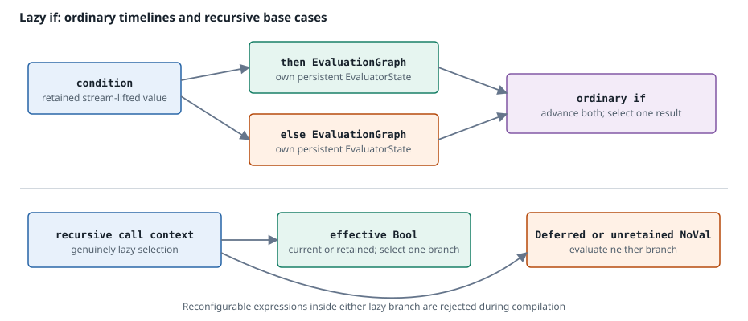

# Language state

[← Previous: Temporal state](temporal-state.md) · [Next: Dynamic properties](dynamic-properties.md) →

Some language constructs need state even when they do not look like explicit history operators. Conditionals preserve independent branch timelines, functions separate immutable definitions from call-site evaluators, and recursion requires per-invocation frames.

This page begins with those semantic ownership rules and then maps them to the evaluator. See [Dataflow execution model](model.md) for ticks, dependencies, and stable identities, and [Temporal state](temporal-state.md) for staging and commit.

## Conditional selection and branch timelines

An `if` has three conceptual parts: a condition evaluated in the enclosing expression, a then-program, and an else-program. The alternatives are separate programs rather than eager operands of an ordinary operation. This makes selection lazy at the value level and gives each branch an independent state timeline.

For ordinary stream evaluation, however, “lazy” does **not** mean “run only the selected branch.” Whenever the enclosing stream advances, both branches advance. Each branch retains its own operation state and output, and temporal commit descends into both branch states. Advancing both sides keeps delays and other state aligned with outer ticks, so changing the condition does not resume a branch whose history silently stopped while it was unselected.

After branch-local sparse lifting:

- `true` selects the then-value;
- `false` selects the else-value;
- an effective `Deferred` or `NoVal` condition propagates that special value;
- `NoVal` from either branch makes the whole conditional `NoVal`; and
- `Deferred` from the unselected branch does not block a known selected result.

The condition itself and each branch output have independent last-value state for sparse lifting.

Dependencies are conservative. Compilation includes the statically visible dependencies of both branch programs, regardless of which branch a particular tick selects. The scheduler can therefore evaluate either branch without changing the stream order after the condition is known.

### The recursive exception

Direct recursive function evaluation needs genuine control-flow laziness: a base case must return without entering the recursive branch. When a conditional executes in a recursive-call context, only the Boolean-selected branch runs. If the effective condition is `Deferred` or `NoVal`, neither branch runs and that special value is returned.

This exception is safe because recursive frames are per-invocation and temporal operators are forbidden in recursive bodies. There is no inactive branch history that must remain aligned across monitor ticks.

## Functions separate definition, capture, and invocation

A function's expression program is immutable and may be shared, but its values and temporal state cannot be shared indiscriminately. The runtime separates three concerns:

1. **Definition identity.** A function value identifies one compiled definition. Stable identity lets an application decide whether an existing callable instance can be reused.
2. **Captures.** Free variables are resolved to locations in the enclosing environment. Their current values are refreshed when the function node or direct call is evaluated.
3. **Invocation state.** A call site owns the evaluator needed to retain lifting and temporal state across ticks. Independent call sites therefore do not accidentally share delay rings.

During binding, parameters are removed from the body's free-variable set. The remaining names become captures, resolved once to outer environment locations. The function body receives a compact local environment with captures first and parameters second.

Captures are by current value at evaluation time, not a snapshot frozen when the monitor was compiled. A function node refreshes its shared capture vector from the current outer row. Every recursive call made from one outer application sees the captures selected for that application.

## Call forms and evaluator ownership

The syntax shape determines who owns state:

| Call form | Evaluator ownership | Stateful body support |
| :-------- | :------------------ | :-------------------- |
| Directly called literal lambda | The call node owns one persistent nested evaluator and a captures-plus-parameters row. | Ordinary temporal operators are supported. Writes are staged and reached by the enclosing monitor's commit traversal. |
| General application of a function value | The application retains the active function definition and, when required, one instantiated callable/evaluator while that definition remains unchanged. | Temporal function bodies are supported at a stable call site. Changing function definition replaces the callable state. |
| Directly applied `fix` lambda | The outer application creates a recursive-call context with resettable frames for active recursion depths. | Temporal operators are not supported. |
| Partial application or `List.map`, `List.filter`, `List.fold` callback | Invocation is one-shot or collection-driven rather than one persistent tick per call site. | Temporal functions are rejected. |

A direct literal call can be lowered specially because the callee program is known. Its nested evaluator is part of the enclosing node state, so it evaluates and stages now, then receives the common outer commit later.

A general `Apply` stream-lifts the function and each argument. `NoVal` or `Deferred` propagates before invocation as appropriate. The call node compares function-definition identity: equal definitions reuse the active callable and its evaluator; a different definition instantiates a fresh callable. This is the state boundary for data-dependent higher-order calls.

Immutable programs can therefore be shared safely while mutable language state remains evaluator-local. Program sharing is not evaluator sharing.

## Recursion is deliberately narrow

The compiler recognizes a directly applied `fix` lambda and rewrites self calls into an explicit recursive-call operation. At runtime the outer recursive application:

- captures the current outer values once;
- creates or reuses a frame for each active recursion depth;
- resets that frame before the invocation;
- fills its parameter locations; and
- supplies a private callback used only by rewritten self calls.

Frames are returned to a pool after use, but reset removes per-invocation node values and lifting state. They do not define a timeline across monitor ticks.

All temporal operators are rejected in a directly recursive body. This includes delays and stateful temporal combinators as well as `dynamic` and `defer`. Without that restriction, it would be ambiguous whether state belonged to recursion depth, call occurrence, or outer tick, and selected-branch-only evaluation could skip required commits.

Do not confuse function recursion with guarded stream feedback. A stream may refer to its own earlier output through a positive delay; binding converts that case to a recursive delay with monitor-tick lifetime. Direct or zero-delay stream self-reference remains illegal. See [Temporal state](temporal-state.md#recursive-delay).

Other first-class uses of `fix` go through the general runtime-function representation; they do not acquire the specialized recursive frame and branch semantics of a directly applied fix lambda.

## Where `dynamic` and `defer` are unsupported

Runtime-defined expressions are fallible: parsing, type checking, scope validation, binding, and dependency repair can fail. The current evaluator supports that fallibility only at monitor-managed reconfiguration points where dependencies can be resolved before affected stateful execution.

As a result, `dynamic` and `defer` are intentionally rejected or unsupported in these locations:

| Location | Reason |
| :------- | :----- |
| Either branch of an `if` | A reconfiguration point cannot be hidden behind nested branch state. Dependencies must be resolved before branch evaluation, and ordinary conditionals advance both branches. |
| Persistent function body, including direct literal calls and first-class temporal functions | Nested function execution does not expose the runtime-compilation failure path required by reconfiguration. |
| Direct recursive function body | Recursive bodies reject every temporal operator; recursive frames are reset per invocation. |
| Partial application and collection callbacks | These forms reject temporal functions generally because they do not provide stable per-call-site evaluator ownership. |
| An expression activated by an outer `dynamic` or `defer` | Nested reconfiguration is detected after runtime compilation and returns `UnsupportedNestedReconfiguration`. |

There are also placement constraints on supported top-level reconfiguration points:

- the expression source must be a constant or an outer environment value, not a node-local intermediate result;
- any computed streams needed to produce a source must be infallible and contain no reconfiguration point; and
- active runtime dependencies must remain acyclic.

These restrictions allow the monitor to evaluate source prerequisites once, resolve every active definition and dependency, repair the schedule, and only then advance the main stream state. See [Static structure and dynamic scheduling](model.md#static-structure-and-dynamic-scheduling) for the outer graph model.

## Implementation mapping

| Concept | Implementation |
| :------ | :------------- |
| Separate branch programs | `StreamOp::If` contains two nested `EvaluationGraph` values; the condition remains in the enclosing graph. |
| Persistent branch timelines | `NodeState::LazyIf` owns `then_state`, `else_state`, the last condition, and retained outputs for both branches. |
| Ordinary branch advancement | `evaluate_lazy_if` evaluates both branches, then selects the result. Commit recursively visits both states. |
| Recursive control flow | An `EvaluationContext` carrying a recursive callback makes `evaluate_lazy_if` evaluate only the selected branch. |
| Bound function definition | `StreamFunction` contains a shared `StreamProgram`, parameters, display text, and outer `capture_slots`. |
| Runtime function value | `NodeState::Function` retains stable function identity and a shared capture vector refreshed from the current environment. |
| General call site | `NodeState::CallLift` retains lifted operands, active function identity, and an optional instantiated callable. |
| Direct persistent call | `NodeState::PersistentCall` owns a nested `StreamEvaluator`, local environment values, and lifted arguments. |
| Direct recursion | The `StreamOp::RecursiveApply` and `StreamOp::RecursiveCall` operations, the private `functions::RecursiveCall` dispatcher, and pooled resettable `CallFrame` values implement the specialized path. |
| Reconfiguration restrictions | Binding validation rejects unsupported temporal function contexts; monitor-plan validation requires early dependency resolution; runtime activation rejects nested reconfiguration. |

[← Previous: Temporal state](temporal-state.md) · [Next: Dynamic properties](dynamic-properties.md) →
