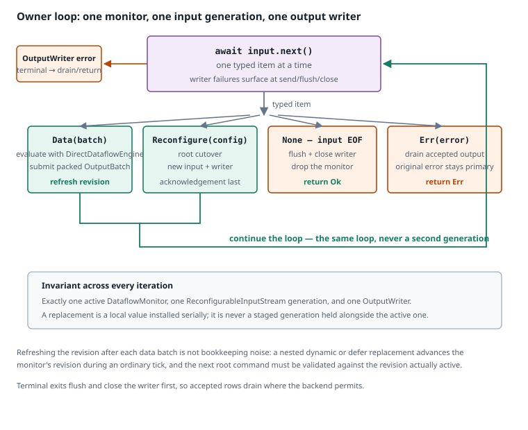
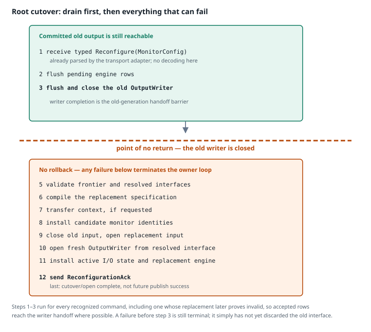

# The reconfigurable runtime

[← Previous: Input and output boundary](runtime-io.md) · [Next: The replacement contract](replacement-contract.md) →

The reconfigurable dataflow runtime uses the same adapter as the ordinary one — the same `DirectDataflowEngine`, packed `OutputBatch` path, and `OutputWriter` backpressure — and adds one thing: the ability to replace the running definition, its inputs, and its outputs without restarting the process.

It does this with a **single persistent owner loop** that holds one definition, input generation, and output writer at a time and swaps them in place. Understanding that shape is most of understanding the design.

## Ownership

```text
one owner loop
  ├─ one active DataflowMonitor
  ├─ one active ReconfigurableInputStream generation
  └─ one active OutputWriter for that generation
```

A replacement monitor is compiled into a **local value**, because dense evaluator layouts are definition-specific and cannot be built against an interface that does not exist yet. The candidate output is likewise resolved locally; `OutputBackendBuilder::open` creates a fresh writer only after the old writer has been drained. The candidate values are installed at one cutover point, and dropped if any step fails.

`RuntimeSpec::ReconfDataflow(policy)` selects this implementation and carries its selected `ExecutionPolicy`. `RuntimeSpec::ReconfSemiSync` is a separate supported implementation in `src/runtime/reconfigurable_semi_sync.rs`; it shares neither this evaluator nor this owner-loop failure policy, and the two should not be reasoned about together.

## The loop



**What to notice.** Only the data and reconfigure paths continue the loop. Both terminal input exits drain the current writer before returning, and any output send/flush/close failure is terminal. The loop itself never restarts: a root cutover replaces the engine, input generation, and output writer in place rather than entering a second generation loop.

Each iteration awaits the next typed input item:

```text
item = input.next() => …
```

The item then dispatches four ways:

| Item | Action |
|---|---|
| `Data(batch)` | Evaluate the batch with `DirectDataflowEngine`, submit packed output according to policy, then refresh `state.revision` from the monitor. |
| `Reconfigure(config)` | Perform a root cutover; the loop continues with a new engine, input generation, and output writer. |
| `None` (EOF) | Flush and close the current writer, then return `Ok`. |
| `Err(error)` | Attempt to drain committed output with writer flush/close, then return the input error. |

Output failures surface when the engine submits a packed batch or when the writer is flushed or closed. They are not recoverable by retrying a later input item: the writer retains its failure and the owner terminates, while cleanup drains already-accepted rows where possible.

Refreshing `state.revision` after each data batch is not bookkeeping noise. A *nested* `dynamic` or `defer` replacement advances the monitor's revision during an ordinary tick, and the owner's copy must track it so the next root command is validated against the revision that is genuinely active. See [The replacement contract](replacement-contract.md#identity-accounting).

## Root cutover



**What to notice.** Draining the old writer comes first, before validation, compilation, or transfer. Everything above that line can fail without discarding the old interface; below it, the old writer has been flushed and closed and the owner cannot roll back to it.

For every typed `Reconfigure(MonitorConfig)` item — including one whose replacement later turns out to be invalid — the owner performs:

```text
typed Reconfigure(MonitorConfig)
→ submit pending rows as one packed `OutputBatch`
→ flush and close the old `OutputWriter`     ══ point of no return ══
→ validate the replacement frontier and config-derived interfaces
→ compile the replacement specification
→ transfer context, if requested
→ install candidate monitor identities
→ close and drop the old input generation
→ open the replacement input generation
→ open a fresh writer from the resolved output interface
→ install active input/output state and the replacement engine
→ send acknowledgement
```

### Why drain comes first

Placing the drain before validation looks backwards — surely an invalid command should be rejected before disturbing anything?

The rows the old definition already computed are correct, and a later invalid command does not retroactively invalidate them. If validation came first and failed, the owner would terminate with those rows still buffered in the engine or writer, discarding work that was legitimately produced. Draining first submits pending packed rows and completes the old writer's `flush`/`close` handoff before any replacement step. The cost is where that puts the boundary: after the drain, the old external interface is gone, so a later failure has nothing to continue with and ends the loop.

### Ordering details that are not incidental

- **The old input generation is dropped before the replacement input is opened**, even when the effective input interface is unchanged. Every reconfiguration stream terminates after yielding its control item, so it must be closed regardless. There is exactly one active subscription at a time and no old/candidate overlap.
- **The replacement output is resolved before opening and opened as a fresh writer.** `OutputBackendBuilder::resolve` is pure; `open` validates the resolved structure, opens each destination, applies stages, and closes partial opens on failure.
- **The acknowledgement is last.** It reports identities and input/output state that are already installed and confirms cutover/open completion. It does not promise that a future writer send or remote transport publish cannot fail. Library callers may receive it through the in-process sink; CLI deployments must coordinate through their source/backend-specific external controller, because the CLI does not define a network acknowledgement protocol.
- **No decoding happens in the owner loop.** The `MonitorConfig` was parsed by the transport adapter before the item was yielded.

Every step below the writer drain can fail, and all of them terminate the loop; rows already accepted by the old writer have been drained where possible by the completed flush/close path.

## Nested replacement

Root replacement swaps the whole machine at a tick boundary. Nested `dynamic`/`defer` replacement swaps one expression body **inside** a tick, at the source barrier, while the surrounding monitor keeps running.

The local order is:

```text
unchanged fast path
→ compile local body
→ transfer from old donor
→ install body once
→ update dependencies and schedule
→ advance RevisionId
```

Three properties of this ordering matter:

1. **The unchanged check comes first**, and the old active body is taken only after it. An unchanged source keeps its active evaluator and its history; nothing is cloned.
2. **Transfer precedes installation.** A strict transfer failure returns an error before the new body is visible. A compatible transfer keeps safe semantic cells and leaves incompatible cells cold. The first `defer` activation has no donor at all.
3. **Only the body is built; the arena, scheduler, and control-state tree are used in place.** The same shape as the root path, at a smaller scope.

Sealing and source release remain after the successful temporal commit, as described in [Tick execution](tick-execution.md#why-defer-release-is-post-tick).

A nested replacement, dependency, schedule, or evaluation error poisons the monitor like any other tick failure, returning the specific first error.

## What reconfigurability costs

Being reconfigurable is not free, but the costs are confined to ticks that actually use the capability:

| Cost | When it applies |
|---|---|
| Retained environment row | Allocated for every reconfigurable monitor. |
| Current-row clear to `NoVal` each tick | Every reconfigurable tick. |
| Source range and resolution barrier | Only while live points still need computed prerequisites. |
| Whole-plan fused JIT blocked | Only while a non-empty source barrier exists. |
| Compilation, transfer, schedule repair | Only on a tick where a source actually changes. |

Stable static and dynamic ticks retain their allocation-free fast paths. Unchanged dynamic ticks and sealed `defer` ticks clone no evaluators and no schedulers. And once every `defer` has sealed and released its prerequisites, the source range can become empty — at which point the plan has no barrier and JIT selection may promote the monitor to a fused artifact, as covered in [Execution tiers](execution-tiers.md#the-source-barrier).

## Packed output batches carry no generation fence

Packed `OutputBatch` values are not revision-filtered and carry no root-generation fence.

This is deliberate. A fence would let a nested change drop its own successfully evaluated row — the row was computed under a valid plan and committed; the fact that a revision advanced during the same tick does not make the packed batch stale.

## Transport support

| Transport | Reconfigurable? |
|---|---|
| Manual | Yes |
| MQTT | Yes, subject to feature and connection setup |
| ROS | Yes, subject to feature and connection setup |
| Redis Pub/Sub | Yes; Redis *knowledge* sources cannot carry control |
| File | **No** |

File input is not reconfigurable because reopening it would restart the file session from the beginning, replaying rows the old definition already consumed.

Global ordering across independent MQTT topics still requires an external controller: the single-source contract gives source-local ordering, not a cross-transport total order. See [Input and output boundary](runtime-io.md#one-source-one-order).

[← Previous: Input and output boundary](runtime-io.md) · [Next: The replacement contract](replacement-contract.md) →
