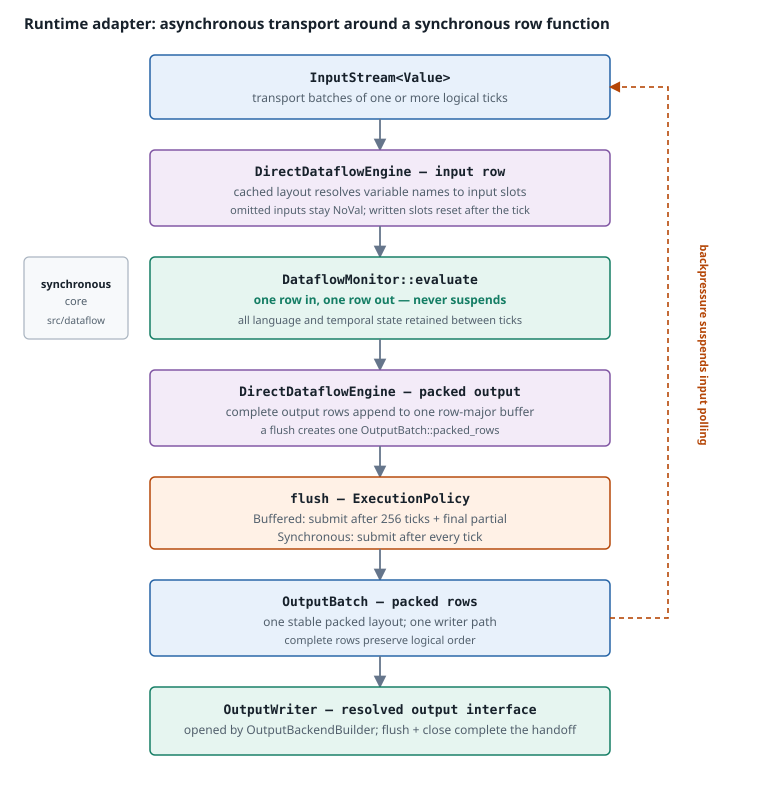

# The dataflow runtime adapter

[← Previous: Execution tiers](execution-tiers.md) · [Next: Input and output boundary](runtime-io.md) →

`DataflowMonitor` is a synchronous row function. It consumes one complete input row, produces one complete output row, and returns. It owns no input source, output backend, buffering, or asynchronous driver.

`DataflowRuntime` supplies everything else: it acquires input batches asynchronously, drives the monitor one logical tick at a time, accumulates complete rows in a `DirectDataflowEngine`, sends packed `OutputBatch` values to an `OutputWriter`, and applies backpressure when a sink falls behind. It is an adapter around the monitor, not a second interpreter.

Both the ordinary and the reconfigurable variants share this adapter. This page describes the shared machine; [The reconfigurable runtime](reconfigurable-runtime.md) describes what the reconfigurable variant adds.

## The adapter at a glance

**What to notice.** The monitor sits at the centre as a pure row function. Every asynchronous concern—batching, buffering, writer capacity, and sink delivery—lives on one side or the other of it. Logical tick count is decided entirely by the input stream's tick boundaries; nothing in the adapter creates or removes a tick.

## Runtime owners

| Component | Role |
|---|---|
| `InputStream<Value>` | Asynchronously supplies transport batches, each containing one or more logical ticks. |
| `DataflowMonitor` | Evaluates one row per tick and retains all language state between ticks. |
| `DirectDataflowEngine` (private) | Converts input ticks into monitor rows and accumulates complete output rows in one contiguous row-major buffer. |
| `OutputBackendBuilder` / `ResolvedOutput` | Resolves model outputs, auxiliary values, destinations, and routes into generation-specific output interfaces, then opens the writer. |
| `OutputWriter` | Accepts packed `OutputBatch` values for the resolved interface and provides send, flush, and close barriers. |
| `ExecutionPolicy` | Selects when accumulated rows are submitted to the writer. |

`DirectDataflowEngine` is deliberately private. It has no semantics of its own to expose: it changes the transport's tick shape into reusable monitor rows and packed output batches.

## The engine loop

`run_direct_dataflow_engine` repeats one loop until input EOF:

1. **Await the next `InputBatch`.** A batch is a delivery unit, not a synchronization event.
2. **Visit its logical ticks in order.** Segment boundaries inside the batch are invisible at this level.
3. **Write the tick's values into a reusable input row,** leaving omitted inputs as `NoVal`.
4. **Call `DataflowMonitor::evaluate` exactly once.**
5. **Reset the supplied input slots to `NoVal`** so the next tick starts from absence rather than from the previous tick's values.
6. **Append the complete output row contiguously** in the monitor's output layout.
7. **Submit a packed `OutputBatch` according to the execution policy.**

Step 5 is the reason the engine resets only the slots it wrote. The input row is reused across ticks for allocation reasons, but its logical contract is that an input not supplied this tick is absent, not stale. The output row is reused in the same way, while the contiguous output buffer is cleared only after its packed batch has been handed to the writer.

### Two tick shapes

The engine has two entry points into the same loop, chosen by how the input segment stores its data:

| Shape | Path | Behaviour |
|---|---|---|
| Logical ticks | `evaluate_tick` | Reads variable/value pairs, comparing the tick's variable sequence with the cached layout before falling back to name lookup. |
| Packed rows | `select_packed_layout` then `evaluate_packed_row` | Resolves the layout once per run of rows, then writes fixed-width rows directly into input slots. |

Both resolve variable names to input-row indices through a cached layout. A repeated update shape—the common case for a file, map, or in-memory row provider—performs no name lookup after the first row. An input name that is not a declared monitor input is a runtime error rather than a silently ignored update.

Packed storage survives from the input provider to this boundary. The adapter expands each packed input row into the reusable monitor input row, evaluates it once, and repacks the complete monitor output rows into `OutputBatch::packed_rows`. This is what [Input architecture](../../input-architecture.md) means by "runtimes expand a packed row only at a tick or evaluator boundary".

## Rows in, packed batches out

The monitor returns a row: one value per declared output, in the monitor's output order. `DirectDataflowEngine` retains those rows contiguously in one row-major buffer.

When the execution policy requires a submission, the engine constructs `OutputBatch::packed_rows` with the monitor's stable output layout and hands that one batch directly to `OutputWriter`. The writer and its resolved destination interfaces perform any routing, staging, or backend delivery, while preserving the packed row sequence.

The invariant this preserves is exact:

> Every successful monitor evaluation contributes exactly one complete row to the packed output sequence, in the monitor's output order. A failed evaluation contributes no row.

Batching is therefore invisible at the logical interface. Two runs with different flush policies produce the same rows in the same order at the resolved output interface; only submission timing and backend buffering differ.

## Flush policies

| Policy | Submission points | Intended effect |
|---|---|---|
| `ExecutionPolicy::Buffered` | Every `DATAFLOW_RUNTIME_BATCH_SIZE` (256) logical ticks, plus a final non-empty partial batch at input EOF. | Amortize `OutputBatch` submission and writer overhead across many rows. |
| `ExecutionPolicy::Synchronous` | After every logical tick. | Hand that tick's packed output batch to the writer before polling the next input tick. |

The ordinary builder defaults to `Buffered`; the reconfigurable builder defaults to `Synchronous`, because a root command is a barrier and buffered rows must be submitted before the old writer is closed at cutover.

A policy submission is a boundary **at the writer, not necessarily at the external transport**. `OutputWriter::send` accepts a complete `OutputBatch` without forcing a downstream flush. `OutputWriter::flush` is the completion barrier for accepted batches, and `OutputWriter::close` finalizes the opened output generation. A successful send therefore does not mean a remote transport has persisted or permanently retained the value.

`DataflowRuntimeBuilder::controlled_input` wraps an input stream with an `InputController` and selects `Synchronous` for exactly this reason: control acknowledgements are only meaningful if they align with processed logical ticks.

## Backpressure

`OutputWriter` and any configured output stages or pump apply backpressure while accepting complete `OutputBatch` values. A sufficiently slow destination suspends writer submission or flush, which suspends the engine and stops further input polling. Backpressure propagates from the destination, through the single writer path, through the engine, to the input stream.

The monitor itself never participates. It remains a synchronous row evaluator with no notion of capacity; every backpressure concern belongs to this adapter.

## Completion, shutdown, and errors

The direct runtime drives the engine and its already-open writer in one cooperative future. The engine submits its final non-empty `OutputBatch` at input EOF, then `finish_writer` calls `OutputWriter::flush` followed by `OutputWriter::close`.

The resulting behaviour:

| Event | Result |
|---|---|
| Stored compilation or setup error | Returned from `run`; an available writer still receives cleanup `flush`/`close`. |
| Monitor or input failure | Returned as the primary error; rows still buffered in the engine are not submitted, and writer cleanup is attempted. |
| `OutputWriter::send`, `flush`, or `close` failure | Terminal; the writer retains the first operation failure, and cleanup errors are attached without converting the run to success. |
| Engine reaches input EOF | One final non-empty packed batch is submitted, then the writer is flushed and closed. |
| Output writer closes during active processing | Terminal; it is never treated as a successful runtime result. |

A later send failure does not trigger a retry or a new monitor generation. Rows already accepted by the writer are drained by the final writer `flush`/`close` where the backend permits; rows still in the engine's unsent buffer are not emitted on an ordinary monitor or input error. EOF synthesizes no extra ticks, so a monitor value that a `defer` or delay would have produced on a later tick is not drained after the final input row — the stream simply ends.

### The executor setting

`DataflowRuntimeBuilder::executor` is accepted and ignored. The ordinary runtime spawns no separate worker for the dataflow loop: the engine and writer are polled cooperatively in the caller's future.

The reconfigurable builder requires an executor so `OutputBackendBuilder` can open worker-backed output stages and destinations. The owner loop still owns one `OutputWriter` for the active generation; its `flush` and `close` operations provide the completion barrier rather than a separate output-task session. See [The reconfigurable runtime](reconfigurable-runtime.md#root-cutover).

## What the adapter may not change

The adapter is permitted to change transport granularity, buffering, and delivery timing. It is not permitted to change what the monitor observes or publishes:

- **No synthesized ticks.** Batch boundaries, window stages, and flush points never add or remove a logical tick.
- **No merged ticks.** A simultaneous tick stays one row; separate updates stay separate rows.
- **No reordering.** Logical order is preserved from the input stream through to each output stream.
- **No partial rows.** A failed evaluation contributes to no `OutputBatch` row; a successful one contributes a complete row for every declared output.
- **No stale inputs.** An input not supplied this tick is `NoVal`, not the previous tick's value.

[← Previous: Execution tiers](execution-tiers.md) · [Next: Input and output boundary](runtime-io.md) →
