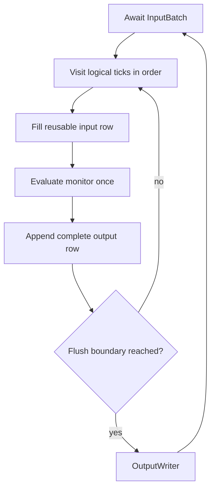

# Runtime adapter

`DataflowRuntime` drives a synchronous `DataflowMonitor` from asynchronous input batches and delivers complete output rows through an `OutputWriter`. It is an adapter around the monitor, not a second interpreter.

**Reading rule.** One logical input tick causes exactly one monitor evaluation. Physical input and output batches may contain several ticks, but they do not change tick count or row boundaries.

## Input adaptation

For each logical tick, `DirectDataflowEngine` writes updates into cached input slots and leaves every omitted input as `NoVal`. It rejects undeclared input variables. After evaluation, supplied slots are reset so values do not leak into the next sparse tick.

The engine reuses input and output row allocations. Cached slot indices avoid repeated name lookup for common update layouts.

## Output batching

Every successful monitor call contributes one complete row in the monitor's output order. Rows are appended contiguously to a packed `OutputBatch`.

Buffered execution flushes after 256 logical ticks and emits a final non-empty partial batch at normal input end. Synchronous execution sends each complete row before polling the next tick. These policies change delivery granularity, not monitor semantics.

## Backpressure

`OutputWriter` readiness is awaited before a batch is accepted. A slow destination therefore suspends the engine and eventually stops further input polling. The synchronous monitor itself has no asynchronous queue; pressure belongs to the adapter and output pipeline.

A successful `feed` means the writer admitted the batch according to its sink contract. `send` performs that admission and then waits for the writer's flush barrier. Neither result implies remote persistence or consumption.

## Completion and failure

On normal end-of-stream, the adapter submits a final partial output batch, flushes the writer, and closes it. End-of-stream does not synthesize extra ticks to drain delay state.

A failed monitor evaluation contributes no output row. Rows accumulated since the previous completed flush are discarded on monitor or input error. Writer, input, and monitor errors terminate the run; close still follows the output cleanup contract where possible.

The reconfigurable runtime uses the same direct engine but inserts typed control handling around it. At a successful root replacement, it rebuilds only transient input/output row layouts around the active replacement monitor.

## Implementation mapping

The implementation mapping leads through `DataflowRuntime` and `DirectDataflowEngine` in `src/runtime/dataflow.rs`; integration behavior is exercised in `tests/runtime_tests.rs`.

Continue with [input and output sessions](runtime-io.md) or [root cutover](reconfigurable-runtime.md).
