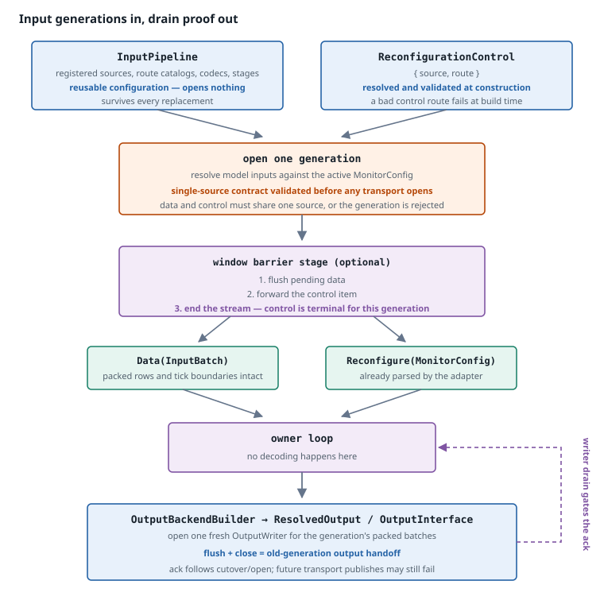

# Input and output boundary

[← Previous: The dataflow runtime adapter](runtime-adapter.md) · [Next: The reconfigurable runtime](reconfigurable-runtime.md) →

The ordinary runtime's boundary is an `InputStream<Value>` plus an already-open `OutputWriter`. The reconfigurable runtime instead retains an `InputPipeline` and an `OutputBackendBuilder`, because it must replace both opened generations while running.

This page describes the boundary machinery that makes replacement possible: how input transports and output backends are resolved, opened, and torn down, how control reaches the owner loop as a typed item, and how the output writer provides a local flush/close handoff barrier. [Input architecture](../../input-architecture.md) covers the same boundary from the user's side — message formats, route catalogs, and window configuration.

## Generations

One term recurs throughout this page, so it is worth fixing first.

A **generation** is one opened input/output binding set: the concrete input subscriptions, sockets, decoders, output backends, and stages serving one definition under one binding configuration. `InputPipeline` and `OutputBackendBuilder` are reusable configuration and outlive every generation; a generation is the live input stream plus the opened `OutputWriter` made from them.

A generation ends when a control item arrives, and the replacement definition opens the next one:

```text
generation 1    in x, in y        subscribes: robot/x, robot/y
                Data … Data … Reconfigure{ spec: "in y, in z" }   ← ends here
                                          │
                            root cutover ─┤  drain writer, compile, transfer, reopen
                                          │
generation 2    in y, in z        subscribes: robot/y, robot/z
                Data … Data …
```

Two properties do most of the work later on. Generations **never overlap** — exactly one is open at a time, so there is no window in which two subscriptions or output writers could both serve a row. And a generation is reopened **even when nothing about the interface changed**: above, `y` is bound to `robot/y` in both, yet generation 1's input subscription is dropped and generation 2 opens its own. The output builder likewise opens a fresh writer for every cutover, even when the resolved output interface compares equal. The reason is that a reconfiguration stream terminates after yielding its control item, and the old output must be closed before the new generation is installed.

## The boundary at a glance



**What to notice.** The input pipeline, control binding, and output builder are long-lived configuration; opened input resources and the writer below them are per-generation and are torn down at each cutover. Data and control converge into one typed item stream precisely so that "before the command" and "after it" are well defined. The old writer's flush/close completion is the output handoff that must precede the acknowledgement.

## Input is a pipeline, not a stream

`InputPipeline` is reusable configuration: registered sources, their route catalogs, codecs, and window stages. It opens nothing.

`ReconfigurableInput` wraps a pipeline together with one validated `ReconfigurationControl`, resolved at construction:

```text
ReconfigurableInput::new(pipeline, requested_route)
  → ensure_reconfigurable(requested_route)
  → resolve_reconfiguration_source(requested_route)
  → source.supports_reconfiguration()?
  → ReconfigurationControl { source, route }
```

Resolving the control binding at construction rather than at first use means a misconfigured control route fails at build time, not at the first reconfiguration command hours into a run.

Calling `open` is what produces a generation: the pipeline resolves the current model inputs against the active `MonitorConfig`, the selected source is opened, and the barrier stage is applied.

Only the selected control source is opened. Other configured sources may remain inactive, including sources that could not carry a live control route at all.

## The typed control boundary

An ordinary input stream carries `InputBatch` values. A reconfigurable stream carries a two-variant item:

```rust
pub(crate) enum ReconfigurableInputItem<V> {
    Data(InputBatch<V>),
    Reconfigure(MonitorConfig),
}
```

Transport adapters parse and structurally validate the `MonitorConfig` before yielding the control item, so the owner loop receives an already-parsed configuration and performs no decoding of its own. Data batches keep their logical ticks and packed-row representation untouched.

The decision worth understanding is that **control is a typed item rather than a model variable.** A control variable would have to be declared in the model interface, would appear in the environment layout, would need a type, and would be visible to the specification — coupling the reconfiguration mechanism to the language it reconfigures. Keeping it a separate variant at the orchestration boundary means the model never knows the mechanism exists.

The type is crate-private for the same reason: it is an orchestration detail, not part of the public input model.

## One source, one order

A reconfiguration command is a barrier, and a barrier is only meaningful relative to an ordering. `open_reconfigurable` therefore enforces a single-source contract, and enforces it **completely before looking up or opening any transport**:

| Generation shape | Outcome |
|---|---|
| No active model bindings | Uses the control source alone. |
| One active source, equal to the control source | Accepted. |
| One active source, different from the control source | Rejected, naming both and suggesting either rebinding or a different control route. |
| Active bindings across several sources | Rejected, listing every active source. |

Validating before opening is what prevents a half-configured generation from acquiring resources — and, in particular, prevents a command from terminating one source's stream while another active source still has data pending.

The guarantee this buys is source-local ordering: because data and control arrive as items of one source-owned stream, "everything before the command" and "everything after it" are well defined. Independent MQTT topics have no such total order, which is why global ordering across them still requires an external controller regardless of this validation.

## The window barrier stage

When the pipeline configures an input window, its stage sits between the transport and the owner loop. The stage converts typed items into window events, drives the window, and converts back:

```text
Data(batch)        → WindowEvent::Data(batch)        → Data(batch)
Reconfigure(cfg)   → WindowEvent::Control(cfg)       → Reconfigure(cfg)
```

Two behaviours follow, and both are load-bearing:

1. **Pending data is flushed before the control item.** A window that has accumulated rows must emit them before the command, or those rows would be evaluated by the wrong definition — or lost.
2. **The control item is terminal for its generation.** The stream ends after the command. Data belonging to the old generation that arrives afterwards is not emitted.

Termination is what makes the owner loop's cutover safe: once it has received a command, no further items from that generation can appear, so it can close the stream and open a replacement without racing a late batch.

## The output boundary

The output side has the harder problem. Closing an input is easy; completing already-submitted rows before handing the interface to a replacement is not.

`OutputBackendBuilder` is unopened, reusable configuration. Its pure `resolve` step validates the model outputs, auxiliary values, destination bindings, routes, and stages, returning a `ResolvedOutput`. Each resolved destination carries an `OutputInterface` containing the fixed routes that its backend will open. The subsequent `open` step opens all destinations, applies their stages, cleans up partial opens on failure, and returns one routed `OutputWriter`. `build` is the convenience operation that performs `resolve` followed by `open`.

The runtime sends complete packed `OutputBatch` values to that one writer. Whether the resolved output has one destination or several, routing remains behind the writer boundary; the dataflow engine emits one packed batch for the resolved layout.

The writer has three distinct operations:

```text
OutputWriter::send(batch)   → submit one packed batch without forcing downstream flush
OutputWriter::flush()       → wait for accepted batches to reach the writer's sink boundary
OutputWriter::close()       → finalize the opened destinations and retain cleanup errors
```

`finish_writer` performs `flush` followed by `close`. During a root cutover, `drain_previous_output` first submits any rows still buffered by `DirectDataflowEngine`, then calls `finish_writer` on the old writer. This is the local output handoff barrier: the old writer is closed before the replacement writer can be used. A successful handoff does not claim that a remote consumer has durable storage or that future transport publishes cannot fail.

If a later `OutputWriter::send`, `flush`, or `close` operation reports a backend failure, the dataflow runtime treats it as terminal. The cleanup path still attempts to flush and close, preserving rows already accepted by the writer where the backend permits, and combines cleanup failures with the primary error.

## Deferred construction failures

`RuntimeBuilder::build` returns a runtime, not a `Result`. Configuration, compilation, input-open, and output-open failures are therefore retained as startup errors and returned by `run` rather than causing a panic.

| Failure | Behaviour |
|---|---|
| Input resolution or open failed | The runtime returns the stored startup error before processing a data batch. |
| Output resolution or `OutputBackendBuilder::open` failed | The runtime returns the stored startup error; any destinations opened before a partial failure are closed by the builder. |
| Replacement input/output open failed | The old generation is already past its drain boundary, so the owner loop terminates and does not restore it. |

This keeps construction infallible without discarding the diagnosis or leaving a partially opened output generation behind.

## Acknowledgements

`acknowledge_reconfiguration` publishes a `ReconfigurationAck` carrying the now-active `RevisionId`, the `InterfaceEpoch` that the next model row must be produced for, and an `applied` flag that is `false` for a semantic and interface no-op.

For the dataflow runtime, the acknowledgement is sent only after all of the following have completed:

1. the old `DirectDataflowEngine` has submitted its pending rows and the old `OutputWriter` has been flushed and closed;
2. the replacement command, activation frontier, and config-derived interfaces have been validated;
3. the replacement specification has been compiled and context transfer has completed, if requested;
4. the old input generation has been dropped, the new input generation has opened, and `OutputBackendBuilder` has opened the new writer from its resolved output interface; and
5. the active monitor identity and runtime input/output state have been installed.

The acknowledgement confirms cutover and generation-open completion. It does **not** promise that a later `OutputWriter::send`, backend flush/close, or remote transport publish cannot fail; later output failures remain terminal. The producer contract is explicit:

> One command at a time. Wait for `ReconfigurationAck`. Then publish the next model row. Added producers start after the acknowledgement; removed producers stop at the barrier.

`GeneralRuntimeBuilder::acknowledgements` installs the in-process sink. The channel is bounded, so a runtime configured with a sink blocks until the controller observes the acknowledgement — and a closed sink is an error, because the producer barrier can no longer be honoured.

The precise claim matters: delivery into that channel releases the **in-process controller contract**. It is not proof of remote observation or future transport delivery. Runtimes without a sink rely entirely on an external controller to enforce the barrier.

[← Previous: The dataflow runtime adapter](runtime-adapter.md) · [Next: The reconfigurable runtime](reconfigurable-runtime.md) →
