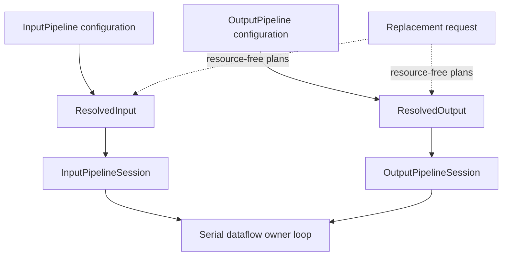

# Input and output sessions

Both `DataflowRuntime` and `ReconfSemiSyncRuntime` keep transport owners live across control requests. `InputPipelineSession` owns opened input sources and their relays; `OutputPipelineSession` owns opened destination writers and routing state. The semisynchronous runtime replaces its monitor/evaluation generation while reusing these sessions.

**Reading rule.** `ResolvedInput` and `ResolvedOutput` describe complete candidate interfaces but own no resources. Sessions own the live resources and apply validated plans in place.

## Input ownership

A session indexes source owners by stable `SourceId`. Each owner feeds a bounded relay. Unchanged sources remain attached during replacement. Removed sources stop ingress and drain already-admitted items before retirement; a retained changed source pauses, drains its old-side items, and rebinds in place when its transport supports that operation. Additions open afterward, and the candidate `ResolvedInput` becomes active when the session resumes its owners.

Bindings can span source owners. The session's composed order is the order observed locally and is not a total order across independent transports. One selected source carries typed control; it may be control-only.

## Output ownership

The output session retains a fixed durable destination registry. A replacement may alter effective bindings, routes, codecs, destination selection, and interfaces supported by existing owners. It may not create or remove owners, alter local backend credentials/endpoints, or change a destination's delivery policy.

For each changed destination, `OutputWriter::rebind` flushes that writer before applying its new interface. Router variable selection changes only after the corresponding interface update. A destination's `DeliveryPolicy` is part of the durable pipeline configuration and cannot change through a reconfiguration plan.

## What crosses the barrier

Data admitted by a removed input relay belongs to the old side of the cutover and is evaluated by the old monitor. Pending engine rows from that work are submitted before input additions, output interface changes, and monitor replacement.

Output acknowledgement is local. Existing external destinations can observe pre-barrier output before another destination fails, and no cross-destination rollback exists.

## Session failure

A stale or cross-pipeline plan is rejected. Input detach, drain, or addition failure terminates the owner loop without restoring detached owners. Output flush or interface-update failure makes the output session sticky-failed; cleanup still attempts every owner.

`ReconfSemiSyncRuntime` uses the same persistence boundary. It replaces the monitor/evaluation generation and transfers compatible variable history, while the opened input and output sessions remain live and rebind their supported interfaces in place.

See the full [input architecture](../../input-architecture.md), [output architecture](../../output.md), and [root cutover](reconfigurable-runtime.md).
