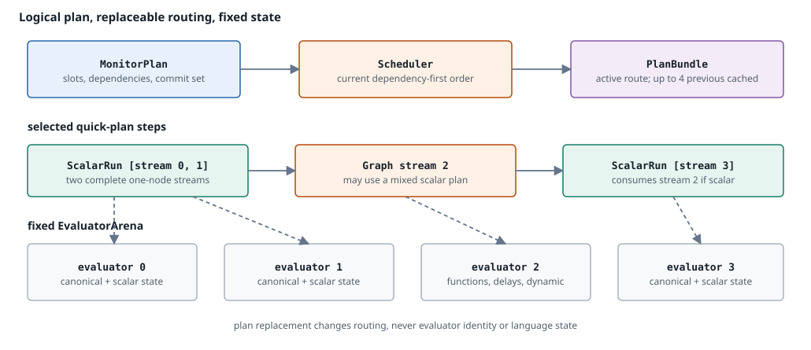

# Runtime ownership

`DataflowMonitor` separates immutable meaning, persistent language state, mutable scheduling, and replaceable execution routing. State remains attached to semantic identities when order or physical execution changes.

**Reading rule.** `EnvironmentSlot` identifies a current-row location. Output order and scheduler order are projections over stable identities; neither is the storage identity of evaluator state.

## Immutable meaning

`DataflowProgram` owns the fixed definition: environment layout, stream programs, monitor plan, output projection, and definition fingerprint. A `StreamProgram` can be shared by several evaluator instances because it contains no mutable node history.

## Persistent state

`MonitorExecution` owns one long-lived evaluator per logical computed stream. Each evaluator owns canonical node values and state, plus optional quickening and native-tier state associated with the same semantic owner.

State includes delay rings, lifting state, branch evaluators, persistent calls, recursive frame pools, and active nested evaluators. The stable coordinate of top-level operation state is a stream identity plus graph-local `NodeId`, not a schedule index.

The current environment row is separate from persistent evaluator state. It is cleared or overwritten for a tick; delay history and other operator state survive.

## Mutable scheduling

`Scheduler` combines fixed dependencies with exact dependencies of currently active nested expressions. It retains or repairs a dependency-valid order over stable stream identities. Replacing that order does not move evaluators, environment cells, or operation state.

For reconfigurable monitors, source-prerequisite streams form one range and the remaining streams form a disjoint main range. The [scheduling architecture](scheduling.md) explains dirty detection, cycle rejection, range projection, and schedule-specific plan selection.

## Replaceable routing

`ScheduledExecutionPlan` maps a valid schedule to physical steps, while `ExecutionEngine` retains the active `PlanBundle` for canonical graph evaluation, scalar runs, or native artifacts.

**Reading rule.** The scheduler and execution layout can be replaced or cached. Every step addresses stable evaluator owners in the fixed arena; histories and dynamic evaluators do not move into the route.

A `PlanId` identifies one schedule-specific route. It is not a state identity. Falling back from native or quickened work must materialize or preserve canonical state before another route continues.

## Ownership table

| Responsibility | Owner | Lifetime |
|---|---|---|
| compiled semantics and fixed layout | `DataflowProgram` | definition |
| current row and monitor history | `DataflowMonitor` | active monitor |
| active dependency order | `Scheduler` | active monitor; repairable |
| per-stream language state | `EvaluatorArena` in `MonitorExecution` | active monitor or compatible transfer |
| nested expression body state | active `Evaluator` | activation |
| physical route and artifacts | `ExecutionEngine`, `ScheduledExecutionPlan`, and `PlanBundle` | schedule-specific and replaceable |
| asynchronous batches and output writer | `DataflowRuntime` and `DirectDataflowEngine` | runtime run |

## Replacement consequence

Root context transfer moves compatible evaluator owners by semantic mapping. Nested expression replacement moves or resets only the nested owner. Schedule replacement moves neither. This is the basis for preserving history while changing dependencies, stream order, or execution tier.

Continue with [tick execution](tick-execution.md) for mutation order and [replacement identity](replacement-contract.md) for cross-definition mappings.
