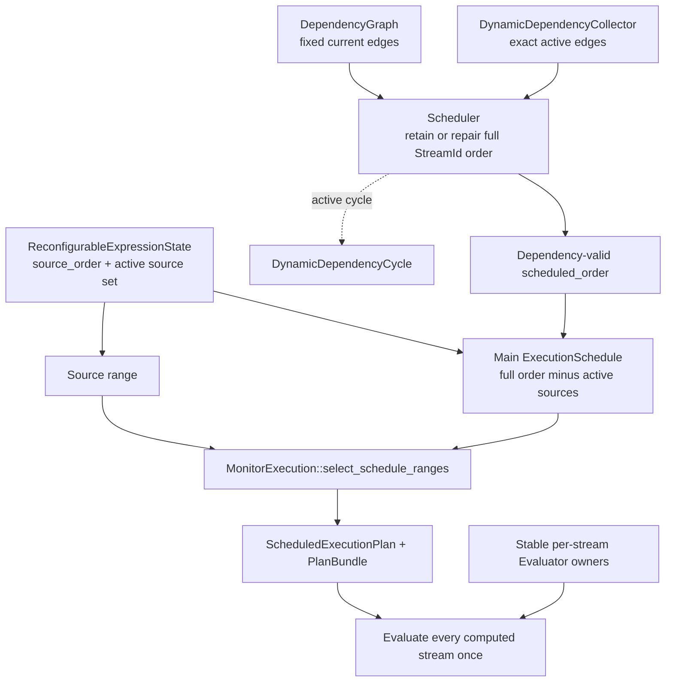

# Dataflow scheduling

Scheduling converts the currently active same-tick dependency graph into an evaluation order over computed streams. The order guarantees that every current producer runs before its consumers; it does not define stream identity, row storage, evaluator ownership, temporal visibility, or an execution tier.

**Reading rule.** Solid arrows show fixed and active dependency input, source/main range construction, and lowering into an executable plan. The dashed edge is dynamic-cycle failure, not a fallback order. `StreamId` and `Evaluator` remain stable throughout: scheduling changes when an owner runs, not which owner or row slot represents the stream.

## Principal entities

| Entity | Responsibility |
|---|---|
| fixed dependency graph (`DependencyGraph`) | Stores compile-time same-tick stream dependencies. Positive historical reads are absent because they observe committed earlier ticks. |
| active-edge collector (`DynamicDependencyCollector`) | Replaces one dynamic consumer's exact producer set after a runtime-defined body is resolved and marks the current order dirty only when a newly added edge violates it. |
| scheduler (`Scheduler`) | Retains or repairs a dependency-valid order over stable `StreamId` values and owns reusable iterative-DFS workspace. |
| main execution order (`ExecutionSchedule`) | Projects the full valid order by removing streams currently assigned to the source range. |
| semantic executable plan (`ScheduledExecutionPlan`) | Records source and main orders, stable slots, stream metadata, temporal effects, and commit streams for execution-tier lowering. |
| execution owner (`MonitorExecution`) | Selects a cached schedule-specific `PlanBundle` or constructs one for the new source/main order. |

## Current dependencies determine order

A current edge `producer → consumer` means that the consumer reads the producer's value from the same logical tick. Every valid schedule places the producer first. Inputs are preloaded into the environment and are not scheduled computed-stream vertices.

The running example is declared in the order `alert`, `total`, `scaled`, but its active current graph requires the reverse computed-stream order:

| Position | Computed stream | Current prerequisite | Why it is ready |
|---:|---|---|---|
| 1 | `scaled` | preloaded input `x` | Inputs already occupy their environment slots. |
| 2 | `total` | `scaled` | `scaled` has published its current value. |
| 3 | `alert` | `total` | `total` has published its current value. |

The recursive `total[1]` read is historical, so it contributes no current edge and cannot create a same-tick cycle. The schedule is one valid topological order, not a copy of declaration order and not a storage layout.

## Static order and retained order

Compilation rejects static current-dependency cycles and arranges computed streams in an initial valid order. `Scheduler::new` begins with that order and records each stream's current position.

A changed dynamic dependency set does not automatically cause repair. Removing an edge cannot invalidate the current order. Adding an edge whose producer is already before its consumer also leaves the order valid. `DynamicDependencyCollector::finish` marks the order dirty only when a newly added producer is at or after its consumer.

When repair is unnecessary, `Scheduler::update_schedule` returns without rebuilding the order or selecting another physical plan. This makes schedule identity depend on an ordering constraint change, not every nested-body change.

## Dynamic edges and repair

Compile-time scope limits what a runtime-defined expression may read; the active body supplies the exact dependencies used for the current tick. These are different sets. The scheduler combines fixed edges with exact active edges only after source expressions have been evaluated and nested bodies resolved.

**Reading rule.** Every dependency arrow points from producer to same-tick consumer. Dashed arrows in the top panel are compile-time permissions, while solid arrows in each runtime panel are exact active dependencies for that tick. Input `x` is preloaded and therefore constrains values without appearing in the computed-stream schedule. The right column shows the retained order and the repaired order; the two panels are consecutive logical ticks, not phases within one tick.

Repair uses an explicit DFS stack over both fixed and active dynamic dependencies. Roots are visited in the current scheduled order, so repair preserves existing ordering where the new constraints permit it. The result replaces `scheduled_order`, refreshes the position index, and rebuilds the main `ExecutionSchedule`.

If DFS reaches a stream already in the visiting state, `Scheduler` returns `DataflowEvaluationError::DynamicDependencyCycle` naming the involved stream. `DataflowMonitor` treats that tick failure as terminal. It does not evaluate with the previous order because that order violates the active graph.

## Source and main ranges

A monitor with `dynamic` or unsealed `defer` expressions divides one logical tick into two disjoint execution ranges separated by the [source barrier](tick-execution.md#tick-and-source-barriers):

1. the source range evaluates fixed prerequisites needed to obtain nested source strings;
2. nested bodies are resolved and exact active dependencies are collected;
3. `Scheduler` retains or repairs the full dependency order;
4. the main `ExecutionSchedule` evaluates every computed stream not already in the active source set.

`ReconfigurableExpressionState` owns the source order and active source set. `Scheduler::build_execution_schedule` filters that set from the full valid order. `MonitorExecution::select_schedule_ranges` packages both ranges into one `ScheduledExecutionPlan`. Together the ranges cover every computed stream exactly once, with no temporal commit between them; staged evaluator state commits only at the later [tick barrier](tick-execution.md#tick-and-source-barriers).

After the first successful `defer` activation, source-only prerequisites may be released. `Scheduler::refresh_main_execution_schedule` then rebuilds only the source/main projection; it need not repair the dependency order when the active graph itself did not change.

## Schedule-specific plans and stable state

A changed source/main order causes `MonitorExecution` to select a matching cached `PlanBundle` or construct a new `ScheduledExecutionPlan`. The execution cache retains at most four inactive schedule-specific bundles in addition to the active bundle. `PlanId` identifies one such route; it is not a semantic state identity.

The selected plan addresses the same `Evaluator` arena and stable `EnvironmentSlot` values as every other schedule. Delay rings, lifting state, recursive frames, and nested evaluator state therefore survive schedule repair. Quickening and JIT consume the selected semantic plan but do not change the scheduler's dependency contract.

## Implementation mapping

- fixed dependencies, `StreamId`, `StreamSet`, source metadata, and stream slots: `src/dataflow/execution_plan.rs`;
- retained order, dynamic collectors, dirty detection, iterative repair, cycle detection, and main-range projection: `src/dataflow/scheduler.rs`;
- source resolution, calls to `Scheduler::update_schedule`, defer release, and schedule selection: `src/dataflow/monitor/evaluation.rs`;
- `ScheduledExecutionPlan`, stable plan metadata, temporal effects, and commit streams: `src/dataflow/execution/scheduled_plan.rs`;
- `PlanBundle` selection and the four-entry inactive route cache: `src/dataflow/execution/monitor_execution/plan.rs`.

Continue with [runtime ownership](runtime-ownership.md) for state identities, [tick execution](tick-execution.md) for the source/main phase boundary, [dynamic properties](dynamic-properties.md) for nested evaluator lifetime, or [execution tiers](execution-tiers.md) for physical lowering of a selected schedule.
