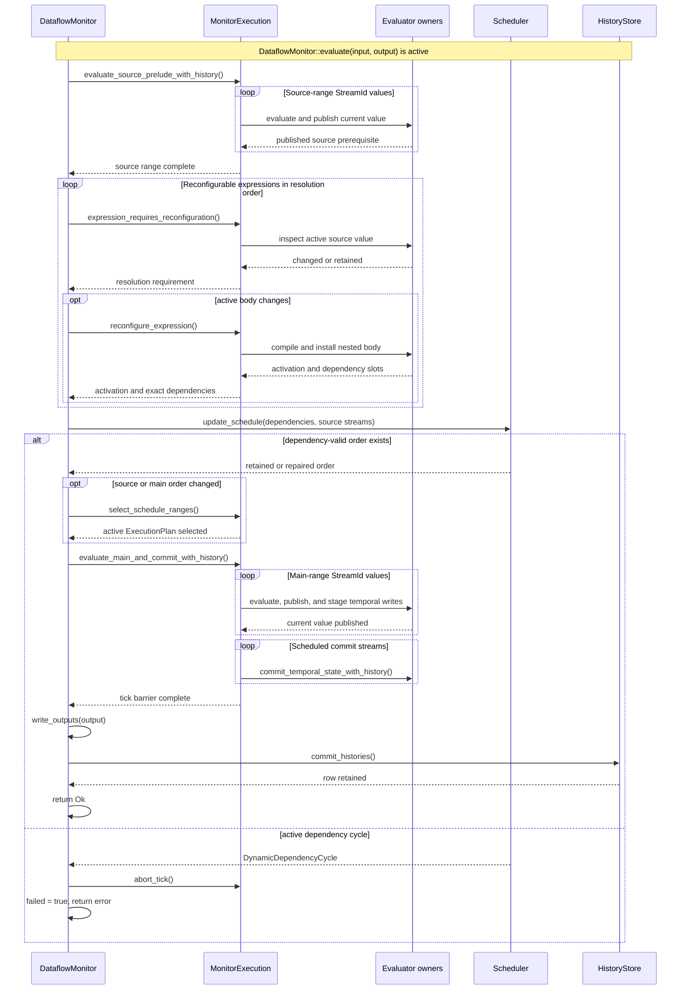

# Tick execution

One `DataflowMonitor` tick computes one current row. Scheduled evaluators publish current values during the row, then staged temporal state becomes historical at one shared commit boundary.

## Tick and source barriers

The **tick barrier** is the logical end of scheduled evaluator execution. At this boundary, `MonitorExecution::commit_active_plan` commits staged evaluator temporal state, making it readable by later ticks. Output projection and the `DataflowMonitor`'s `HistoryStore` commit follow successful evaluator execution; they are not part of the evaluator temporal commit itself.

The **source barrier** is an internal boundary used only by ticks containing `dynamic` or unsealed `defer`. `MonitorExecution` first evaluates the source range. The monitor then resolves nested bodies, collects their exact active dependencies, and asks `Scheduler` to retain or repair the order before the disjoint main range runs. This boundary changes the active body and execution order, not logical time.

{{#include ../../assets/dataflow/tick-barriers.svg}}

**Reading rule.** Time runs left to right. Work on both sides of the source barrier belongs to one logical tick: no new tick begins and no temporal write commits there. Source and main ranges are disjoint and together evaluate every computed stream exactly once; current values published in the source range remain visible to the main range. Temporal writes may be staged in either range, but only the later tick barrier commits them. Root reconfiguration control barriers, input-window boundaries, and output delivery boundaries are separate concepts.

## Static tick

| # | Phase | Responsible entity | Effect and visibility |
|---:|---|---|---|
| 1 | Prepare current row | `DataflowMonitor` | Validate widths, clear the environment, and load all input slots. |
| 2 | Evaluate computed streams | `MonitorExecution` and each `Evaluator` | Run once per stream in the dependency order supplied by `Scheduler`; publish current values to stable slots. |
| 3 | Stage temporal writes | stateful `Evaluator` operations | Record samples that may become historical without exposing them yet. |
| 4 | Commit temporal state | `MonitorExecution` | Push every staged sample at one shared post-row boundary. |
| 5 | Project outputs | `DataflowMonitor` | Read the complete output projection from stable environment slots. |
| 6 | Commit monitor history | `HistoryStore` | Retain the successful row only after output projection succeeds. |

Phases 3 and 4 are distinct visibility boundaries. Staging records future historical samples; only phase 4 makes them readable by the next tick.

## Tick with nested reconfiguration

| # | Phase | Responsible entity | Effect and visibility |
|---:|---|---|---|
| 1 | Prepare current and retained rows | `DataflowMonitor` | Load current inputs and the sparse retained environment needed by nested expressions. |
| 2 | Evaluate source prerequisites | `MonitorExecution` | Run only the fixed streams needed to obtain each `dynamic` or `defer` source value. |
| 3 | Resolve nested programs | nested `Evaluator` owners | Retain, compile, select, transfer, or initialize the active nested body. |
| 4 | Repair active order | `Scheduler` | Merge exact active dependencies with fixed dependencies and produce a valid main-range order. |
| 5 | Evaluate the main range | `MonitorExecution` | Run the disjoint remaining stream set exactly once. |
| 6 | Commit temporal state | `MonitorExecution` | Make staged samples visible to the next tick at the same boundary used by a static tick. |
| 7 | Apply defer sealing | nested reconfiguration state | Retain the first active `defer` body and release source-only prerequisites for later ticks. |
| 8 | Project and retain the row | `DataflowMonitor` and `HistoryStore` | Project outputs and commit monitor history after successful execution. |

Phases 2 and 5 are disjoint and together cover every computed stream exactly once. There is no temporal commit between them; phase 6 remains the single commit boundary.

The interaction view shows which owner controls each boundary while one `evaluate` call remains active:

**Reading rule.** Solid arrows are calls or state-changing requests; dashed arrows are returned values, completed ranges, or outcomes. The source-range return is the source barrier, not a temporal commit. The main-range return follows `commit_active_plan` at the tick barrier; output projection and `HistoryStore` retention occur afterward. A source-resolution or evaluator error follows the same abort-and-terminal-monitor path shown for `DynamicDependencyCycle`. Lifeline spacing is interaction order, not a second logical-time scale.

## Current-row publication

Before execution, the monitor validates input and output widths, clears the current environment, and loads the supplied row. Omitted sparse updates have already become `NoVal` at the runtime adapter.

Each `Evaluator` publishes its result once to its assigned environment slot. A current consumer therefore reads a value produced earlier in the active order. Output projection reads completed slots after all computed streams have run.

## Temporal and monitor commits

Evaluator operations stage ordinary-delay captures or recursive-delay outputs during the forward pass. The post-row temporal commit pushes those samples into their rings. The `DataflowMonitor` commits its `HistoryStore` only after output projection succeeds.

These are visibility boundaries rather than a general transaction over every internal mutation. If evaluation fails, the monitor is marked failed, no output row is published, and monitor history is not committed. The failed monitor accepts no later tick.

## Reconfiguration work within a tick

Nested source values may compile or select a new body. Active dependencies are extracted from that body and merged with fixed dependencies before the main range runs. Earlier nested activations in the same resolution pass are not rolled back if a later activation fails; the resulting tick failure makes the monitor terminal.

A newly sealed `defer` body no longer needs its source prerequisites on later ticks. Their release occurs after the successful execution boundary so the activation tick still observes a complete valid schedule.

## Execution routes

Canonical, quickened, and native routes all enter the same tick phases and must preserve publication, temporal commit, output projection, and failure boundaries. A declined region and a missed native guard both hand work to canonical evaluation; neither creates a second logical evaluation of a stream.

Continue with [scheduling](scheduling.md) for dependency order and source/main range construction, [temporal state](temporal-state.md), [dynamic properties](dynamic-properties.md), or [execution tiers](execution-tiers.md).
