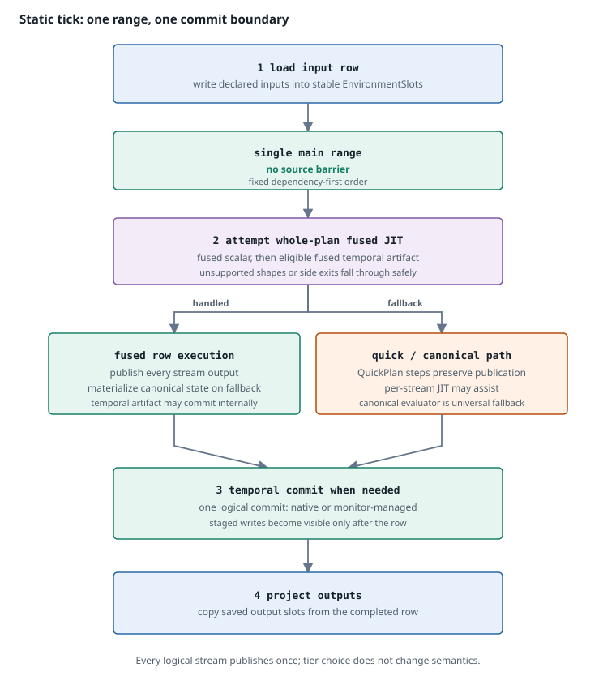
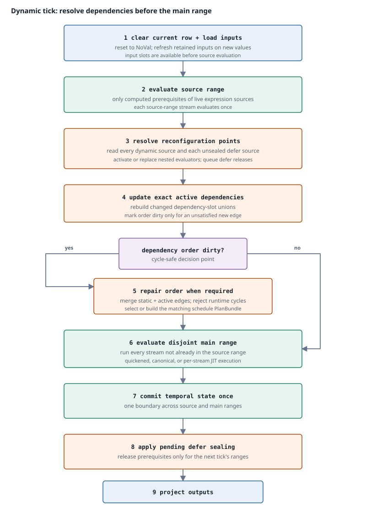

# Dataflow tick execution

[← Previous: Runtime ownership](runtime-ownership.md) · [Next: Temporal state](temporal-state.md) →

One successful `DataflowMonitor::evaluate` call is one logical tick. The caller that makes those calls, and decides nothing about their meaning, is described in [Runtime adapter](runtime-adapter.md). Static and reconfigurable monitors use different phase shapes, but both must publish one current result per logical stream and cross one temporal commit boundary after the complete row succeeds.

## Static tick

**What to notice.** A static monitor has no source barrier. The fixed main range contains every computed stream exactly once. Temporal writes are staged during stream execution and become visible only at the commit boundary; outputs are projected afterward from stable environment slots.

### Phase order

1. **Validate the call.** Reject a previously failed monitor or input/output slices with the wrong lengths.
2. **Load inputs.** Copy the input row into the initial environment slots. Static monitors do not allocate a retained row and do not clear the stream portion first; every computed stream slot will be overwritten by this tick's execution.
3. **Begin the logical tick.** Mark execution in progress and advance JIT activation hotness once for the tick when configured.
4. **Evaluate the main range.** Follow the fixed scheduled order. Each logical stream computes and publishes one current result to its stable environment slot.
5. **Commit temporal state.** If canonical or per-stream execution staged temporal writes, traverse the fixed commit set once after all streams succeed. A complete native temporal artifact may implement the same logical commit internally at the end of its successful run.
6. **Project outputs.** Copy values from saved output slots into caller order. Projection performs no expression evaluation.

The physical executor may be fused, per-stream native, quickened, or canonical. That choice can change dispatch and state representation, but not publication order, current-versus-historical visibility, or the single logical commit.

## Reconfigurable tick

**What to notice.** The source and main ranges are disjoint and together cover every logical stream. Reconfiguration and schedule repair happen between them, before main-range state advances. There is no commit at the barrier. Pending `defer` releases are applied only after successful main execution and the shared commit, so they affect the next tick's ranges.

### Phase order

1. **Validate the call.** Apply the same public failure and arity checks as a static monitor.
2. **Prepare current and retained rows.** Clear the current environment to `NoVal`, load inputs, and update retained input slots only for values other than `NoVal`.
3. **Evaluate the source range.** `evaluate_source_prelude` begins the logical tick and executes the currently required computed source prerequisites. Each source-range stream publishes once and updates retention for a non-`NoVal` result.
4. **Resolve reconfiguration points.** For every still-live point, read its source value and activate, preserve, or replace the nested expression. A successfully activated `defer` is marked sealed and queues a release; the release is not applied yet.
5. **Update exact active dependencies.** If an activation changed dependency slots, rebuild the containing stream's union across all active points. Merge those edges with static dependencies, detect cycles, and repair the scheduled order when needed.
6. **Select source/main routing.** If order changed, select a cached `PlanBundle` or build a new one for the repaired, disjoint ranges.
7. **Evaluate the main range.** Run every stream not already evaluated in the source range exactly once, using the repaired dependency-valid order.
8. **Commit temporal state.** After the main range succeeds, commit the active plan's complete temporal stream set once. Source-range staging and main-range staging cross the same boundary.
9. **Apply pending `defer` releases.** Decrement source-user and live-point reference counts. If source membership changes, refresh and select the schedule ranges for the next tick.
10. **Project outputs.** Publish the completed row to the caller only after `execute_tick` returns successfully.

A reconfigurable monitor may eventually have an empty source range—for example, after every `defer` point that needed computed source prerequisites has sealed. The orchestration path remains reconfiguration-aware, but the active scheduled plan then has no source barrier and all logical streams are in the main range.

## Static and reconfigurable phases compared

| Concern | Static monitor | Reconfigurable monitor |
|---|---|---|
| Current row preparation | Overwrite input slots; stream slots are overwritten during execution. | Clear the row to `NoVal`, load inputs, and update retained inputs. |
| Retained outer row | Not allocated. | Allocated for sparse current-or-retained values used by active nested programs. |
| Source range | Empty. | Computed prerequisites still needed by live source users. |
| Resolution barrier | None. | Compile/activate nested expressions and discover exact active edges. |
| Main range | Every logical stream. | Every logical stream not in the source range. |
| Schedule changes | None after compilation. | Repair only when active edges or source membership require it. |
| Whole-plan fusion | Eligible when other requirements hold. | Blocked while a non-empty source barrier exists. |
| Temporal commit | Once after main execution, or equivalent successful complete native commit. | Once after both ranges; never between them. |
| Post-tick release | None. | Apply pending `defer` releases after commit for the next tick. |

## Source and main ranges form one partition

`ScheduledExecutionPlan::new` asserts that the lengths of the source and main orders sum to the number of programs and that each `StreamId` appears exactly once. This turns the “evaluate once” rule into a plan invariant rather than a convention in the phase loop.

The source range contains only streams needed to obtain current expression sources. It is not a speculative prefix of the main range. A stream in the source range is omitted from the main range, even if ordinary consumers also need its value; they read its already published environment slot.

When a sealed `defer` releases its final claim on a prerequisite, that stream is not deleted. It moves from the source range to the main range of a subsequently selected plan. Its `StreamId`, environment slot, evaluator, and temporal state remain unchanged.

Quickened scalar availability may carry across the barrier, but a scalar run does not. Per-stream native artifacts remain indexed by stable stream identity and may execute on either side. A complete per-stream temporal kernel is disabled in the source prelude because it would commit internally before the whole row succeeds. Whole-plan fused execution is rejected whenever the plan has a source barrier.

## One current evaluation and publication per stream

For the current logical row, every stream has one semantic evaluation and one canonical publication point:

- static execution visits each stream in the main range;
- reconfigurable execution visits each stream in exactly one of the source or main ranges; and
- schedule repair occurs between ranges rather than restarting work already performed.

Optimized side exits may perform bounded reconstruction work. In particular, canonical replay can evaluate a previous successful native row to reconstruct lifting state before the current row falls back. That replay is not a second evaluation of the current logical stream row: temporal node state is snapshotted and restored so replay neither stages nor commits the previous row again. The current row still publishes once and commits once.

A native attempt may also begin and side-exit before canonical fallback. Such physical work is constrained to preserve the same semantic publication and state boundary; checked native temporal writes are placed after all checked work so a failed native attempt cannot expose a partial commit.

## One temporal commit per successful tick

Temporal evaluation has two operations:

1. read history committed before the current tick and stage the current sample; and
2. make staged samples historical after the row succeeds.

The source barrier never separates these operations into two timelines. `evaluate_source_prelude` sets `tick_in_progress`, while `evaluate_main_and_commit` completes the same tick. The latter traverses `commit_streams` only when main execution returns `Ok`.

**What to notice.** Every historical read in both source and main ranges sees the same pre-tick state. Current samples become history only after the complete row succeeds, so main-range evaluation cannot observe a temporal write staged by a source-range stream on the same tick.

The commit set is derived from `StreamProgram::requires_temporal_commit` and is independent of current schedule position. Commit traversal can descend into branch state, persistent calls, and active runtime-defined evaluators. A schedule change may reorder forward evaluation, but it does not change which stable evaluators require commit.

## Why `defer` release is post-tick

A successful first `defer` activation marks the point sealed immediately so it is not resolved again. Its source prerequisites nevertheless remain in the active source range through the rest of that tick.

This delayed release preserves three properties:

- the active `PlanBundle` remains valid while the main range executes;
- a source stream that has already advanced is not moved into and re-evaluated in the current main range; and
- temporal commit uses the same complete plan under which the row was computed.

Only after `evaluate_main_and_commit` succeeds does `apply_pending_releases` update reference counts. Shared prerequisites remain in the source range while any other `dynamic` or unsealed `defer` still needs them. If membership changes, the monitor selects new ranges for the next tick.

A failed activation does not seal a `defer`, and a failed tick never reaches release application.

## Failed ticks

An input or output count mismatch is rejected before `execute_tick` begins, so no evaluator advances and the caller may retry.

Any error that escapes `execute_tick` is terminal: the monitor sets `failed`, later calls return `MonitorFailed`, and the tick projects no outputs, commits no temporal writes, and applies no pending `defer` releases. This is a deliberate simplification rather than a set of boundaries to reason about case by case — see [Failure and termination](failure-model.md).

[← Previous: Runtime ownership](runtime-ownership.md) · [Next: Temporal state](temporal-state.md) →
