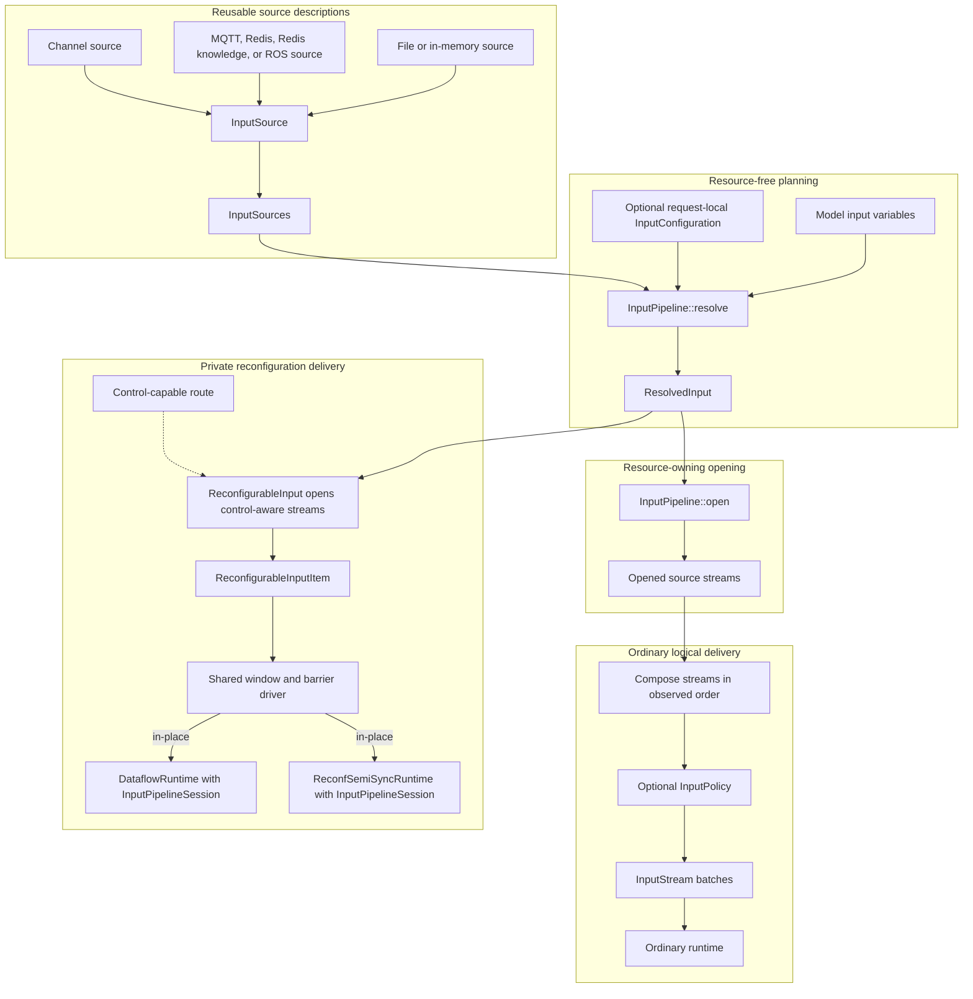
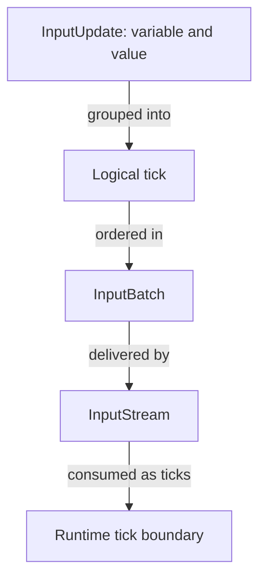
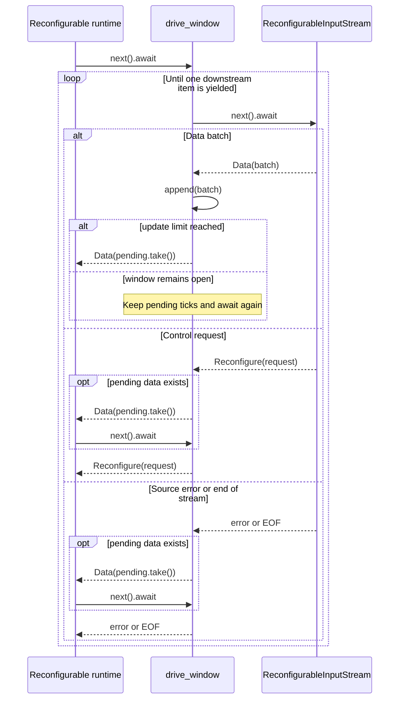
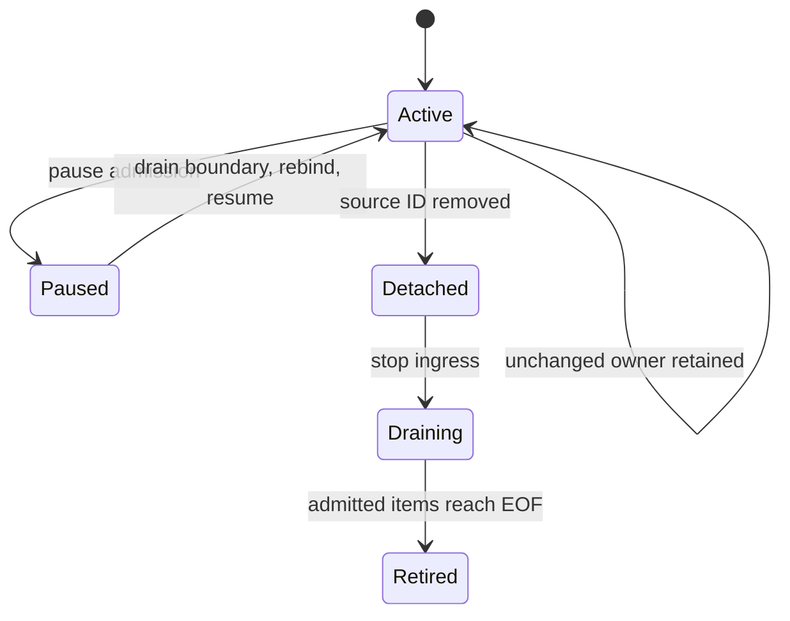

# Input architecture

The input subsystem resolves declared model inputs onto reusable source descriptions, opens the selected source owners, and delivers ordered logical ticks to a runtime. It is the architecture layer that hides where input came from and how that source is owned while preserving the logical time seen by evaluation.

## Scope of the abstraction

| Concern | Input subsystem responsibility |
|---|---|
| external source variety | Present files, in-memory data, MQTT, Redis, Redis knowledge state, feature-gated ROS, and channel producers as reusable `InputSource` descriptions and opened streams. |
| model binding | Resolve declared input variables onto source identities, opaque routes, and formats before acquiring resources. |
| logical time | Normalize source-specific physical shapes into ordered `InputBatch` ticks while preserving simultaneous updates and existing tick boundaries. |
| composition and reduction | Merge selected source streams in locally observed order and optionally batch or reduce complete ticks through one `InputPolicy`. |
| live ownership | Separate resource-free `ResolvedInput` plans from opened source owners, relay tasks, and reconfigurable `InputPipelineSession` lifetime. |
| control | Keep ordinary `InputStream` data-only while exposing `ReconfigurationRequest` through a private typed path for runtimes that support replacement. |

The subsystem does not evaluate the model, create a total order between independent transports, or make input cutover transactional. Those responsibilities belong respectively to the runtime/monitor, the external producers, and the reconfiguration owner loop.



**Reading rule.** Solid arrows show source construction, planning, opening, and delivery; edge labels distinguish the two implemented reconfigurable consumers. The dashed edge is the optional control-capable route into the private path, not an ordinary data edge. `InputPipeline::open` composes source streams before its optional policy, while reconfigurable opening yields typed data/control items to the shared barrier driver. Composition across independent streams exposes the order observed by this process, not a distributed total order.

## Principal entities

| Entity | Responsibility |
|---|---|
| reusable source description (`InputSource<V>`) | Describes one file, in-memory, transport, knowledge-state, or channel source. It stores configuration and an optional reconfiguration route, but no opened transport handle. |
| source registry (`InputSources<V>`) | Owns the `SourceId`-to-source catalog and optional default. It validates catalog ownership and selects a control-capable source without opening resources. |
| input pipeline (`InputPipeline<V>`) | Couples the source registry to at most one `InputPolicy`; it resolves request-specific bindings and opens the source streams named by a resolved plan. |
| resolved plan (`ResolvedInput`) | Records selected source identities and `InputBinding` route/format assignments for one request without owning resources. |
| logical input (`InputUpdate<V>`, `InputBatch<V>`, `InputStream<V>`) | Represents variable/value updates, ordered logical ticks, and the ordinary data-only stream that delivers batches. |
| reconfiguration adapter (`ReconfigurableInput`) | Owns `ReconfigurationControl`, opens the private `ReconfigurableInputItem<V>` path, and can create a persistent `InputPipelineSession`. |
| runtime owners (`DataflowRuntime`, `ReconfSemiSyncRuntime`) | Consume the control-aware stream using retained source owners and ordered binding changes. |

The source adapters are native owners for their external resources. Shared input
infrastructure (`OpenedInputSource`, `InputSourceSet`, and `OpenedInput`) adds
relay cancellation, composition, policy application, and draining around those
adapters. A source description and an opened owner therefore have different
lifetime and failure boundaries: resolving a description does not acquire a
transport, while dropping an opened owner requests source shutdown.

## The logical data contract

An `InputUpdate<V>` is one variable/value pair. A logical tick is one or more updates evaluated together; a valid constructed tick is nonempty and contains no duplicate variable. An `InputBatch<V>` is an ordered sequence of those ticks delivered as one physical unit. `InputBatch::update` constructs one independent width-one tick, `InputBatch::tick` constructs one simultaneous tick, and `InputBatch::from_ticks` constructs an ordered sequence.

For example, one batch can carry two model steps without making the second step part of the first:

```rust
{{#include ../../tests/docs_examples.rs:input_batch_from_ticks}}
```

| Logical unit | Updates | Runtime meaning |
|---|---|---|
| first tick | `x = 1` | one independent model step |
| second tick | `x = 2`, `y = 3` | one simultaneous model step |
| containing batch | first tick, then second tick | two ordered steps delivered together |

The public stream is data-only:

```rust
{{#include ../../src/core/input.rs:input_stream_alias}}
```

A batch boundary is therefore a delivery boundary, not an additional synchronization event. Consumers may expand a batch through `ticks()` or `into_ticks()`, but they must preserve the distinction between the two ticks in the example.



**Reading rule.** Solid arrows show logical grouping and delivery, not extra model-time steps. A simultaneous tick remains one evaluator step even when storage or delivery boundaries change; no dashed relationship is used in this abstract contract.

## Resolution and opening

`InputSources` owns reusable `InputSource` values in a stable-ID catalog. `InputPipeline` adds the request-independent source set and the optional input policy. `InputConfiguration` can qualify bindings by source, assign bindings across several sources, or leave ownership to source catalogs and the default source. Explicit source qualification wins; otherwise a catalog owner is used, and an unowned variable falls back to a default source only when that source supports a default route.

`InputPipeline::resolve` validates the selected source, complete model-variable coverage, duplicate ownership, route shape, and format requirements. It returns a `ResolvedInput` containing `ResolvedSource` entries with `InputBinding` records. A `Route` is an opaque address plus an optional `FormatId`; its fields are exposed through accessors rather than transport-specific route structs. The control source is not a field in that plan: `ReconfigurableInput` holds a separate `ReconfigurationControl`, and a reconfigurable opening can add a control-only source plan when the selected control source has no model-data bindings.

Resolution does not parse a file, create a subscription, connect a socket, or spawn a source task. `InputPipeline::build` is the public ordinary path: it resolves the model inputs and then opens the resulting streams. The opening step clones each selected source, calls its source-specific opener, attaches source context to emitted errors, composes the child streams, and applies the pipeline's single optional `InputPolicy` after composition. The result is an `OpenedInput` owner that retains the opened source set alongside its data stream.

`OpenedInput::into_drain` is the explicit shutdown boundary. It stops source ingress, then yields already admitted input until the source set reaches end of stream; `into_drain_with_deadline` applies one absolute shutdown deadline to that drain. A live owner dropped without a drain releases its source owners and requests cancellation, while a drain preserves the locally admitted data needed by runtime shutdown.

The following example uses the in-memory tick adapter to exercise that complete public boundary without an external transport:

```rust
{{#include ../../tests/docs_examples.rs:input_pipeline_build}}
```

`InputSource` remains reusable and unopened until `build`; the returned `InputStream` contains the two original logical ticks. Internally, `build` performs resource-free resolution before opening, but `InputPipeline::resolve` and `InputPipeline::open` are crate-private phases rather than separate public calls.

The source adapters preserve one logical contract while choosing different physical shapes:

| Source form | Opened logical result |
|---|---|
| file | Parsed rows are emitted as fixed-layout `PackedRows`; absent sparse rows use the source value's missing-value representation. |
| in-memory rows | Selected columns are emitted as fixed-layout packed rows; the typed opener rejects unequal column lengths. |
| in-memory ticks | Existing `InputBatch` values are filtered to the requested variables without discarding their remaining tick boundaries. |
| MQTT or Redis Pub/Sub | A decoded route payload becomes an independent `InputBatch::update`. |
| Redis knowledge-state | Selected key updates produce ordinary `Value` batches through the same data-only protocol; this source is not control-capable. |
| ROS | Each subscribed message is decoded and mapped to an independent `InputBatch::update`. |
| channel | Per-variable streams are joined into an `InputBatch::tick`, so the values available in one join iteration are simultaneous. |

A source can be selected for a multi-source resolution without implying a global order. The composed stream yields whichever child item the local stream combinator observes next.

## Ordinary data and private control

The ordinary type cannot carry a control frame. Reconfigurable runtimes instead consume this crate-private boundary:

```rust
{{#include ../../src/io/reconfigurable_input.rs:reconfigurable_input_item}}
```

`ReconfigurableInput::new` validates the selected control source and stores a `ReconfigurationControl` containing its source ID and route. MQTT, Redis, ROS, and a channel source with a control fanout are control-capable. File, in-memory row/tick, and Redis knowledge sources are not. With multiple configured sources, the control source is the one source that declares `reconfiguration_route`; with one configured source, that source must support control. A control-only source can therefore be separate from the sources that own model variables.

The backend boundaries have different ordering and lifetime facts:

| Adapter | Current boundary behavior |
|---|---|
| MQTT | The shared rumqttc MQTT 3.1.1/5 owner (default `3.1.1`) decodes data and control from one item stream, using QoS 1 subscriptions. Pause establishes a generation boundary; an ordered marker follows admitted old-generation observations before bindings change. Rejected MQTT 5 protocol acknowledgements are terminal for the driver. |
| Redis Pub/Sub | Data and control are decoded from one Pub/Sub stream. Pause stops admission and queues a boundary marker behind admitted items; the same owner applies subscription and route changes before resuming. |
| ROS | Data and control use independent subscriptions. The control subscription yields one request, while the data subscription remains separate; polling control first is a responsiveness choice, not a data-before-control ordering guarantee. |
| channel | Data and control use independent fanouts. The adapter polls control first for responsiveness, but the fanouts provide no cross-stream ordering edge. |

MQTT, Redis, and ROS reject a control route that collides with an active data route. A channel source can provide a separate control fanout. The shared window driver adds a local barrier rule: when it observes a control item while data is pending, it emits the pending data before the control item. It does not establish an order between independent producers, and it does not guarantee that a later data item exists after the underlying source stream ends.

## Windowing preserves logical ticks

`InputPipeline::with_policy` accepts one bounded `InputPolicy`. `InputWindow` requires a maximum delay, an update limit, or both. The two implemented policies are `InputPolicy::Batch` and `InputPolicy::WindowToStep` with `InputReduction::LastUpdateWins`.

The shared `drive_window` consumes data events for ordinary input and data/control events for reconfigurable input. A timer, update threshold, end-of-stream, source error, or control item flushes pending data. A source error is forwarded only after pending data has been emitted; a control item is forwarded after the pending data and the data stream then continues only if its underlying source remains live.

The pull interaction makes the pending-data ordering explicit:



**Reading rule.** Solid arrows are pull calls or local state changes; dashed arrows are yielded stream items or terminal outcomes. The optional second pull shows that pending data and the following control, error, or EOF are separate downstream items. A maximum-delay expiry can produce the same pending-data yield without a source item. Lifeline order does not establish an order between independent backend producers.

{{#include assets/input-window-ticks.svg}}

**Reading rule.** Left-to-right position is logical tick order, while values aligned inside one box are simultaneous. `InputPolicy::Batch` changes the physical delivery unit but preserves both incoming ticks. `InputPolicy::WindowToStep` with `LastUpdateWins` deliberately creates one new simultaneous tick, retaining `y = 2` and replacing the earlier `x = 1` with `x = 3`.

- **Batch** accumulates the incoming physical segments while retaining every logical tick and every simultaneous boundary. It may split a packed segment at a flush boundary, but it never splits one logical tick merely to meet the update limit.
- **Window-to-step** consumes complete ticks, keeps the latest update for each repeated variable within the window, and emits the retained values as one simultaneous tick. Its update limit is still a flush threshold, not a hard row-width limit.

The private `InputSegment` representation distinguishes singleton ticks, one simultaneous `Tick`, and fixed-layout `PackedRows`. `InputBatch` exposes them through its logical iterators rather than making storage shape a second public semantic level. Concatenation and value mapping preserve logical order; packed rows stay packed until a consumer needs their tick view.

## Persistent input sessions

The reconfigurable dataflow and semisynchronous runtimes retain unchanged source owners. `ReconfigurableInput::open_session` creates an `InputPipelineSession` with an active `ResolvedInput`, an `InputSourceSet` of `OpenedInputSource` relays, and a control-aware stream. Each relay stops ingress through cancellation and uses a bounded channel of one queued item; the relay task may hold one additional item while it forwards.

`PipelineGeneration` is an opaque identity attached to the durable input
pipeline and every resolved plan. A new durable pipeline configuration gets a
new generation, which prevents a plan from an older configuration from being
applied. An opened input session also carries an opaque `SessionId` and
monotonic `SessionRevision`; reconfiguration checks both before it starts and
advances the revision only after the candidate has been applied.

`InputPipeline::plan_reconfiguration` compares active and candidate bindings by source ID. Unchanged owners remain live. MQTT, Redis, and channel owners apply changed bindings in place; removing an ID and adding a distinct ID retires one owner and opens another. Unsupported changes to a retained owner fail during preparation.

A source owner follows this lifecycle during an in-place cutover:



**Reading rule.** Solid transitions describe one owner’s lifecycle. Binding changes retain that owner through pause and resume. Removing its source ID retires it after draining; an added source ID opens a separate owner. No dashed transition is used.

`InputPipelineSession::rebind` consumes the session while it establishes a
boundary, processes admitted old-binding data, rebinds retained native owners,
drains removed sources, opens additions, and resumes retained sources before
returning the updated session. The
dataflow callback evaluates drained old batches before the candidate is opened
and the active plan is replaced. It then commits the session revision after the
input and output changes and the monitor replacement have succeeded. If a
detach, drain, addition, or callback fails, cleanup runs and the stopped owner
cannot be restored by the failed call.

`ReconfSemiSyncRuntime` prepares the next model and binding plans without opening resources. Its rebind callback evaluates old-binding observations before retained history is captured. It replaces the evaluation context while retaining both I/O sessions, then commits their revisions after the input and output changes succeed.

## Failure and resource boundaries

A failure while resolving bindings occurs before source acquisition. A failure while creating a source stream is returned from the opening operation; an error emitted by an already-opened source is wrapped with that source's ID and terminates its stream. The window driver preserves pending-data-before-error ordering, but it does not recover a failed source.

The input relay's local prefetch is bounded by one queued item plus one item held by its relay task. An update limit can be exceeded by one indivisible logical tick, and neither bound implies a distributed ordering guarantee. Dropping a live session cancels its source tasks. Already admitted items are drained when the owner enters `into_drain` or when `rebind` stops a changed source and evaluates its pending data before opening additions.

The input/output session and cutover details continue in [input and output sessions](architecture/dataflow/runtime-io.md) and [root cutover](architecture/dataflow/reconfigurable-runtime.md). The downstream logical consumer is described in the [dataflow execution model](architecture/dataflow/model.md), and the broader replacement distinction is in [reconfiguration architecture](reconfiguration.md).

## Implementation mapping

- Logical updates, batches, segment preservation, and `InputStream`: `src/core/input.rs`.
- `InputSource`, `InputSources`, `InputPipeline`, resolution, opening, and source-change planning: `src/io/builders/input_stream_factory.rs` and `src/io/config/types.rs`.
- Window and control-barrier reductions: `src/io/aggregation.rs`.
- `ReconfigurableInput`, private control items, source relays, `InputPipelineSession`, and removal drains: `src/io/reconfigurable_input.rs`.
- Persistent dataflow ownership and ordered cutover: `src/runtime/dataflow.rs`.
- Semisynchronous evaluation replacement with retained I/O sessions: `src/runtime/reconfigurable_semi_sync.rs`.
- Source-specific logical shapes and transport behavior: the file, map, MQTT, Redis, ROS, and channel adapters under `src/io/`; focused unit tests live beside those implementations.
