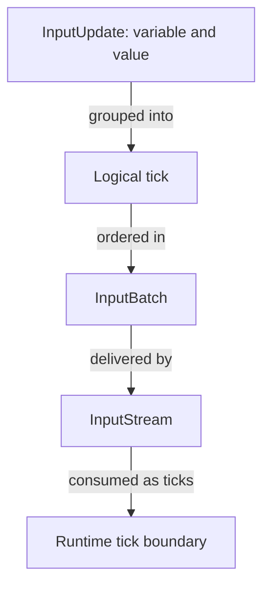
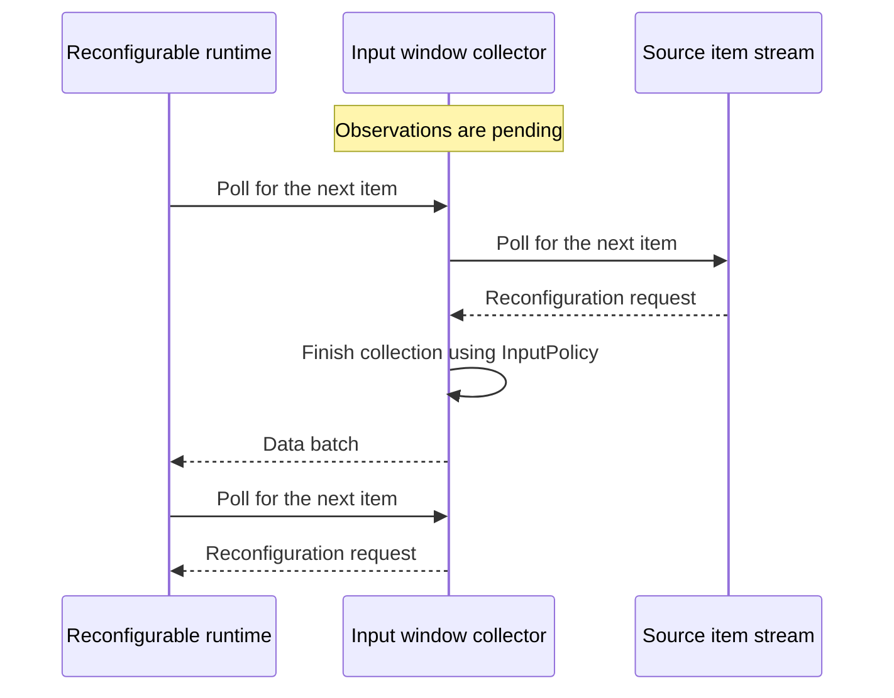
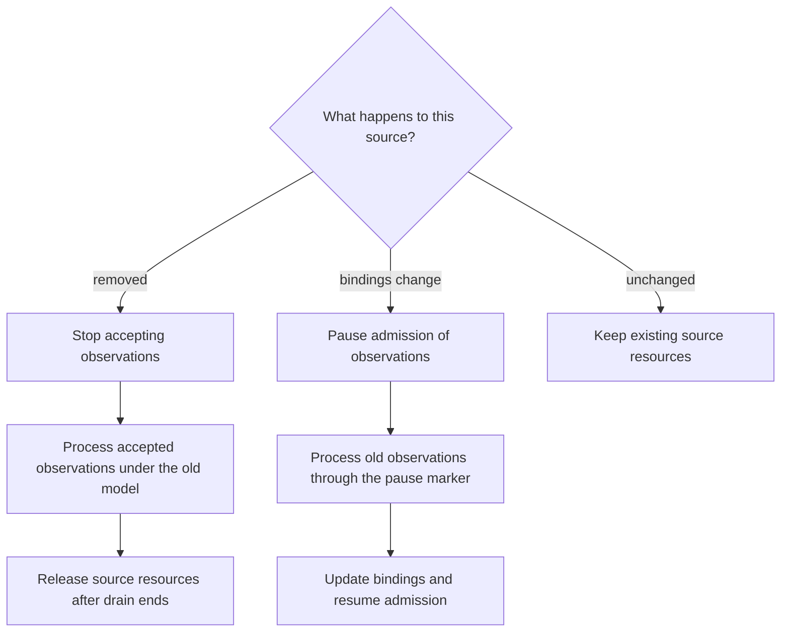

# Input architecture

The input layer reads observations from files, in-memory data, or live producers and supplies them to the runtime for evaluation. It decides where each model input comes from, keeps the required connections and tasks alive, and stops them when they are no longer needed. Observations that belong to the same model step stay together; successive steps stay ordered.

## Scope of the abstraction

| Concern | Input layer responsibility |
|---|---|
| Reading observations | Adapt files, in-memory data, MQTT, Redis, Redis knowledge state, feature-gated ROS, and channel producers to a common data stream. |
| Connecting model variables to sources | Check which source and address supply each variable before opening connections or files. |
| Preserving model steps | Keep simultaneous updates together and preserve the order of successive steps. |
| Collecting observations | Optionally deliver several steps in one batch, or explicitly reduce a collection to one step. |
| Managing resources | Retain active connections and tasks, stop new input when requested, and drain observations already accepted. |
| Receiving reconfiguration requests | Give supporting runtimes a separate kind of item for requests to replace the model or its input/output bindings. |

The runtime evaluates observations and coordinates reconfiguration. When several independent producers supply input, the input layer exposes the order it observes locally. It cannot determine a single global order between those producers. Reconfiguration can fail after some changes have taken effect; it does not roll them back.

The overview separates descriptions of available sources from the resources opened to read them:

```mermaid
{{#include assets/input-architecture.mmd}}
```

**Reading rule.** Solid arrows show choosing sources, opening them, and delivering their observations. The dashed arrow adds the source of reconfiguration requests. Opened input objects keep connections and tasks alive while the runtime reads from them. Ordinary runtimes receive data batches; reconfigurable runtimes can also receive requests and internal markers used to stop or update a source. The type names identify the implementation of each role; the sections below explain their contracts.

## The logical data contract

An observation updates a named variable, such as `x = 1`. The type `InputUpdate<V>` stores that variable/value pair. A logical tick is one or more updates evaluated together in one model step; a valid constructed tick is nonempty and contains no duplicate variable. An `InputBatch<V>` is an ordered sequence of those ticks delivered as one physical unit. `InputBatch::update` constructs one independent width-one tick, `InputBatch::tick` constructs one simultaneous tick, and `InputBatch::from_ticks` constructs an ordered sequence.

For example, one batch can carry two model steps without making the second step part of the first:

```rust
{{#include ../../tests/docs_examples.rs:input_batch_from_ticks}}
```

| Logical unit | Updates | Runtime meaning |
|---|---|---|
| first tick | `x = 1` | one independent model step |
| second tick | `x = 2`, `y = 3` | one simultaneous model step |
| containing batch | first tick, then second tick | two ordered steps delivered together |

The runtime reads a stream of batches, with errors reported as stream items. `InputStream` is the type alias for that asynchronous stream; `LocalStream` is its boxed stream representation. Its type definition is:

```rust
{{#include ../../src/core/input.rs:input_stream_alias}}
```

Receiving the example batch still requires two evaluation steps. The `ticks()` and `into_ticks()` iterators expose those steps in order; receiving them together does not make their updates simultaneous. The diagram shows how updates, ticks, batches, and streams relate:



**Reading rule.** Solid arrows show how data is grouped and delivered. Updates in one tick are evaluated together. A batch can carry several ticks, which the runtime evaluates separately in their original order.

## Principal entities

A source description records how to obtain observations. An opened owner holds the connections, tasks, and stop handles needed to read them. These types separate those responsibilities:

| Entity | Responsibility |
|---|---|
| reusable source description (`InputSource<V>`) | Describes one file, in-memory, transport, knowledge-state, or channel source. It stores configuration and an optional reconfiguration route, but no opened transport handle. |
| source registry (`InputSources<V>`) | Owns the `SourceId`-to-source catalog and optional default. It validates catalog ownership and selects a control-capable source without opening resources. |
| input pipeline (`InputPipeline<V>`) | Couples the source registry to at most one `InputPolicy`; it resolves request-specific bindings and opens the source streams named by a resolved plan. |
| resolved plan (`ResolvedInput`) | Records selected source identities and `InputBinding` route/format assignments for one request without owning resources. |
| logical input (`InputUpdate<V>`, `InputBatch<V>`, `InputStream<V>`) | Represents variable/value updates, ordered logical ticks, and the ordinary data-only stream that delivers batches. |
| reconfiguration adapter (`ReconfigurableInput`) | Selects the source of reconfiguration requests and opens input that carries both observations and requests. It can retain those sources in an `InputPipelineSession`. |
| runtime owners (`DataflowRuntime`, `ReconfSemiSyncRuntime`) | Consume the control-aware stream using retained source owners and ordered binding changes. |

Each transport implementation manages its own external resources. Shared wrappers (`OpenedInputSource`, `InputSourceSet`, and `OpenedInput`) combine their streams, apply any collection policy, and coordinate stopping and draining. Merely describing or selecting a source does not open it; an opened owner is responsible for requesting shutdown when it is dropped.

The [shared I/O lifecycle](io-lifecycle.md) explains the infrastructure used by
both directions, transport-local recovery, and the shutdown deadline shared by
input draining and output close.

## Resolution and opening

Before reading data, the input layer must decide which source supplies each model variable and how to find its value there. A **binding** records that choice: a source identity, a variable, and a route describing its address and optional format. The input layer checks that every requested variable has one source and that the selected transport accepts its route and format.

`InputSources` stores the available source descriptions under stable IDs. `InputPipeline` combines that catalog with an optional collection policy. Request-specific `InputConfiguration` can name a source explicitly for each binding. Otherwise, a variable is assigned to the source whose catalog declares it; a variable absent from those catalogs can use the default source if it supports a default route.

This resource-free selection step is called **resolution**. Internally, `InputPipeline::resolve` returns a `ResolvedInput` containing a `ResolvedSource` entry for each selected source and its `InputBinding` records. A `Route` contains an opaque address and optional `FormatId`. Transport implementations validate their meaning; shared composition code does not parse transport payloads.

Reconfiguration requests can arrive from a source that supplies no model observations. `ReconfigurableInput` records that source separately in `ReconfigurationControl` and includes it when opening input for a reconfigurable runtime.

The public `InputPipeline::build` operation performs resolution and then opens the selected sources. Only opening parses files, creates subscriptions or sockets, and starts source tasks as needed. It attaches source IDs to errors, combines the source streams in locally observed order, and applies the optional collection policy. The returned `OpenedInput` retains the resources while exposing their batches through Rust's `Stream` interface.

To stop input without discarding accepted observations, consume that owner with `OpenedInput::into_drain`. It stops new input and returns an `InputDrain` stream of the observations still available locally. Poll this stream to its end to complete shutdown and observe errors. `into_drain_with_deadline` bounds the operation by an absolute deadline. Dropping the live owner requests cancellation but provides no awaited drain-completion result.

Converting an arbitrary `InputStream` into an `OpenedInput` cannot supply a missing source-stop protocol, so that conversion has an empty drain. The pipeline and lifecycle-aware channel openers retain the ownership information needed for graceful draining.

This example defines two observations in memory, opens them for model input `x`, and reads both:

```rust
{{#include ../../tests/docs_examples.rs:input_pipeline_build}}
```

`InputSource` remains reusable and unopened until `build`; the returned `OpenedInput` yields the two original logical ticks through its `Stream` implementation. Internally, `build` performs resource-free resolution before opening, but `InputPipeline::resolve` and `InputPipeline::open` are crate-private phases rather than separate public calls.

Different sources turn their data into ticks in different ways. Fixed-layout packed rows store successive ticks with the same variables in one flat buffer; they still represent separate model steps:

| Source form | Opened logical result |
|---|---|
| file | Parsed rows are emitted as fixed-layout `PackedRows`; absent sparse rows use the source value's missing-value representation. |
| in-memory rows | Selected columns are emitted as fixed-layout packed rows; the typed opener rejects unequal column lengths. |
| in-memory ticks | Existing `InputBatch` values are filtered to the requested variables without discarding their remaining tick boundaries. |
| MQTT or Redis Pub/Sub | A decoded route payload becomes an independent `InputBatch::update`. |
| Redis knowledge-state | Selected key updates produce ordinary `Value` batches through the same data-only protocol; this source is not control-capable. |
| ROS | Each subscribed message is decoded and mapped to an independent `InputBatch::update`. |
| configured channel source | Per-variable streams are joined into an `InputBatch::tick`, so the values available in one join iteration are simultaneous. |

The separate batch-channel API used by embedded callers accepts complete ticks and batches directly; it does not join one stream per variable.

When several sources are active, their combined stream yields whichever source item it observes next. Independent producers supply no ordering guarantee beyond that local observation.

## Observations and reconfiguration requests

An ordinary runtime receives observations as `InputBatch` values. A reconfigurable runtime also needs to receive requests to replace its model or bindings. Those requests travel as separate typed items, so a control message cannot be mistaken for an observed value. The internal item definition is:

```rust
{{#include ../../src/io/reconfigurable_input.rs:reconfigurable_input_item}}
```

`Boundary(u64)` is an internal lifecycle marker: an owner places it after observations admitted before a pause. It lets the session identify the end of that admitted data during a binding change. It is distinct from a user request to replace the model.

A source of reconfiguration requests must support a separate control route or channel. MQTT, Redis, ROS, and a channel source with a control fanout support this. `ReconfigurableInput::new` validates the selected source and stores its ID and route in `ReconfigurationControl`. File, in-memory row/tick, and Redis knowledge sources are not. With multiple configured sources, the control source is the one source that declares `reconfiguration_route`; with one configured source, that source must support control. A control-only source can therefore be separate from the sources that own model variables.

The ordering between observations and requests depends on how the transport receives them:

| Adapter | Current boundary behavior |
|---|---|
| MQTT | The shared rumqttc MQTT 3.1.1/5 owner (default `3.1.1`) decodes data and control from one item stream, using QoS 1 subscriptions. On pause, a marker follows observations accepted under the old bindings, allowing those observations to be processed before the bindings change. Rejected MQTT 5 protocol acknowledgements are terminal for the driver. |
| Redis Pub/Sub | Data and control are decoded from one Pub/Sub stream. Pause stops admission and queues a boundary marker behind admitted items; the same owner applies subscription and route changes before resuming. |
| ROS | Data and control use independent subscriptions. The persistent control subscription yields requests across reconfigurations, while the data subscriptions remain separate; polling control first is a responsiveness choice, not a data-before-control ordering guarantee. |
| channel | Data and control use independent fanouts. The adapter polls control first for responsiveness, but the fanouts provide no cross-stream ordering edge. |

MQTT, Redis, and ROS reject using the same active route for both observations and requests. Channel input can use a separate control fanout. If the input layer is collecting observations when a request arrives, it emits that pending collection before forwarding the request. This preserves the order already observed by the collector. It cannot establish an order between independent producers, or produce further data after the source has ended.

## Collecting observations into input windows

An input window is a temporary collection of incoming observations. It lets the input layer deliver several ticks together, or deliberately reduce them to one model step. It is separate from the monitor's history: the collection happens before evaluation. Without an `InputPolicy`, the input layer forwards source batches without this additional collection step.

`InputWindow` names the **limits on that collection**, not an active buffer or a worker. It contains an optional maximum delay and an optional update-count limit; at least one must be set. The count measures incoming variable/value updates, including repeated updates to the same variable. For example, `{x = 1, y = 2}` followed by `{x = 3}` counts as three updates across two ticks. The collector emits after reaching the threshold, but always retains a complete tick, so an indivisible tick can exceed the limit. With a maximum delay, it starts a timer when it has pending data; the timer does not wait for the count limit to be reached.

`InputPolicy` chooses what the collected observations mean:

| Policy | Result for `{x = 1, y = 2}`, then `{x = 3}` |
|---|---|
| `Batch(window)` | One physical batch containing both original ticks: two model steps. |
| `WindowToStep { window, reduction: LastUpdateWins }` | One simultaneous tick containing `{x = 3, y = 2}`: one model step. |

The diagram compares the two policies using those same observations:

{{#include assets/input-window-ticks.svg}}

**Reading rule.** Left-to-right position is logical tick order, while values aligned inside one box are simultaneous. `InputPolicy::Batch` changes the physical delivery unit but preserves both incoming ticks. `InputPolicy::WindowToStep` with `LastUpdateWins` deliberately creates one new simultaneous tick, retaining `y = 2` and replacing the earlier `x = 1` with `x = 3`.


For example, this runnable input uses a three-update limit to batch two ticks without changing either tick:

```rust
{{#include ../../tests/docs_examples.rs:input_window_batch}}
```

The implementation function `drive_window`, in `src/io/aggregation.rs`, constructs the stream adapter that maintains this collection. It is shared by ordinary and reconfigurable input. It runs when its returned stream is polled; it does not spawn a background worker. Internally, it tracks pending observations, applies the chosen policy, and yields completed batches.

A timer, update threshold, end-of-stream, source error, reconfiguration request, or lifecycle marker ends a pending collection. For a request, marker, or error, the adapter emits the collected data first and forwards the following item on the next pull. This keeps locally observed old data ahead of a reconfiguration request without inventing an order between independent producers.

The following interaction focuses on a request arriving while observations are pending:



**Reading rule.** Solid arrows are polls or local work; dashed arrows return stream items. The collector is the stream adapter built by `drive_window`. Batching returns the original ticks; reduction returns one simultaneous tick. The request follows that result on a separate poll. Lifecycle markers and source errors follow the same pending-data-first rule; EOF finishes the collection before the stream ends. A timer or count threshold can finish a collection without a request.

Internally, `InputSegment` stores separate updates, simultaneous ticks, or fixed-layout rows. Batching can split storage between ticks to meet a threshold, but never splits a simultaneous tick. Reducing a window also consumes complete ticks before emitting its result.

## Persistent input sessions

Reconfiguration often changes the model while leaving some input sources in use. Keeping their connections and tasks avoids reopening unchanged sources. Both reconfigurable runtimes retain those resources in an `InputPipelineSession`, created by `ReconfigurableInput::open_session`.

The session keeps the active source bindings and a combined stream of observations and requests. For live input, a relay task forwards source items through a bounded channel. It can retain one queued item and one additional item being forwarded, so a slow runtime eventually stops further local admission. The session can cancel these tasks when input must stop.

A prepared change must still belong to the setup and session for which it was computed. `PipelineGeneration` identifies the durable input setup and is attached to each resolved plan. A new durable pipeline configuration gets a
new generation, which prevents a plan from an older configuration from being
applied. An opened input session also carries an opaque `SessionId` and
monotonic `SessionRevision`; reconfiguration checks both before it starts and
advances the revision only after the candidate has been applied.

To decide which resources can be kept, `InputPipeline::plan_reconfiguration` compares current and requested bindings by source ID. Unchanged owners remain live. MQTT, Redis, ROS, and channel owners apply changed bindings in place; removing an ID and adding a distinct ID retires one owner and opens another. Unsupported changes to a retained owner fail during preparation.

### Stopping or updating an input source

When reconfiguration removes an input source, the runtime must stop receiving new observations from it while still processing observations that were already accepted. It stops new input, drains the accepted observations through the old model, and then releases the source's resources. This prevents accepted observations from being silently discarded or evaluated under the replacement model.

A source that remains in use may support changing its subscriptions or bindings without closing the connection. In that case, it pauses admission, lets the runtime process observations accepted under the old bindings, applies the binding changes, and resumes. An unchanged source keeps its existing resources.



**Reading rule.** Solid arrows show the steps for one source. Removing a source ends its lifetime after draining. A supported binding change retains its resources while admission pauses; the marker identifies the end of observations accepted under the old bindings. An added source opens separately. Resumed admission may queue observations, but evaluation under the replacement model waits for the coordinated reconfiguration to succeed.

The consuming `InputPipelineSession::rebind` operation coordinates these changes. Its callback gives the runtime accepted old-binding batches to evaluate before it opens additional sources and returns the updated session. The runtime records the new session revision only after input changes, output changes, and monitor replacement succeed. If stopping, draining, opening, or processing data fails, cleanup runs and the call cannot return the former live session.

The semisynchronous runtime follows the same input-lifetime rule. It processes old-binding observations before capturing the history needed by the replacement evaluator, retains the I/O sessions while replacing that evaluator, and then records successful session revisions.

## Failure and resource boundaries

An invalid source assignment fails before resources are opened. A connection or subscription failure during opening is returned to the caller. Once a source is active, a terminal error is tagged with its source ID and ends its stream. If an input window holds observations at that point, it yields them before yielding the error.

Retryable connection failures are handled by the transport implementation before it reports a terminal stream error. Collecting or combining input does not restart failed transports or replay their batches. See [recovery and terminal failure](io-lifecycle.md#recovery-and-terminal-failure) for the retry boundary.

Stopping input explicitly lets the runtime process accepted observations through the drain described above. Dropping a session instead requests cancellation of its source tasks. The [graceful-shutdown contract](io-lifecycle.md#graceful-shutdown) explains the deadline shared by input draining and output completion, including what happens when that time runs out.

The input/output session and cutover details continue in [persistent I/O sessions](architecture/dataflow/runtime-io.md) and [root cutover](architecture/dataflow/reconfigurable-runtime.md). The downstream logical consumer is described in the [dataflow execution model](architecture/dataflow/model.md), and the broader replacement distinction is in [reconfiguration architecture](reconfiguration.md).

## Implementation mapping

- Logical updates, batches, segment preservation, and `InputStream`: `src/core/input.rs`.
- Shared storage and traversal: `src/core/batch.rs`; shared diagnostic representation: `src/core/io_error.rs`.
- `InputSource`, `InputSources`, `InputPipeline`, resolution, opening, and source-change planning: `src/io/builders/input_stream_factory.rs` and `src/io/config/types.rs`.
- Window and control-barrier reductions: `src/io/aggregation.rs`.
- `ReconfigurableInput`, private control items, source relays, `InputPipelineSession`, and removal drains: `src/io/reconfigurable_input.rs`.
- Persistent dataflow ownership and ordered cutover: `src/runtime/dataflow.rs`.
- Semisynchronous evaluation replacement with retained I/O sessions: `src/runtime/reconfigurable_semi_sync.rs`.
- Source-specific logical shapes and transport behavior: the file, map, MQTT, Redis, ROS, and channel adapters under `src/io/`; focused unit tests live beside those implementations.
