# Input architecture

The input API has one public data model for ordered input data. Providers keep
whatever physical representation is cheapest while they acquire and compose
input; the ordinary runtimes consume the data-only `InputStream`. Reconfiguration
control is handled by a private adapter used only by the reconfigurable runtime.



## Updates, ticks, batches, and private storage

The public model has three logical levels:

- An **update** is one variable/value pair, represented by
  `InputUpdate<V>`. For example, `x = 3` is one update.
- A **tick** is the unit evaluated together. It contains one or more updates.
  A tick with one update is an independent update; a tick with several updates
  is simultaneous and must not be flattened into separate ticks.
- An **input batch** is an ordered sequence of logical ticks delivered by an
  input stream. A batch boundary is a delivery and storage boundary, not an
  additional synchronization event.

The corresponding public types are:

```rust
pub struct InputUpdate<V> {
    pub variable: VarName,
    pub value: V,
}

pub struct InputBatch<V> { /* crate-private storage */ }

pub type InputStream<V> =
    OutputStream<anyhow::Result<InputBatch<V>>>;
```

Library callers construct independent updates and simultaneous or multi-tick
batches with `InputBatch::update`, `InputBatch::tick`, and
`InputBatch::from_ticks`. They inspect the logical view through methods such as
`ticks`, `updates`, `tick_count`, and `update_count`.

The physical representation is deliberately not public API. Crate-private
`InputSegment` values retain runs of independent singleton ticks, one
simultaneous tick, or packed fixed-width rows, and crate-private
`InputBatchStorage` holds one or several such segments. Built-in file, map, and
in-memory row providers use packed rows where possible, while MQTT, Redis, ROS,
and manual live updates normally arrive as singleton ticks. Library callers do
not construct or inspect segments or packed-row storage directly.

Construction validates logical tick invariants at the boundary. Internal packed
construction also validates layouts and row widths. Concatenation and mapping
preserve logical order and retain packed storage; runtimes expand a packed row
only at a tick or evaluator boundary. Physical segments are therefore an
implementation optimization and shape record, not another public level or a
nested batch model.

The public API intentionally does not expose separate event-shaped and
step-shaped stream aliases. Independent updates and simultaneous rows are both
represented by `InputBatch`, and their tick boundaries remain explicit.

## Ordinary streams and reconfiguration control

An ordinary runtime receives only data:

```rust
pub type InputStream<V> = OutputStream<anyhow::Result<InputBatch<V>>>;
```

There is no public control frame in `InputStream`. Functions such as
`map_input_values`, `try_map_input_values`, and source composition operate on
batches, while the private `input::into_tick_stream` boundary expands owned
logical ticks only where a runtime needs per-tick fanout. This keeps normal
runtimes independent of reconfiguration protocol details.

Ordinary and reconfigurable inputs use the same private window driver when an
input window is configured. Ordinary batches are adapted to private data events
with an impossible control type. The reconfigurable adapter maps its private
data and control items to the same event form, runs the shared driver, and maps
the results back. This gives both paths identical batching, atomic-step, timer,
update-threshold, end-of-stream, and error-flush behavior without adding control
to the public stream API.

The reconfigurable semi-sync runtime's private item has the following shape:

```rust
pub(crate) enum ReconfigurableInputItem<V> {
    Data(InputBatch<V>),
    Reconfigure(MonitorConfig),
}
```

`ReconfigurableInput` owns a reusable `InputPipeline` and one validated control
binding. It opens the data sources and the control route for one generation,
then translates one control message into the private `Reconfigure` item. The
control route is not a model variable, does not enter value/variable mapping,
and is never exposed as an ordinary `InputStream` item. The reconfigurable
runtime therefore accepts an `InputPipeline`, not a pre-opened direct
`InputStream`.

A control item is a terminal barrier for its generation. The shared private
window driver first flushes pending data, then emits the private reconfiguration
item and terminates without polling or emitting later old-generation data. The
old source tasks are then dropped. The new specification is parsed and
validated, a generation-specific resolved input is produced from the
replacement `MonitorConfig`, and a fresh generation is opened. Even
when the input and output sets have the same shape, the barrier starts a new
generation.

## Sources, resolution, and composition

`InputSource` is reusable configuration; it does not hold an opened transport
connection. `InputSources` is the owned local source set: it gives sources stable
IDs and keeps route catalogs, defaults, endpoints, security-sensitive connection
settings, and each source's optional transport-local `reconfiguration_route`
together. It does not hold a generation-specific control selection.

Resolution and opening are separate. `InputPipeline::resolve(model_inputs,
monitor_config)` validates ownership, complete coverage, routes, and codecs and
returns an internal immutable `ResolvedInput` made of `ResolvedSource` and
`ResolvedBinding` values for one generation. `InputPipeline::open(resolved)`
then acquires only the resources described by that resolved value. The convenient
`build(model_inputs)` method performs the default/catalog resolution followed by
opening for simple callers. A reconfigurable generation resolves its
`MonitorConfig` immediately before opening; neither the pipeline nor the private
reconfiguration adapter stores a resolved generation plan.

Resolution follows these rules:

1. An explicit source-qualified binding wins and is checked against that source.
2. Otherwise a variable with exactly one source catalog owner is assigned to
   that source.
3. A variable with no catalog owner uses the configured default source, when
   that source supports a default route. Generic MQTT and Redis sources use
   the variable name as the route; file input selects the variable from the
   trace.
4. Missing owners, multiple catalog owners, duplicate bindings, undeclared
   variables, missing model inputs, and invalid route/codec combinations are
   errors before any resource is opened.

The private `ReconfigurableInput` adapter selects and validates the fixed control
source separately. A single source needs no marker; with multiple sources,
exactly one source must declare `reconfiguration_route`. `--reconf-topic` may
override the route but not the selected source. The selected source is opened
for every generation, with its active model-data bindings when present or an
empty binding list for a dedicated control-only source. Each other selected
data source is opened with only its bindings. Source streams are composed in
observed stream order. Completion of one source does not terminate its siblings,
and no synchronization policy is invented merely because sources were composed.
A live update remains an independent tick; a packed file or map source remains
packed; a mixed batch may contain several segment kinds without merging an event
into an existing simultaneous row.

A simple single-source library pipeline looks like this:

```rust
let pipeline = InputPipeline::new(InputSource::mqtt(None, Some(1883)));
let stream = pipeline.build(spec.input_vars().clone()).await?;
```

For a named multi-source deployment, use `InputSources` through the
`--input-config` command-line form. Catalog ownership or compact
source-qualified monitor bindings determine each generation's resolved input.

## Batch and atomic-step windows

The pipeline has at most one input window stage. A window can be bounded by a
maximum delay, an update limit, or both:

```text
--input-window-ms <milliseconds>
--input-window-update-limit <updates>
--input-window-mode batch|atomic-step
```

When a bound is supplied and no mode is selected, the mode is `batch`.
Windows are applied after the selected source streams have been composed.

The update limit is a flush threshold and a soft bound, not a hard maximum. The
shared private driver accepts a complete logical tick and flushes once the
accumulated update count reaches or exceeds the threshold. It never splits one
atomic logical tick, so a wide simultaneous tick can make either mode's emitted
batch exceed the configured count. A timer, end-of-stream, error, or control
barrier may flush below the threshold.

- **Batch mode** accumulates input while retaining every logical tick and its
  simultaneous boundaries. Internally it concatenates physical segments rather
  than flattening them.
- **Atomic-step mode** consumes the logical ticks in the window and emits one
  simultaneous tick. It applies last-update-wins per variable, so later updates
  in the same window replace earlier values. This is an intentional change of
  semantics: a window of independent events becomes one atomic step. The file
  input CLI requires an update limit when this mode is selected.

The two modes should not be confused with the physical representation. A
packed row is already one simultaneous tick, but a batch window can contain
many such rows; an atomic-step window reduces the whole configured window to
one final simultaneous tick.

Textual stream values from files, MQTT, and Redis are decoded as JSON5. Standard
JSON is therefore accepted without a separate parser or fallback path.

## Compact route catalogs and input configuration

A route catalog is a JSON5 object from model variable to route. Standard JSON
remains valid input because it is a subset of JSON5. A route is
either a string or a compact two-element array containing a route and codec:

```json
{
  "x": "/robot/input/x",
  "pose": ["/robot/input/pose", "Pose2D"]
}
```

The same compact form is used by `--input-mqtt-file`,
`--input-redis-file`, `--input-ros-file`, and the corresponding output route
files. MQTT and Redis normally use their JSON5 codec and can use string routes;
ROS routes must carry the message codec. Route catalogs are source-owned
bindings, not fake model variables or an extra control-plane variable.

The simple input modes are single-source defaults:

- `--input-file` reads the variables declared by the current specification
  from the trace.
- `--mqtt-input` and `--redis-input` use the current specification's variable
  names as routes when no catalog is supplied.
- A route-file option supplies explicit routes and, for ROS, codecs.

For multiple live sources, `--input-config` defines an owned local source set.
It is exclusive with the other input-selection flags. A minimal configuration
is:

```json
{
  "default": "robot-mqtt",
  "sources": {
    "robot-mqtt": {
      "kind": "mqtt",
      "host": "localhost",
      "reconfiguration_route": "monitor/reconfigure",
      "routes": {
        "alarm": "/robot/alarm"
      }
    },
    "robot-ros": {
      "kind": "ros",
      "routes": {
        "pose": ["/robot/pose", "Pose2D"]
      }
    }
  }
}
```

The `default` source supplies unowned variables, while explicit route catalogs
make source ownership unambiguous. Each input variable may occur in only one
source's catalog. Named file sources are not a shortcut around a local path:
file input remains a single `--input-file` source, and manual sources are
constructed through the library API.

## Compact reconfiguration messages

A reconfiguration message always contains a new `spec`. Its optional route
fields use the same compact route form as route catalogs:

```json
{
  "spec": "in x: Int\nout z: Int\nz = x",
  "inputs": {
    "x": "/robot/input/x"
  },
  "outputs": {
    "z": "/robot/output/z"
  }
}
```

With `inputs`, `source` may identify the named source for all of those input
bindings. With a multi-source local source set, `sources` assigns bindings by
source:

```json
{
  "spec": "in alarm: Bool\nin pose\nout safe: Bool\nsafe = alarm",
  "sources": {
    "robot-mqtt": {
      "alarm": "/robot/alarm"
    },
    "robot-ros": {
      "pose": ["/robot/pose", "Pose2D"]
    }
  }
}
```

`inputs` and `sources` are alternatives. If neither is present, the next
specification is resolved from the local source catalogs and default, so a
single-source reconfiguration can be spec-only. This is useful for compact
messages and keeps transport details in local configuration. `outputs` is
optional and updates output routes for the new generation. The message is
validated before any replacement is opened.

## Context transfer and unsupported file reconfiguration

Context transfer is enabled by default for `reconf-semi-sync`. When a new
model is prepared, retained history is kept by variable identity for variables
that still exist in the new model. Histories are aligned to the longest
retained history with `NoVal` on the left, so the replacement can continue with
as much compatible trace context as possible. Use `--no-context-transfer` to
start the replacement without that history.

Reconfiguration requires a control-capable live source: MQTT, Redis, ROS, or a
manual library source with a control channel. File and in-memory row/tick
sources can provide ordinary data, but file-backed reconfiguration is
unsupported. In particular, `--input-file` cannot be combined with
`--runtime reconf-semi-sync`; there is no file control route from which a
running monitor can receive a replacement request.

## Runtime consumption

- Dataflow can validate packed layout once and evaluate packed rows directly.
- Async and semi-sync runtimes expand rows only at their per-variable or
  evaluator boundary.
- Controlled and replay input preserves `InputBatch` tick boundaries while
  applying any configured data window.
- Distributed scheduling and MSTLO consume the same logical tick view, so
  simultaneous rows remain simultaneous and independent updates remain ordered
  updates.

## Redis status

Redis Pub/Sub input and Redis output remain supported. The selected-key Redis
knowledge-state provider is **not implemented in this stage**. It can later be
added as an event-shaped `InputSource` using the same `InputBatch` and
`InputStream` protocol; no public stream-model change will be required.
