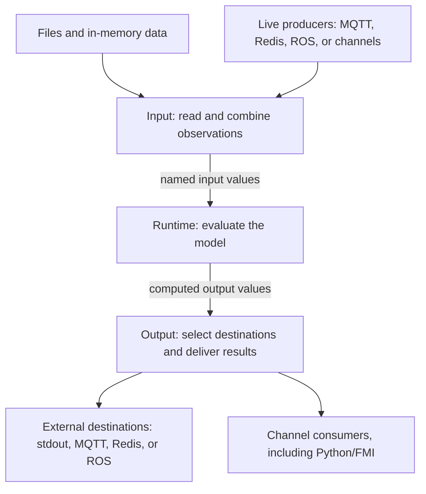

# I/O architecture

The I/O layer connects a monitor to the data it observes and the places that receive its results. Input reads observations from files, in-memory data, or live producers and presents them as named values. The runtime evaluates the model. Output selects the destinations for the computed values and delivers them using the appropriate transport.

This separation lets the same model receive data from different sources and send results to different destinations. Transport implementations handle connections, subscriptions, message formats, and acknowledgements. Shared I/O code handles source selection, combining input streams, routing output, buffering, and stopping resources.

## From observations to results

A model declares input and output variables. Its I/O setup connects those names to external addresses, such as MQTT topics, Redis channels, or columns in a file. The runtime works with variable values rather than those external addresses.

**Reading rule.** Arrows show the direction of data movement. The input and output branches represent available source and destination choices; a run uses the configured selection. Model evaluation belongs to the runtime between the two I/O directions. Multiple destinations receive separate deliveries, so one may succeed before another fails.

For example, suppose a model reads `x` from an MQTT topic, computes `doubled = x * 2`, and sends `doubled` both to stdout and to a second MQTT topic:

| Stage | First observation | Next observation |
|---|---|---|
| Input decodes the message and assigns its variable | `x = 4` | `x = 8` |
| Runtime evaluates the model | `doubled = 8` | `doubled = 16` |
| Output delivers to each selected destination | `doubled = 8` | `doubled = 16` |

Each column represents one model step, called a **logical tick**. A tick can contain several simultaneous variable updates. A **batch** carries one or more ordered ticks together. Delivering the two example ticks in one batch still means two model steps; it does not make the two values of `x` simultaneous.

## Connecting model variables to sources and destinations

The application first describes the sources and destinations available to a run. Those descriptions contain transport settings and the information needed to locate values. They do not themselves open connections or start transport tasks.

Before opening resources, the I/O layer checks the requested variable assignments. Each input variable must have a selected source. Output assignments determine which destinations receive each computed variable, including additional copies when configured. The resulting assignments are called **bindings**. Transport implementations validate their addresses and formats.

Opening then creates the resources needed to read and deliver data. An ordinary run keeps them for its lifetime. A reconfigurable run can retain existing resources while supported bindings change. The public setup types are currently named `InputPipeline` and `OutputPipeline`; the opened input, writer, and session objects hold the active resources.

## Reading input and delivering output

Input and output have different jobs even though they share implementation infrastructure:

| Input | Output |
|---|---|
| Yields observed values for evaluation. | Accepts computed values for delivery. |
| Combines active sources in the order observed locally. | Selects values for each configured destination. |
| Can collect several ticks into a batch, or explicitly reduce a collection to one model step. | Can coalesce several batches while preserving every output tick. |
| Stops new observations and drains accepted input during graceful shutdown. | Finishes pending delivery and closes destination resources. |

The runtime reads input through an asynchronous Rust `Stream` and submits output through a `Sink`. A stream yields the next item when available. A sink lets the producer wait for capacity, submit an item, and wait for delivery completion. The [Sink recap](output.md#rust-sinks-readiness-admission-and-completion) explains those operations in more detail.

Input and output batches have distinct public types, `InputBatch` and `OutputBatch`, while sharing storage and traversal code. The directions also share diagnostic infrastructure, retry settings, and shutdown timing. The behavior of reading observations remains separate from the behavior of delivering results.

## Slow transports, failure, and changes during a run

Live input and buffered output use bounded local queues. When downstream work cannot keep up, those bounds make producers wait instead of accumulating unlimited local work. Output defaults to direct delivery; background queuing and coalescing are explicit policies. Accepting a result into a queue is separate from completing its delivery. What completion establishes depends on the transport—for example, a broker acknowledgement does not mean that a subscriber has processed the result.

Transport implementations retry failures they can safely recover from, according to the configured retry policy. A terminal I/O failure stops the session and triggers cleanup. Graceful shutdown stops new input, processes accepted observations while evaluation can continue, finishes pending output, and closes resources under one shared deadline if configured.

Reconfiguration coordinates changes across input, output, and the model. Observations accepted under old bindings are processed under the old model before replacement. Existing resources are retained where supported. A failure partway through stops the run; already applied changes are not rolled back.

## Further reading

- [Input architecture](input-architecture.md): source selection, observation ordering, input windows, and stopping or updating sources.
- [Output architecture](output.md): destination selection, the Rust Sink interface, buffering, coalescing, and delivery completion.
- [I/O ownership and lifecycle](io-lifecycle.md): shared implementation, explicit drain and close operations, retry boundaries, and shutdown deadlines.
- [Reconfiguration architecture](reconfiguration.md): coordination between I/O changes and model replacement.
