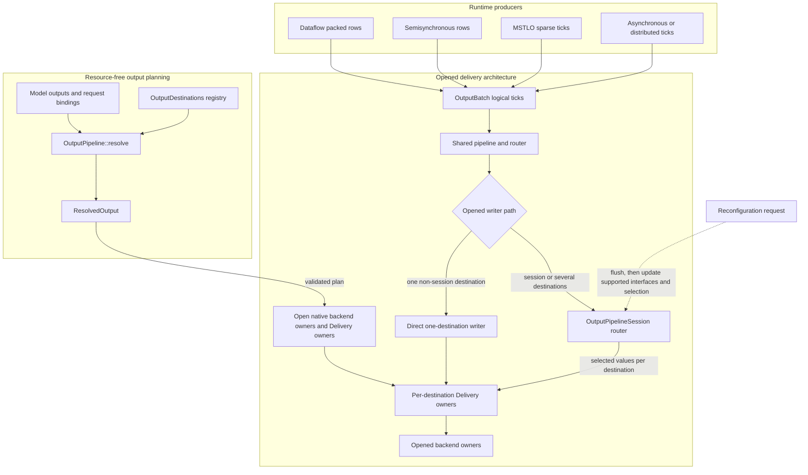
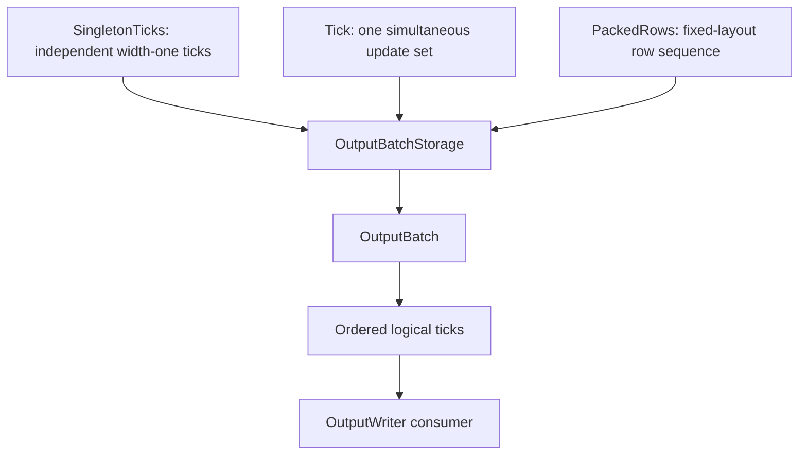
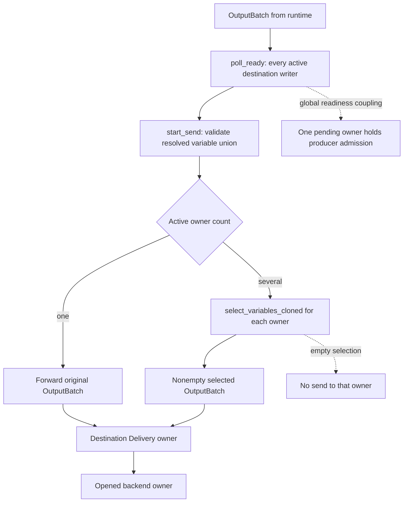
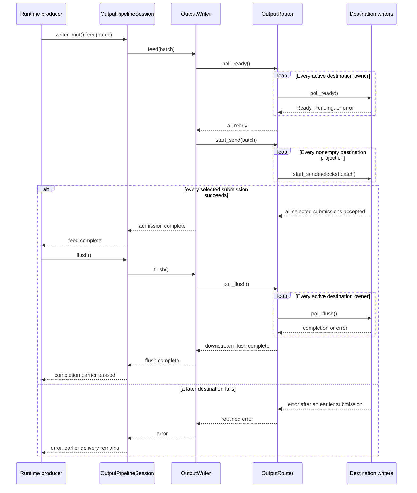

# Output architecture

The output subsystem accepts complete logical output ticks from a runtime and turns them into configured delivery through local or transport-backed destination owners. It is the architecture layer that hides destination selection, opaque route/format interfaces, delivery ownership, fan-out, backpressure, and writer lifecycle behind one runtime-facing `OutputWriter`.

## Scope of the abstraction

| Concern | Output subsystem responsibility |
|---|---|
| runtime output forms | Accept singleton, simultaneous, packed-row, and mixed `OutputBatch` segments without redefining their logical ticks. |
| destination configuration | Resolve model outputs and request bindings onto stable `OutputDestination` owners, opaque routes, formats, and explicit mirrors. |
| resource ownership | Separate resource-free `ResolvedOutput` planning from opened native backend owners, delivery workers, and session state. |
| delivery topology | Place one per-destination `Delivery` owner around a native backend owner, then route selected batches through the shared pipeline. |
| fan-out and pressure | Select each destination's variables while exposing one readiness contract to the producer. |
| lifecycle and replacement | Order send, flush, close, cleanup, sticky failure, and supported in-place interface handoff through `OutputWriter` and `OutputPipelineSession`. |

The subsystem does not choose the runtime's logical output shape, provide an atomic transaction across destinations, or prove that a remote service persisted or consumed an admitted batch.



**Reading rule.** Solid arrows separate the resource-free planning path from runtime batch delivery and show the two opened writer alternatives. Shared pipeline routing surrounds each per-destination `Delivery` owner. The dashed edge is session control, not output data. The focused routing figure below expands router readiness and selection without changing these connection points.

## Principal entities

| Entity | Responsibility |
|---|---|
| logical output (`OutputBatch`) | Carries ordered logical ticks in the native singleton, simultaneous, packed-row, or mixed representation chosen by the runtime. |
| destination registry (`OutputDestinations`) | Holds stable destination identities and unopened `OutputDestination` backend, selection, route, and delivery configuration. |
| output pipeline (`OutputPipeline`) | Resolves model outputs and request bindings, opens native backend owners, and attaches each destination's `DeliveryPolicy`. |
| resolved output plan (`ResolvedOutput`) | Records complete ownership, mirroring, opaque routes, formats, delivery policies, interfaces, and destination selection without opening resources. |
| delivery owner (`Delivery<V>`) | Applies one destination's direct, queued, or coalescing `DeliveryPolicy` around an opened backend writer. |
| backend interface (`OutputBackendConfig`, `OutputInterface`) | Separates reusable backend configuration from the resolved bindings and routes supported by an opened owner. |
| runtime-facing sink (`OutputWriter`) | Applies readiness, send, flush, and close ordering to complete output batches. |
| live output session (`OutputPipelineSession`) | Retains fixed opened destination owners and router state so supported interfaces and selected variables can change in place. |

Each backend has a native opener for its resource: local sinks are opened by
crate-private functions, the public channel transport exposes `output` and
`open_output`, and MQTT, Redis, and ROS keep their transport-specific openers.
The shared `OutputPipeline`, `OutputRouter`, and `Delivery` types coordinate
selection, bounded delivery, rebind, and cleanup around those native owners.
There is no common backend wrapper hierarchy or out-of-band interface
reconfiguration handle; the opened `OutputWriter` owns the sink and its
supported `rebind` operation.

## The logical output contract

`OutputBatch<V>` stores an ordered sequence of non-empty logical ticks. A tick may be a singleton update, a simultaneous set of updates, or a row in fixed-layout packed storage. Physical concatenation, mapping, and variable selection preserve logical boundaries.

Output shape belongs to the producing runtime:

| Producer | Native output representation |
|---|---|
| dataflow runtime | packed fixed-layout rows |
| semisynchronous runtime | simultaneous rows |
| MSTLO runtime | sparse singleton ticks; a variable may appear in more than one tick |
| asynchronous and distributed runtimes | singleton ticks in observed merge order |



**Reading rule.** Solid arrows map physical segment forms onto the common logical contract. The forms may coexist in one batch, but they do not merge simultaneous ticks, invent model time, or require packed rows to be expanded before iteration.

A batch is not an external transaction. Successful admission to an `OutputWriter` also does not prove that a remote service has persisted or consumed the values.

## Resolution and opening

`OutputPipeline` owns durable destination and delivery configuration. `OutputPipeline::resolve` combines that configuration with model outputs, auxiliary variables, and request-local bindings to produce a complete immutable `ResolvedOutput`.

Resolution establishes primary ownership, explicit mirroring, opaque routes, formats, per-destination delivery policies, and destination selection. Every model output has at least one primary owner. Additional delivery is explicit; a default destination does not mirror to every configured destination.

An `OutputBinding` names a variable, its output or auxiliary role, and an
optional `Route`. A route carries an opaque address and optional `FormatId`; the
transport interprets those values when its native owner opens or rebinds. An
`OutputInterface` validates the bindings as one unique variable set shared by
the opened writer.

Resolution opens no backend. Opening validates the resolved structure again, then creates native destination owners and their `Delivery` wrappers in deterministic order. If a later destination fails to open, already-opened owners are closed before the error is returned. `OutputPipeline::open` uses a direct writer when exactly one destination is resolved and otherwise opens a session-backed router. `OutputPipeline::open_session` always retains the router because its fixed owners may receive new bindings during reconfiguration.

This example makes the planning, ownership, and completion boundaries explicit with a local null destination:

```rust
{{#include ../../tests/docs_examples.rs:output_pipeline_open}}
```

`resolve` is resource-free; `open` creates the native destination and shared delivery owners. `feed` admits the complete batch under the writer's readiness contract. `flush` waits for downstream completion, and `send` combines admission with that flush. Even that barrier states completion only at the opened backend's contract and does not imply remote persistence for a transport-backed destination.

## Delivery policy, routing, and destination owners

The router precomputes the union of variables accepted by its active destinations and rejects any update outside that resolved set. Its detailed admission and selection path is:



**Reading rule.** Solid arrows carry admitted batches; the one-owner and multi-owner branches are alternatives. Dashed arrows show consequences rather than batch delivery: empty projections are skipped, while readiness remains coupled across all active owners. Each `Delivery` owner preserves its destination's order but does not provide cross-destination rollback.

Selection preserves logical tick boundaries; ticks containing no selected values disappear from that destination's batch:

{{#include assets/output-routing-ticks.svg}}

**Reading rule.** Columns retain the original `OutputBatch` tick positions. A destination receives only nonempty projections, so its local sequence can omit an original tick, but values from separate original ticks never become simultaneous. The two destination lanes are independent delivery sequences, not an atomic cross-destination commit.

There is no cross-destination observation order or atomic commit.

## Delivery policies and bounds

Each destination has one `DeliveryPolicy`. The default `direct` policy owns no
worker and forwards batches to the native destination writer. A `queued` policy
uses `QueueLimits`: `max_batches` bounds admitted batches retained by the
delivery worker, and optional `max_updates` bounds the charged updates across
queued and in-flight work. One indivisible batch may cross an update threshold.

A `coalesce` policy joins complete physical batches before sending them to the
native writer. It preserves every logical tick and never applies
last-update-wins. `tick_limit`, `update_limit`, and `max_delay_ms` are flush
thresholds checked between incoming batches, so one complete batch may overshoot
them. Coalescing supplies a default queue limit of 32 batches; an explicit queue
configuration can add or replace its queue limits. The durable configuration
shape is:

```json5
{
  delivery: {
    queue: { max_batches: 64, max_updates: 4096 },
    coalesce: { tick_limit: 128, update_limit: 256, max_delay_ms: 2 },
  },
}
```

Omitting `delivery`, or leaving both policy objects empty, selects direct
delivery. Coalescing without an explicit queue uses the default queue.

Worker-backed delivery owns its local-executor task and cancellation handle.
`flush`, `rebind`, and `close` are ordered barriers: the worker drains pending
delivery, invokes the corresponding native writer operation, and returns its
one-shot acknowledgement. No delivery worker is detached from its owning
`OutputWriter`.

The runtime-facing writer follows the standard `Sink` sequence: readiness is
polled before `start_send`, `flush` waits for the downstream sink, and
`poll_close` performs final cleanup. A worker-backed `Delivery` represents
`flush`, `rebind`, and `close` as queued commands with one-shot acknowledgements;
the acknowledgement means that the local owner completed that barrier or
returned its error. It does not assert remote persistence.

## Backpressure and failure

`OutputWriter` exposes sink readiness to its producer. In a multi-destination session, readiness waits for every destination writer, including one that will receive no values from the next batch. Per-destination queued delivery can absorb work after routing but does not remove this global admission coupling.

A destination may already have observed a batch when another destination fails. The pipeline provides no cross-transport rollback. The first operation failure becomes sticky: later sends fail fast, while close still attempts to flush and close every delivery owner and native destination and retains cleanup failures separately.

The writer interaction distinguishes admission from the later completion barrier:



**Reading rule.** Solid arrows are calls or batch submissions; dashed arrows are readiness results, returns, or completion signals. `feed` completes after admission. `flush` waits through every active destination, and `send` performs both operations. The loop order does not create an atomic cross-destination commit, and an error does not reverse an earlier owner’s accepted batch.

## Live interface handoff

Both `DataflowRuntime` and `ReconfSemiSyncRuntime` keep a fixed registry of opened destination owners in an `OutputPipelineSession`. A request may change bindings, opaque routes, formats, or destination selection supported by those owners. It cannot create or remove durable destination owners, replace local backend configuration, or change a destination's `DeliveryPolicy`.

Application first flushes affected owners, or the shared writer when the delivery boundary requires a global barrier. It then calls `OutputWriter::rebind` on each affected owner and updates the router's selected variables. A native sink that cannot rebind reports the error; the pipeline does not silently close and reopen it.

Updates are sequential rather than transactional. If a later destination fails, an earlier destination update can remain applied. This partial-application boundary is part of the [root cutover](architecture/dataflow/reconfigurable-runtime.md).

`PipelineGeneration` is an opaque identity attached to durable pipeline
configuration and its resolved plans. A configuration edit creates a new
generation, so a plan from an older generation cannot be applied to the current
pipeline. An opened session has its own opaque `SessionId` and monotonic
`SessionRevision`; a coordinated reconfiguration checks both before applying a
candidate and advances the revision only after the ordered update commits.

## Implementation mapping

- `OutputUpdate`, `OutputBatch`, segment preservation, `OutputWriter`, and sticky writer lifecycle: `src/core/output.rs`.
- `OutputDestination`, `OutputDestinations`, `OutputPipeline`, `ResolvedOutput`, router selection, and `OutputPipelineSession`: `src/io/output/pipeline.rs`.
- Per-destination queue and coalescing workers, bounds, acknowledgements, and barriers: `src/io/output/delivery.rs`.
- Runtime-native batching and handoff: `src/runtime/dataflow.rs`, `src/runtime/semi_sync.rs`, `src/runtime/mstlo.rs`, `src/runtime/asynchronous.rs`, `src/runtime/distributed.rs`, and `src/runtime/output.rs`.
- Focused output batch, delivery, routing, backpressure, opening-cleanup, and reconfiguration tests live beside these implementations.

Continue with the [input architecture](input-architecture.md), [runtime adapter](architecture/dataflow/runtime-adapter.md), or [failure containment](architecture/dataflow/failure-model.md).
