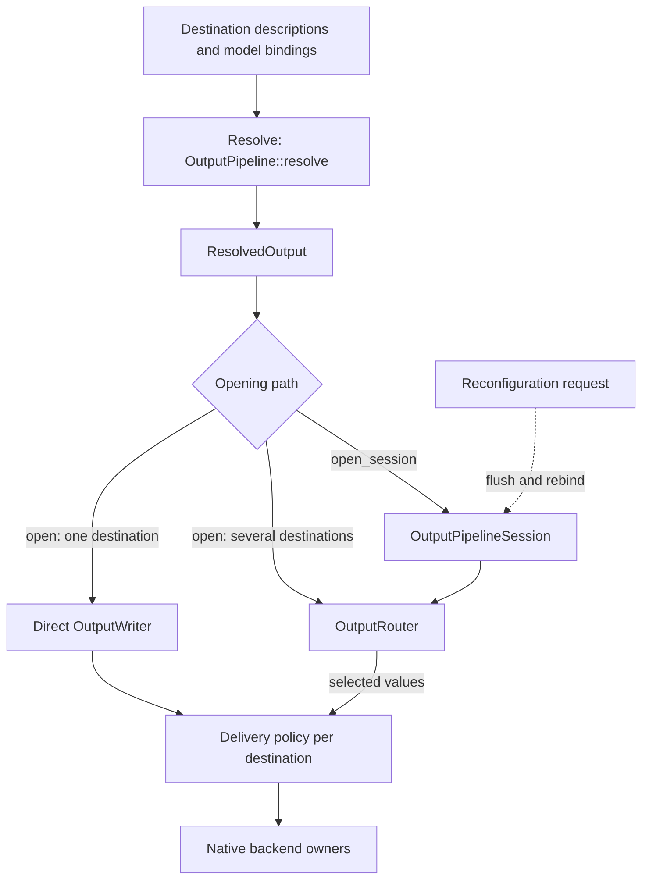
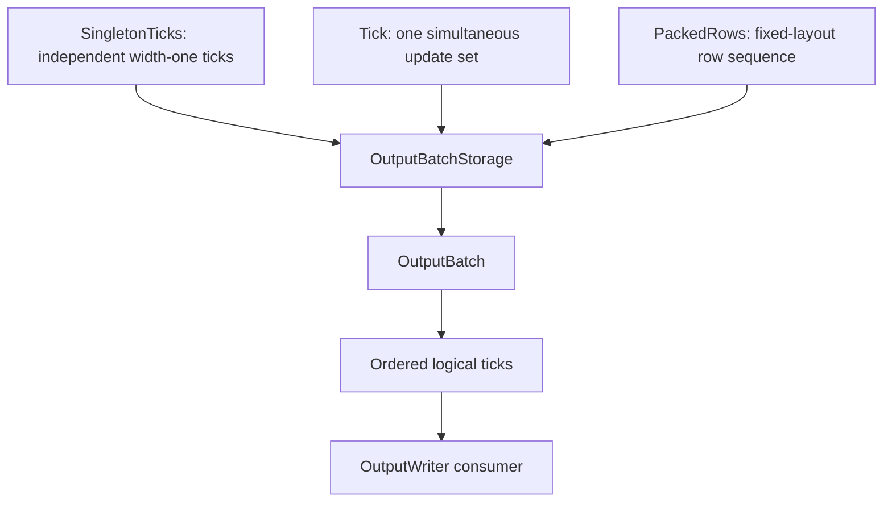
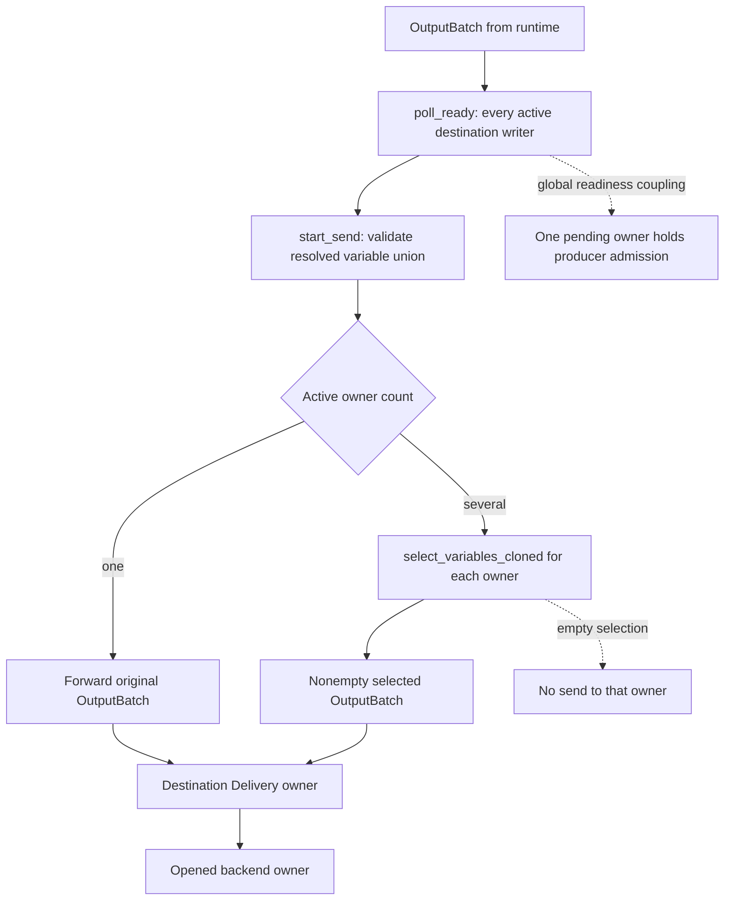
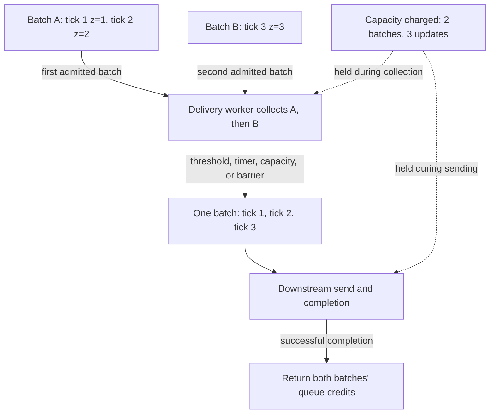
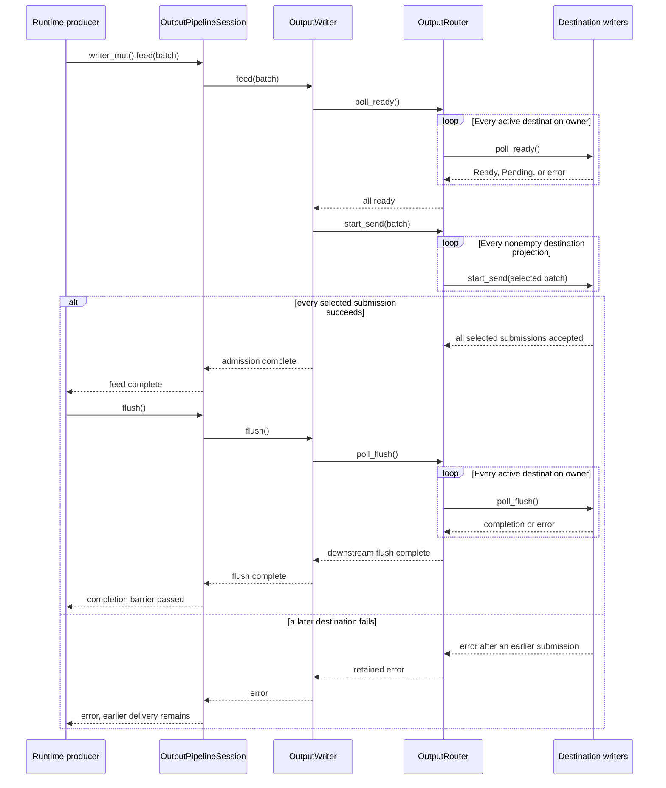

# Output architecture

The output layer sends computed values from the runtime to external destinations. Values produced together in one model step form a **logical tick**. The layer selects where those values go, keeps successive ticks separate, waits when a destination cannot accept more work, and closes the resources it opened at shutdown. The runtime submits results through an `OutputWriter` instead of handling each transport itself.

## From a completed tick to configured destinations

| Concern | Output layer responsibility |
|---|---|
| Receiving results | Accept one or several model steps together while preserving which values belong to each step. |
| Selecting destinations | Determine which destination receives each variable, including copies sent to additional destinations. |
| Opening resources | Check the requested destinations and addresses before opening their connections, files, or tasks. |
| Delivering results | Send directly, or retain a bounded amount of work in a background delivery task. |
| Handling slow destinations | Make the producer wait when more results cannot yet be accepted. |
| Stopping or changing output | Finish pending delivery before closing resources or changing supported bindings, and report failures. |

The runtime chooses which values form each tick. Destinations can complete or fail independently; sending to several destinations does not make their effects atomic. Accepting a batch locally also does not establish that a remote service has stored or processed it.

Before delivery starts, destination descriptions and model bindings are checked without opening sockets, files, or tasks. Opening then chooses the smallest runtime path: one destination is connected directly, while several destinations require a router; live reconfiguration retains that router even when only one destination is active.



**Reading rule.** Follow the solid arrows from configuration checking through opening to the transport owner that performs delivery. `open` returns one writer: it connects directly to a single destination or routes to several. `open_session` keeps the router available for later interface changes, even with one destination. The dashed edge shows such a live reconfiguration after pending output has been flushed. The focused routing figure below expands how a batch is admitted and selected.

## Components that implement delivery

The following types divide the work between data representation, configuration, live resources, and the writer presented to a runtime. A sink is a consumer to which asynchronous Rust code can submit values; its readiness and completion operations are explained below.

| Entity | Responsibility |
|---|---|
| logical output (`OutputBatch`) | Carries ordered logical ticks in the native singleton, simultaneous, packed-row, or mixed representation chosen by the runtime. |
| destination registry (`OutputDestinations`) | Holds stable destination identities and unopened `OutputDestination` backend, selection, route, and delivery configuration. |
| output pipeline (`OutputPipeline`) | Resolves model outputs and request bindings, opens native backend owners, and attaches each destination's `DeliveryPolicy`. |
| resolved output plan (`ResolvedOutput`) | Records complete ownership, mirroring, opaque routes, formats, delivery policies, interfaces, and destination selection without opening resources. |
| delivery owner (`Delivery<V>`) | Applies one destination's direct, queued, or coalescing `DeliveryPolicy` around an opened backend writer. |
| backend interface (`OutputBackendConfig`, `OutputInterface`) | Separates reusable backend configuration from the resolved bindings and routes supported by an opened owner. |
| runtime-facing sink (`OutputWriter`) | Applies readiness, send, flush, and close ordering to complete output batches. |
| live output session (`OutputPipelineSession`) | Retains fixed opened destination owners and router state so supported interfaces and selected variables can change in place. |

Each backend has a native opener for its resource: local sinks are opened by
crate-private functions, the public channel transport exposes `output` and
`open_output`, and MQTT, Redis, and ROS keep their transport-specific openers.
The shared `OutputPipeline`, `OutputRouter`, and `Delivery` types coordinate
selection, bounded delivery, rebind, and cleanup around those native owners.
There is no common backend wrapper hierarchy or out-of-band interface
reconfiguration handle; the opened `OutputWriter` owns the sink and its
supported `rebind` operation.

## Preserving logical ticks in output batches

A runtime can emit one value, several simultaneous values, or several completed rows at once. In every case, downstream code must still be able to tell which values belong to the same logical tick and which belong to later ticks. `OutputBatch<V>` records that ordered sequence of non-empty ticks while allowing several physical storage forms.

Output shape belongs to the producing runtime:

| Producer | Native output representation |
|---|---|
| dataflow runtime | packed fixed-layout rows |
| semisynchronous runtime | simultaneous rows |
| MSTLO runtime | sparse singleton ticks; a variable may appear in more than one tick |
| asynchronous and distributed runtimes | singleton ticks in observed merge order |



**Reading rule.** Each storage form contributes ticks to the same ordered sequence consumed by a writer. Several forms may coexist in one batch, but converting or joining their storage does not merge distinct ticks or create additional model time. Packed rows can remain packed while consumers iterate over the common tick view.

A batch is not an external transaction. Successful admission to an `OutputWriter` also does not prove that a remote service has persisted or consumed the values.

## Choosing destinations before opening resources

Configuration must be rejected before it creates partial external state. The subsystem therefore first combines the declared model outputs, auxiliary variables, and request-local bindings into a complete plan without opening a backend. `OutputPipeline::resolve` performs that step and returns the immutable `ResolvedOutput` plan.

Resolution establishes primary ownership, explicit mirroring, opaque routes, formats, per-destination delivery policies, and destination selection. Every model output has at least one primary owner. Additional delivery is explicit; a default destination does not mirror to every configured destination.

An `OutputBinding` names a variable, its output or auxiliary role, and an
optional `Route`. A route carries an opaque address and optional `FormatId`; the
transport interprets those values when its native owner opens or rebinds. An
`OutputInterface` validates the bindings as one unique variable set shared by
the opened writer.

Resolution opens no backend. Opening validates the resolved structure again, then creates native destination owners and their `Delivery` wrappers in deterministic order. If a later destination fails to open, already-opened owners are closed before the error is returned. `OutputPipeline::open` uses a direct writer when exactly one destination is resolved and otherwise opens a session-backed router. `OutputPipeline::open_session` always retains the router because its fixed owners may receive new bindings during reconfiguration.

The following local null destination shows all three observable boundaries: checking a plan opens nothing, opening creates the destination owner, and flushing waits for the opened backend's completion contract.

```rust
{{#include ../../tests/docs_examples.rs:output_pipeline_open}}
```

`resolve` is resource-free; `open` creates the native destination and shared delivery owners. `feed` admits the complete batch under the writer's readiness contract. `flush` waits for downstream completion, and `send` combines admission with that flush. Even that barrier states completion only at the opened backend's contract and does not imply remote persistence for a transport-backed destination.

## Rust Sinks: readiness, admission, and completion

Before sending a batch, the runtime may have to wait for capacity. Once capacity is available, accepting the batch and completing its downstream delivery remain separate events. The asynchronous `futures::Sink` contract names these steps as follows:

| Operation | Contract |
|---|---|
| `poll_ready` | Wait for capacity to accept an item. After `Ready(Ok(()))`, the caller may submit one item. |
| `start_send` | Transfer that item into the sink after readiness. Success means admission. |
| `poll_flush` | Drive previously admitted items to the sink's completion boundary. |
| `poll_close` | Finish pending delivery and close the sink. |
| `feed(item).await` | Await readiness and submit the item, without flushing. |
| `send(item).await` | Await readiness, submit the item, and flush. |

The polling methods are the implementation interface. A `Pending` result yields
control to the executor; the sink registers the supplied waker so the executor
can poll again when progress is possible. `SinkExt` provides the asynchronous
helpers used by callers. Implementing `Sink` does not itself create a worker.

`OutputWriter` implements this contract for a complete `OutputBatch`, adds
validation and sticky errors,
and forwards polling to the router or destination sink it owns. This is why the
example above uses `feed` followed by `flush`: the two calls expose the
admission and completion boundaries separately.

## Routing one batch to its destinations

With several destinations, one slow destination can delay admission for the whole batch. After all active destinations report capacity, the router checks that every update is configured, selects the values assigned to each destination, and skips an empty selection. The following figure shows that path before each selected batch reaches its destination-specific delivery policy.



**Reading rule.** Solid arrows carry an accepted batch along one of the alternative routing paths. Dashed arrows show consequences: an empty destination projection produces no send, while any destination that lacks capacity holds admission for all of them. Each destination preserves its own tick order, but successful delivery to one destination is not rolled back if another fails.

Selection can remove an entire tick for one destination when that tick contains none of its variables. It does not combine the ticks that remain:

{{#include assets/output-routing-ticks.svg}}

**Reading rule.** Columns retain the original `OutputBatch` tick positions. A destination receives only nonempty projections, so its local sequence can omit an original tick, but values from separate original ticks never become simultaneous. The two destination lanes are independent delivery sequences, not an atomic cross-destination commit.

There is no cross-destination observation order or atomic commit.

## Choosing direct or buffered delivery

An application can send directly when the destination's own backpressure is sufficient, or place a bounded worker queue in front of that destination. The default `direct` policy forwards each batch without creating a worker. The `queued` policy admits work into a delivery worker only while its `QueueLimits` permit it: `max_batches` bounds retained batches, and optional `max_updates` bounds their updates across queued and in-flight work. Because admission never splits a batch, one batch may carry the count across an update threshold.

## Output coalescing

Coalescing collects several accepted output batches and joins them into one downstream batch. Every logical tick remains in order, including successive ticks that update the same variable. For example, a batch containing `z = 1`, then `z = 2`, followed by a batch containing `z = 3`, becomes one batch containing all three ticks.

The delivery worker owns the pending collection. `tick_limit` and `update_limit` trigger emission after a complete incoming batch has been appended, so that batch can take the collection over a threshold. `max_delay_ms` starts a timer with the first pending batch. Reaching the queue's batch or update capacity also triggers emission, allowing progress even when the configured coalescing threshold is larger than the queue. A flush, rebind, or close command finishes any pending collection before its own operation.

The figure follows two accepted batches until the destination completes their combined send. The capacity charge remains attached to both original batches throughout that interval.



**Reading rule.** Solid arrows show batch collection, delivery, and completion; dashed arrows show the capacity charged while work remains outstanding. The edge labels specify admission order. Coalescing removes the physical boundary between A and B while keeping all three model ticks. It does not replace earlier values with the latest value. The returned credits allow subsequent readiness checks to admit more work. The worker loop and credit accounting are implemented in `src/io/output/delivery.rs`.

Coalescing supplies a default queue limit of 32 batches. An explicit queue configuration can replace that limit and add an update bound:

```json5
{
  delivery: {
    queue: { max_batches: 64, max_updates: 4096 },
    coalesce: { tick_limit: 128, update_limit: 256, max_delay_ms: 2 },
  },
}
```

Omitting `delivery`, or writing `delivery: {}`, selects direct delivery.
`queue: {}` is invalid because `max_batches` is required, and `coalesce: {}` is
invalid because coalescing requires at least one threshold. Coalescing without
an explicit queue uses the default queue.

When a policy adds a delivery worker, that destination owns the worker's
local-executor task and cancellation handle.
`flush`, `rebind`, and `close` are ordered barriers: the worker drains pending
delivery, invokes the corresponding native writer operation, and returns its
one-shot acknowledgement. A successful explicit `close` waits for that
acknowledgement and joins the worker task. Drop is a fallback: an unclosed writer
with an attached cleanup executor detaches an asynchronous close task. If the
delivery owner itself is dropped before its worker is joined, it closes the
command sender and detaches the worker to finish pending work. Both paths
require continued executor progress and provide no completion result to the
caller.

The runtime-facing writer follows the standard `Sink` sequence: readiness is
polled before `start_send`, `flush` waits for the downstream sink, and
`poll_close` performs final cleanup. A worker-backed `Delivery` represents
`flush`, `rebind`, and `close` as queued commands with one-shot acknowledgements;
the acknowledgement means that the local owner completed that barrier or
returned its error. It does not assert remote persistence.

Queue credits count original admitted batches. A batch retains its batch and
update charges while it is queued, combined into a coalesced batch, or in
flight. The worker releases those charges only after the downstream `send`
completes. This keeps coalescing from making several admitted batches appear as
one unit of queue pressure.

## Transport completion

A completed flush reaches the boundary offered by the opened backend; it does not have one universal remote meaning. The built-in adapters establish the following facts:

| Backend | What completion establishes |
|---|---|
| MQTT | The QoS 1 publish received its broker `PUBACK`; this is not subscriber consumption. |
| Redis | The server returned the `PUBLISH` command reply; this is not subscriber consumption. |
| channel | Every logical tick was handed to the channel as a row; this is not consumer processing. |
| stdout | The writer accepted the encoded rows and its flush completed. |
| ROS | The local publisher accepted each publish call; there is no remote acknowledgement. |

Close deadlines are shared across the output owners participating in shutdown,
rather than restarted for each owner. When the deadline expires, the remaining
output work is aborted and the timeout is reported, combined with an earlier
primary error when one exists. The broader shutdown order, input drain, retry,
and deadline contracts are described in [I/O lifecycle](io-lifecycle.md).

## How slow or failing destinations affect the runtime

Before the runtime can submit a batch to several destinations, every active destination must report capacity, including one that will receive no selected values from that particular batch. A per-destination queue can absorb work after routing, but it does not remove this shared admission wait.

A destination may already have observed a batch when another destination fails. The pipeline provides no cross-transport rollback. The first operation failure becomes sticky: later sends fail fast, while shutdown still attempts cleanup of every owner within the remaining deadline and retains cleanup failures separately.

Worker-backed delivery is asynchronous after admission. A downstream failure
that happens after `feed` returns is retained by the worker and becomes visible
on a later readiness, flush, rebind, or close operation. Therefore successful
`feed` alone says neither that downstream delivery completed nor that no error
will be reported by the next sink operation.

The sequence below shows what has completed when `feed` returns, what the later `flush` waits for, and how a failure after an earlier destination accepted its batch is reported.



**Reading rule.** Solid arrows are calls or batch submissions; dashed arrows are readiness results, returns, or completion signals. `feed` completes after admission. `flush` waits through every active destination, and `send` performs both operations. The loop order does not create an atomic cross-destination commit, and an error does not reverse an earlier owner’s accepted batch.

## Changing bindings while destinations remain open

During live reconfiguration, the runtime keeps its destination connections open rather than replacing their local resource owners. `DataflowRuntime` and `ReconfSemiSyncRuntime` retain those owners in an `OutputPipelineSession`. A request can change bindings, opaque routes, formats, or variable selection supported by the existing owners. It cannot add or remove durable destination owners, replace their local backend configuration, or change a destination's delivery policy.

Application first flushes affected owners, or the shared writer when the delivery boundary requires a global barrier. It then calls `OutputWriter::rebind` on each affected owner and updates the router's selected variables. A native sink that cannot rebind reports the error; the pipeline does not silently close and reopen it.

Updates are sequential rather than transactional. If a later destination fails, an earlier destination update can remain applied. This partial-application boundary is part of the [root cutover](architecture/dataflow/reconfigurable-runtime.md).

A failed rebind leaves the session failed; it cannot resume ordinary delivery.
The remaining lifecycle operation is cleanup through close.

A plan prepared from an older configuration must not be applied after that
configuration changes. `PipelineGeneration` provides the opaque identity used
to reject such stale plans. An opened session independently carries a
`SessionId` and monotonic `SessionRevision`; coordinated reconfiguration checks
both before changing an owner and advances the revision only after the ordered
update commits.

## Implementation mapping

- `OutputUpdate`, `OutputBatch`, segment preservation, `OutputWriter`, and sticky writer lifecycle: `src/core/output.rs`.
- `OutputDestination`, `OutputDestinations`, `OutputPipeline`, `ResolvedOutput`, router selection, and `OutputPipelineSession`: `src/io/output/pipeline.rs`.
- Per-destination queue and coalescing workers, bounds, acknowledgements, and barriers: `src/io/output/delivery.rs`.
- Runtime-native batching and handoff: `src/runtime/dataflow.rs`, `src/runtime/semi_sync.rs`, `src/runtime/mstlo.rs`, `src/runtime/asynchronous.rs`, `src/runtime/distributed.rs`, and `src/runtime/output.rs`.
- Focused output batch, delivery, routing, backpressure, opening-cleanup, and reconfiguration tests live beside these implementations.

Continue with the [input architecture](input-architecture.md), [runtime adapter](architecture/dataflow/runtime-adapter.md), or [failure containment](architecture/dataflow/failure-model.md).
