# Output architecture

The output boundary is a single runtime-facing `OutputWriter<V>`. Runtimes produce
logical output ticks; destinations and transports consume those ticks without
choosing their shape.

[](assets/output-end-to-end-flow.svg)

## Logical output data

`OutputBatch<V>` is a physical container for an ordered sequence of logical ticks.
It is not an atomicity or time contract:

- `OutputUpdate<V>` is one variable/value update.
- `OutputBatch::update` is an independent width-one tick.
- `OutputBatch::tick` is one simultaneous tick containing duplicate-free updates.
- `OutputBatch::packed_rows` is non-empty fixed-layout row-major storage.
- batches can contain mixed singleton, simultaneous, and packed segments.
- empty output is `OutputBatch::empty()`, never a zero-row or zero-width packed segment.

Borrowed `ticks()` and `updates()` iteration does not expand packed rows. Owned
expansion is available only when a consumer needs individual tick vectors. Mapping,
concatenation, and variable selection retain segment representations; adjacent
compatible singleton or equal-layout packed segments may be appended, while
simultaneous ticks are never merged. Every non-empty logical tick is duplicate-free.

For independently progressing streams, width-one tick order is the observed merge
order. It is not a promise of a global model timestamp.

## Runtime-owned shapes

Output shape comes from the producer, not from the backend:

| Runtime | Native output representation |
| --- | --- |
| Dataflow | packed fixed-layout rows, batched natively |
| Semi-sync | simultaneous logical rows, including starting-history replay |
| MSTLO | sparse singleton ticks; repeated verdicts are preserved |
| Async/distributed | singleton ticks in observed merge order unless an explicit row boundary exists |

The runtime gives the writer a batch. It does not give the writer unresolved
catalogs, monitor control frames, or a destination-selected output mode.

## Destinations and resolution

`OutputDestination<V>` is unopened local configuration. It contains a backend
configuration, a durable route catalog, an explicit selection role, and
destination-local stages. `OutputDestinations<V>` stores destinations in stable
`BTreeMap` order and optionally names a default destination.

The configured `default` destination is the primary destination for otherwise
unassigned model outputs; it does not implicitly mirror output to every other
destination. In a multi-destination configuration, every secondary destination
must establish an explicit role with a `partition`, `variables`, `mirror: true`,
or a route catalog. `variables` is the legacy route-free spelling of a primary
`partition`. The `variables`, `partition`, and `mirror` fields are mutually
exclusive; repeating a variable in explicit destination roles is what makes
fan-out/mirroring intentional.

Backends include stdout, null, limited-null, MQTT, Redis, and ROS (when compiled
with the ROS feature). `limited-null` requires a positive `limit`. The manual
backend is programmatic-only and cannot be selected in `--output-config`.
MQTT output is Paho-only; the CLI's MQTT input backend choice does not change
that output implementation. Configuration is resource-free: opening a
configuration creates clients, nodes, publishers, and stage workers only after a
complete output has been resolved.

`OutputPipeline::resolve(model_outputs, auxiliary, monitor_config)` returns a
complete deterministic `ResolvedOutput`:

1. explicit request bindings win;
2. otherwise local catalogs and selection roles own variables;
3. otherwise the sole/default local destination supplies supported primary defaults;
4. every model output must have at least one primary owner;
5. additional delivery is explicit through a partition, variables, mirror role,
   route role, or repeated grouped binding;
6. extra explicit variables are rejected, except declared auxiliary variables;
7. route and codec capability checks happen before opening any backend.

Flat `outputs` bindings target an explicit, sole, or default destination and do
not fan out on their own. Grouped `destinations` bindings cover the model output
union exactly; a variable occurring in multiple groups is intentionally mirrored.
MQTT and Redis omitted codecs are normalized to JSON. ROS routes require a codec.
Local destinations such as stdout and null use `route: None` and do not require
fake routes. Manual output is available only through the programmatic API.
Within one destination, duplicate MQTT topics and duplicate Redis channels are
rejected. The same topic or channel may be reused by distinct destinations;
uniqueness is destination-local.

`ResolvedOutput` carries process-local resolved-plan integrity data and the
identity of the `OutputPipeline` instance that produced it. Before opening,
the pipeline recomputes the integrity data, checks its durable configuration and
pipeline-instance identity, and rejects a plan from another instance. These
guards are process-local and are not stable cross-process cache keys.

## Pipeline execution and routing

The execution order is:

```text
runtime OutputBatch
  -> shared stages (producer to consumer)
  -> compiled router
  -> destination-local stages (producer to consumer)
  -> backend writer
```

Stage arrays are configured in producer-to-consumer order and wrapped in reverse
when opened. A one-destination pipeline that receives the complete output set
uses the direct fast path; the no-stage path forwards batches without routing or
selection allocations.

For multiple destinations the router precomputes variable-to-destination
membership and uses global readiness: `poll_ready` waits for every opened
destination, including one that receives no value from the next batch. Once the
batch is admitted, the router scans it and clones the selected values for each
destination; primary partition routing is not a move-only fast path. A destination
that receives no variables from a tick receives no empty tick. Per-destination
order is preserved, but one slow or blocked destination can hold producer
admission, so destination-local stages do not provide full destination pressure
isolation. No cross-destination observation order, transaction, rollback, or
external atomicity is promised:

> A batch may have reached one external destination before another destination
> fails. There is no cross-transport rollback or transaction guarantee.

A destination failure is fail-fast for producer operations. Close still drives
every destination and reports the first operation failure together with distinct
cleanup failures.

## Stages

`OutputStage` is deliberately a closed enum:

- `Buffer(OutputBuffer)` is reliable, bounded, FIFO, and blocking. `max_batches`
  bounds retained physical batches; `max_updates` is a pressure threshold over
  queued and in-flight updates, not a numeric hard cap. Readiness admits a batch
  before seeing its size, so an indivisible batch can cross the threshold; an
  oversized batch is accepted when the queue is empty and no further batch is
  admitted until pressure drains. This is the documented one-physical-batch
  overshoot. The ordinary batch-only buffer owns its downstream writer in an
  executor task; flush and close are ordered barriers and close joins the task.
- `Coalesce(OutputCoalescing)` changes only physical batching. It preserves every
  logical tick and its order, never deduplicates, never applies last-update-wins,
  and never splits a simultaneous tick to satisfy a bound. `tick_limit` counts
  ticks and `update_limit` counts updates. Count limits are flush thresholds
  evaluated between incoming physical batches, not per-tick admission caps: a
  complete physical batch containing many ticks or updates may overshoot either
  limit. Coalescing never splits an incoming physical batch and still preserves
  every logical tick. A delay-bound coalescer owns the downstream writer and a
  timer worker; when the deadline or a count limit fires, the worker sends the
  pending batch through the backend even if the producer is idle. Flush and
  close drain pending data.

A timed stage requires the runtime's local executor. Count-only coalescing is a
local state machine; ordinary batch-only buffering is worker-backed. No output
worker is detached. After a worker or backend error, sends are rejected, the
first error remains primary, and close still drives downstream cleanup exactly
once.

Stage order is observable:

```text
[Coalesce, Buffer]  = producer -> coalescer -> bounded queue -> backend
[Buffer, Coalesce]  = producer -> bounded queue -> coalescer -> backend
```

Coalescing before buffering reduces queued batch count but can make producer
submission wait for the coalescer. Buffering before coalescing overlaps producer
work and lets the downstream coalescer combine queued batches. Shared stages
apply one policy before routing. Destination stages shape each destination's
writer, but the router's global readiness still couples producer admission to
every destination; they are not full pressure isolation.

## Lifecycle and reconfiguration

`OutputPipeline::open(ResolvedOutput)` validates the resolved structure, compiles
routing, opens destinations in deterministic order, and cleans up already-opened
destinations if a later open fails. No runtime sees a partially opened pipeline.

`OutputWriter` retains `primary_error` and an explicit open/closing/closed
lifecycle. After a failure, data operations fail fast, but close still flushes and
closes every stage and destination. Flush and close barriers propagate through all
wrappers.

Reconfigurable semi-sync follows this order:

```text
final pre-barrier tick
  -> parse/type-check replacement
  -> resolve both replacement input and output plans without I/O
  -> transfer context explicitly
  -> cancel the active monitor
  -> drain coalescing and buffer stages
  -> close old destinations and join workers
  -> drop old input resources
  -> replacement builder.build()
       -> open replacement input and output
       -> establish input subscriptions
```

Control messages are not `OutputBatch` variants. Wire reconfiguration can change
bindings, routes, codecs, destination selection, and output shape, but it
cannot create endpoints or change local backend host/port, credentials/TLS,
MQTT implementation, ROS executor, or local stage configuration.

## CLI and compact configuration

Single-destination shortcuts remain concise:

```text
--output-stdout
--mqtt-output
--output-mqtt-file <ROUTES>
--redis-output
--output-redis-file <ROUTES>
--output-ros-file <ROUTES>
```

Use `--output-config <PATH>` for multiple destinations or stage configuration.
The file is JSON5 and keeps local transport configuration separate from wire
requests. This is a valid default-primary plus explicit-mirror configuration for
model outputs `alarm` and `verdict`:

```json5
{
  default: "telemetry",
  shared_stages: [],
  destinations: {
    telemetry: {
      kind: "mqtt",
      host: "localhost",
      port: 1883,
      routes: { alarm: "/robot/alarm", verdict: "/robot/verdict" },
      stages: [
        { kind: "buffer", max_batches: 64, max_updates: 4096 },
        { kind: "coalesce", max_delay_ms: 2, update_limit: 256 }
      ]
    },
    archive: {
      kind: "redis",
      host: "localhost",
      port: 6379,
      mirror: true,
      routes: { alarm: "monitor:alarm", verdict: "monitor:verdict" }
    }
  }
}
```

Here `telemetry` is primary and `archive` receives an explicit mirror of both
outputs. A partitioned configuration must assign each model output to exactly
one primary partition; mirrors can then receive those values explicitly:

```json5
{
  destinations: {
    telemetry: {
      kind: "mqtt",
      partition: ["alarm"],
      routes: { alarm: "/robot/alarm" }
    },
    console: {
      kind: "stdout",
      partition: ["verdict"]
    },
    archive: {
      kind: "redis",
      mirror: true,
      routes: { alarm: "monitor:alarm", verdict: "monitor:verdict" }
    }
  }
}
```

`variables` is an alternative legacy spelling for `partition`; supplying either
with `mirror`, or supplying both `variables` and `partition`, is an error.
Monitor `outputs` and grouped `destinations` use compact string or
`[route, codec]` forms. They are mutually exclusive with each other, and
`destination` is only valid with flat `outputs`.

## Configuration reference

This is the compact reference for `--output-config` JSON5 and its resolved
destination policy.

| Scope | Fields | Rule |
| --- | --- | --- |
| Top level | `default`, `shared_stages`, `destinations` | `destinations` is non-empty. `default` must name a destination and is the primary fallback for otherwise-unassigned model outputs, subject to backend route/codec rules; it does not mirror to other destinations. |
| Common destination | `kind`, `routes`, `stages` | `kind` is `stdout`, `null`, `limited-null`, `mqtt`, `redis`, or `ros`. `routes` is a variable map; a route catalog can establish an explicit destination role. |
| Backend-specific | `host`, `port`, `limit` | `host` and `port` are only for MQTT/Redis. `limit` is only for `limited-null` and must be positive. Local and ROS destinations reject these fields. |
| Selectors | `partition`, legacy `variables`, `mirror` | These three are mutually exclusive. `partition` assigns a primary subset; `mirror: true` mirrors all model outputs; a secondary destination needs one of these or a route catalog. For `MonitorConfig`, flat `outputs` and grouped `destinations` are mutually exclusive, and `destination` is valid only with flat `outputs`. |
| Routes/codecs | `routes: {var: "route"}` or `{var: ["route", "codec"]}` | MQTT/Redis omitted codecs resolve to `json`, and explicit codecs must be `json` or `json5`; ROS routes require a codec; local backends do not accept codecs. Duplicate MQTT topics or Redis channels are rejected within one destination, but reuse across distinct destinations is allowed. |
| Stage bounds | `buffer`: `max_batches`, optional `max_updates`; `coalesce`: `max_delay_ms`, `tick_limit`, `update_limit` | `max_batches`, `max_updates`, `tick_limit`, and `update_limit` must be positive when present. A coalescer needs at least one bound; count bounds are flush thresholds between physical batches and do not split one. |
| Feature requirements | MQTT, Redis, ROS, manual | MQTT output uses Paho and requires the `mqtt` feature; Redis requires the `redis` feature (both are enabled by default); stdout, null, and limited-null need no optional feature; ROS requires the `ros` feature and its ROS environment/overlay; manual output is programmatic-only. |
| CLI shortcut conflict | `--output-config` and output shortcuts | Output selection is single-choice: `--output-config` conflicts with `--output-stdout`, `--mqtt-output`, `--output-mqtt-file`, `--redis-output`, `--output-redis-file`, and `--output-ros-file`; those shortcuts also conflict with one another. |

### Programmatic opening

The public API separates unopened destination configuration, pure resolution, and
resource opening:

```rust
use trustworthiness_checker::{
    io::{OutputBackendConfig, OutputDestination, OutputPipeline},
    OutputWriter, Value, VarName,
};

async fn open_output() -> anyhow::Result<OutputWriter<Value>> {
    let destination =
        OutputDestination::<Value>::new("local", OutputBackendConfig::null()).all();
    let pipeline = OutputPipeline::from_destination(destination)?;
    let resolved = pipeline.resolve(
        [VarName::new("verdict")],
        std::iter::empty::<VarName>(),
        None,
    )?;
    let writer: OutputWriter<Value> = pipeline.open(resolved).await?;
    Ok(writer)
}
```

The async function must be driven by an executor. This no-stage example needs no
pipeline-local executor; timed coalescing or a buffer without `max_updates`
requires `OutputPipeline::with_executor` with an `Rc<smol::LocalExecutor<'static>>`,
and that local executor must remain driven while the writer runs. Count-only
coalescing and update-bounded buffering do not require it.

## Performance guidance

The dedicated `benches/output_pipeline.rs` target compares direct writing with
one-destination pipeline writing, buffering, coalescing, both stage orders,
two/four-destination partitioning and partial mirroring, packed/mixed/singleton
shapes, and producer-native batching. The corrected harness keeps logical tick
counts, physical batch counts, and per-destination delivery counts separate.
It distinguishes producer `feed` admission wait from backend start and backend
completion latency. Backend latency samples are keyed by synthetic logical tick
IDs, so a coalesced physical batch does not become one p50/p95/p99 sample.

The harness reports admission wait as a producer backpressure proxy. It does
not observe stage internals and therefore must not be used to claim an exact
queue depth or exact peak queue. Multi-destination counters are per resolved
destination; mirrored delivery can intentionally exceed the producer total.

The synthetic backend models explicit arithmetic work per physical batch,
optional arithmetic work per update, and one bounded async delay per physical
batch. The current cases set per-update work to zero and do not make a
per-update performance claim. All results remain local-sink results: they do
not model broker behavior, serialization, network contention, transport
acknowledgements, Redis/MQTT/ROS scheduling, or remote queueing.

No performance numbers are retained in this document. Compile the benchmark
with `cargo bench --profile bench-fast --bench output_pipeline --no-run`, then
pin only the resulting benchmark executable to an otherwise-idle P-core for
controlled measurements. Record the source revision, feature set, CPU/core,
filter, sample configuration, and machine load alongside published results. A
compile-only check or focused correctness smoke run is not a controlled
production performance baseline.
