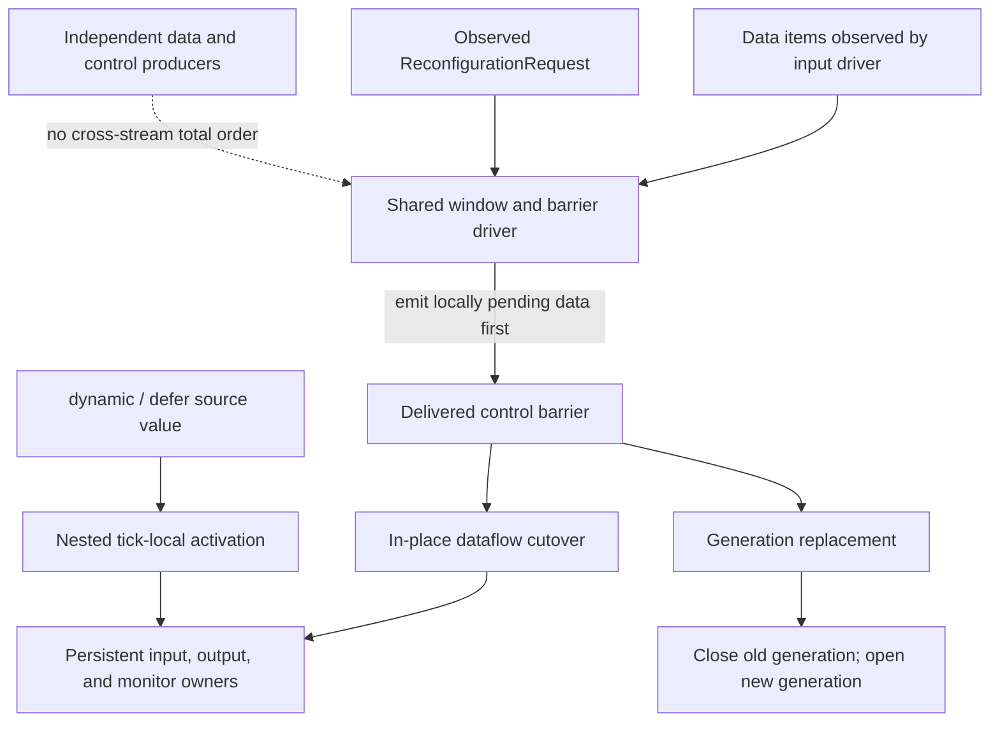
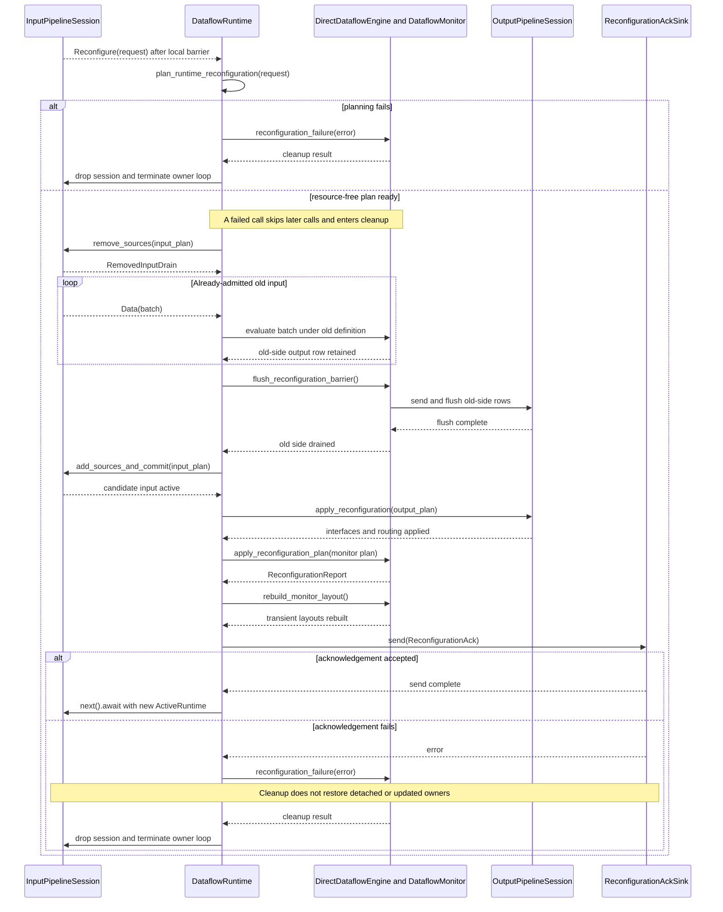

# Reconfiguration architecture

Reconfiguration changes a running monitor's specification and effective input/output interface at a locally ordered control boundary. The project implements two distinct replacement models: the dataflow runtime updates one persistent owner loop in place, while the semisynchronous runtime ends one complete generation and opens another.



**Reading rule.** Solid arrows show the ordering established after the shared driver observes items: pending window data is emitted before the delivered control barrier. The dashed edge denies a stronger guarantee—independent ROS or manual data/control producers have no cross-stream total order. Root requests replace the monitor definition and effective I/O interface; nested `dynamic` and `defer` activations do not run that protocol.

## Principal entities

| Entity | Responsibility |
|---|---|
| control request (`ReconfigurationRequest`) | Carries the candidate specification and effective input/output configuration to an ordered runtime barrier. |
| dataflow owner loop (`DataflowRuntime`, configured by `ReconfigurableDataflowRuntimeBuilder`) | Serializes data evaluation and root cutover across the persistent monitor and I/O sessions. |
| live input session (`InputPipelineSession`) | Retains unchanged source owners and detaches, drains, retires, or opens owners during an in-place cutover. |
| live output session (`OutputPipelineSession`) | Retains fixed destination owners while applying supported interface and selected-variable changes after an ordered flush. |
| synchronous monitor (`DataflowMonitor`) | Owns the compiled program and persistent language state; a `MonitorReconfigurationPlan` retains, installs, or transfers that state. |
| semisynchronous generation (`ReconfSemiSyncRuntime`) | Ends one complete evaluator and I/O generation before opening its replacement. |
| nested expression evaluator (`Evaluator`) | Activates `dynamic` or `defer` bodies inside one monitor tick, outside the root request protocol. |

## Two supported runtime models

| Property | Reconfigurable dataflow | Reconfigurable semisynchronous |
|---|---|---|
| lifetime | one serial owner loop | a sequence of complete runtime generations |
| input | persistent `InputPipelineSession`; unchanged sources retained | complete input stream replaced |
| output | persistent `OutputPipelineSession`; existing interfaces updated | complete writer replaced |
| monitor | planned retain, cold install, or mapped transfer | replacement evaluator generation |
| acknowledgement | local cutover reports monitor and interface revisions | no equivalent dataflow revision protocol |
| partial application | ordered cutover without rollback | old generation ends before replacement opening |

These are separate runtime implementations, not execution tiers of one evaluator.

## Constructing the control request

`ReconfigurationRequest` is the public transport-independent envelope delivered at the control barrier. Its constructor starts with unchanged default input and output configurations, so a request can replace only the monitor specification:

```rust
use trustworthiness_checker::io::ReconfigurationRequest;

let replacement = "in x: Int\n\
    out alert: Bool\n\
    out total: Int\n\
    out scaled: Int\n\
    alert = total > 40\n\
    total = default(total[1], 0) + scaled\n\
    scaled = x * 2";

let request = ReconfigurationRequest::new(replacement);
request.validate()?;
assert_eq!(request.specification, replacement);
```

`validate` checks the request's transport-independent structure: the specification is nonempty and the nested input/output descriptions are structurally valid. It does not parse or compile the replacement, resolve it against the runtime's durable I/O registries, acquire resources, or apply a cutover. Those operations begin when the owner loop plans the delivered request.

Requests that change interfaces populate the public `input` and `output` fields with `InputConfiguration` and `OutputConfiguration`; those values describe the requested effective bindings, while `InputPipeline` and `OutputPipeline` remain the owners of durable local source and destination configuration.

## One root replacement

A representative request changes one input source binding, one output route, and part of the specification while retaining compatible stream state.

| # | Phase | Responsible entity | Architectural effect |
|---:|---|---|---|
| 1 | Deliver the local barrier | shared input driver | Emit data already pending when control was observed, then deliver `ReconfigurationRequest`. |
| 2 | Plan the complete target | `DataflowRuntime` | Validate, compile, resolve input/output, and build a resource-free `RuntimeReconfigurationPlan`. |
| 3 | Detach and drain old input | `InputPipelineSession` and old `DataflowMonitor` | Stop selected ingress and evaluate already-admitted items under the old definition. |
| 4 | Flush old output rows | `DirectDataflowEngine` and `OutputWriter` | Submit output produced before the candidate interfaces become active. |
| 5 | Apply input and output changes | `InputPipelineSession` and `OutputPipelineSession` | Open input additions, commit input resolution, flush output ownership, and update interfaces and selection. |
| 6 | Apply monitor replacement | `DataflowMonitor` | Retain the active monitor, install cold state, or transfer compatible semantic state. |
| 7 | Rebuild transient layouts | `DirectDataflowEngine` | Recreate reusable rows and cached slot mappings around the active monitor. |
| 8 | Acknowledge local completion | `DataflowRuntime` | Publish monitor/interface revisions and change flags. |

Phase 1 states only the local order produced after the shared input driver observes control, not a total order over independent producers. Phase 2 is resource-free; mutation begins in phase 3. Phase 8 confirms local application, not remote destination consumption.

The interaction view exposes the returned drain, the owners crossed during application, and the acknowledgement boundary:



**Reading rule.** Solid arrows are calls, ownership-changing requests, or submitted old-side output; dashed arrows are yielded items, returned artifacts, completions, or terminal outcomes. The `RemovedInputDrain` keeps admitted old work on the old monitor side until EOF, and acknowledgement is attempted only after input, output, monitor, and transient-layout changes. The failure branch is containment and cleanup, never rollback; effects completed before the failing call can remain active. Lifeline spacing is causal order rather than logical tick spacing.

## Planning establishes a candidate

`DataflowRuntime` plans the complete target before opening or stopping resources:

1. validate the request structure;
2. parse and compile the replacement specification;
3. resolve and plan the complete target input;
4. resolve and plan the complete target output;
5. plan monitor retention, cold installation, or state transfer.

A failure in this phase leaves active owners structurally unchanged. The `DataflowRuntime` owner loop nevertheless treats the request failure as terminal rather than retrying it.

## Application is ordered, not transactional

The in-place cutover order is:

```text
detach removed input owners
→ drain already-admitted old input through the old monitor
→ flush pending engine output rows
→ open additions and commit the input resolution
→ flush affected output owners or the shared stage
→ update output interfaces and routing
→ apply the monitor replacement plan
→ rebuild transient input/output row layouts
→ acknowledge
```

There is no rollback across these owners. A source can already be detached, or one destination interface already updated, when a later operation fails. The architecture guarantees serial ownership and an explicit ordering boundary, not all-or-nothing replacement across transports, monitor state, and remote systems.

## Identity and persistence

Replacement preserves state by semantic identity, not schedule position or storage coincidence. Compatible streams match by variable identity and `StreamStateKey`; unmapped or changed state starts cold. `MonitorRevision` tracks accepted semantic activations, while `InterfaceRevision` changes only when the effective input/output interface changes.

The exact mapping and transfer rules are documented in [replacement identity](architecture/dataflow/replacement-contract.md) and [context transfer](architecture/dataflow/context-transfer.md).

## Nested expression activation

A `dynamic` or `defer` source is evaluated by a nested `Evaluator` inside one `DataflowMonitor` logical tick. Source prerequisites run first, active nested programs are resolved, dependency order is repaired if necessary, and the remaining streams run once before the common temporal commit.

A changed `dynamic` body receives a fresh evaluator unless compatible state transfers from the immediately previous body. Returning later to old source text does not revive its former evaluator. `defer` seals its first active body and releases source prerequisites only after a successful execution boundary. See [dynamic properties](architecture/dataflow/dynamic-properties.md).

## Failure boundary

Planning, input drain, source opening, output flushing, interface update, monitor transfer, and acknowledgement delivery can each terminate the dataflow owner loop. Cleanup is still attempted, but already-applied cutover work is not reversed. A failed monitor tick publishes no row and commits no monitor history for that tick.

The complete containment ladder is in [failure and termination](architecture/dataflow/failure-model.md).

## Implementation mapping

- Root request planning, application, revisions, and acknowledgement: `src/runtime/dataflow.rs`.
- Persistent input ownership and cutover: `src/io/reconfigurable_input.rs`.
- Persistent output owners and interface handoff: `src/io/output/pipeline.rs`.
- Monitor replacement planning and state application: `src/dataflow/monitor/reconfiguration.rs` and `src/dataflow/execution/monitor_execution/reconfiguration.rs`.
- Semisynchronous generation replacement: `src/runtime/reconfigurable_semi_sync.rs`.

## Reading route

- [Dataflow architecture](architecture/dataflow/index.md) establishes the synchronous machine and its boundaries.
- [Input and output sessions](architecture/dataflow/runtime-io.md) explains persistent transport ownership.
- [Root cutover](architecture/dataflow/reconfigurable-runtime.md) gives the exact planning and application phases.
- [Replacement identity](architecture/dataflow/replacement-contract.md) defines keys, mappings, and revisions.
- [Context transfer](architecture/dataflow/context-transfer.md) identifies state that survives.
- [Failure and termination](architecture/dataflow/failure-model.md) states partial-application and cleanup consequences.
