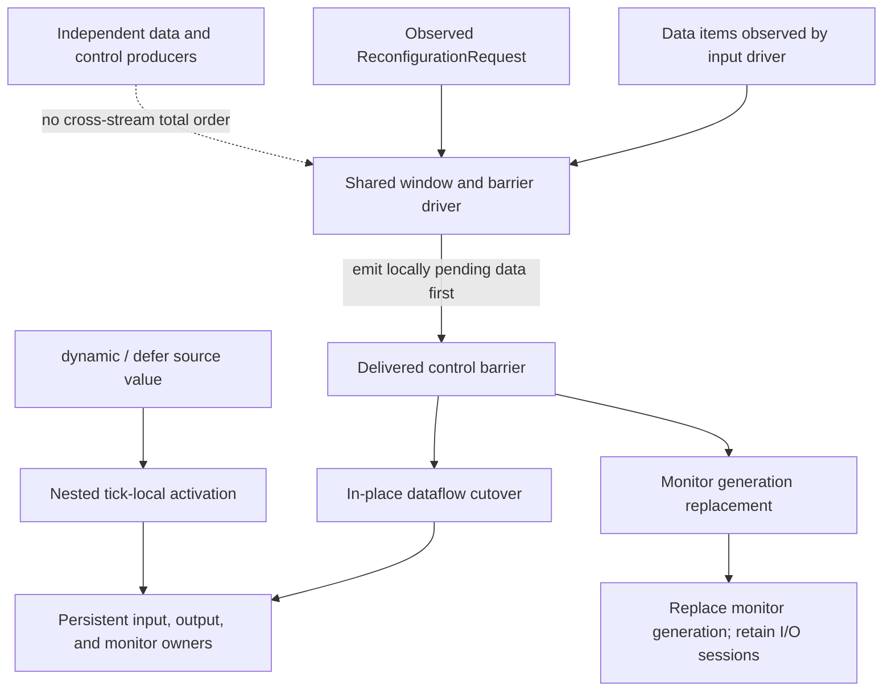
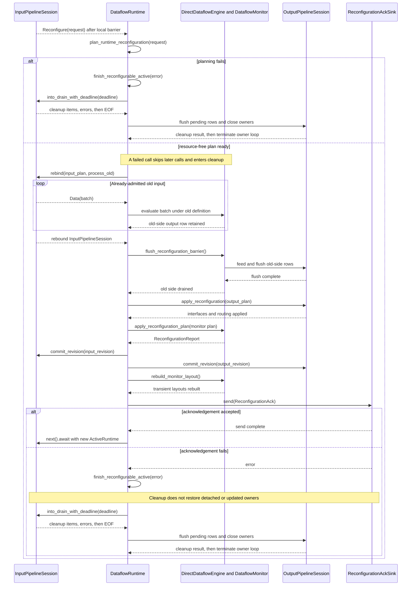

# Reconfiguration architecture

Reconfiguration changes a running monitor's specification and effective input/output interface at a locally ordered control boundary. Both reconfigurable runtimes retain their opened input and output sessions. The dataflow runtime updates one persistent monitor owner in place, while the semisynchronous runtime replaces the monitor/evaluation generation and carries compatible history into the next one.



**Reading rule.** Solid arrows show the ordering established after the shared driver observes items: pending window data is emitted before the delivered control barrier. The dashed edge denies a stronger guarantee—independent data and control producers have no cross-stream total order. Root requests replace the monitor definition and effective I/O interface; nested `dynamic` and `defer` activations do not run that protocol.

## Principal entities

| Entity | Responsibility |
|---|---|
| control request (`ReconfigurationRequest`) | Carries the candidate specification and effective input/output configuration to an ordered runtime barrier. |
| dataflow owner loop (`DataflowRuntime`, configured by `ReconfigurableDataflowRuntimeBuilder`) | Serializes data evaluation and root cutover across the persistent monitor and I/O sessions. |
| live input session (`InputPipelineSession`) | Retains unchanged source owners and detaches, drains, retires, or opens owners during an in-place cutover. |
| live output session (`OutputPipelineSession`) | Retains fixed destination owners while applying supported interface and selected-variable changes after an ordered flush. |
| synchronous monitor (`DataflowMonitor`) | Owns the compiled program and persistent language state; a `MonitorReconfigurationPlan` retains, installs, or transfers that state. |
| semisynchronous monitor generation (`ReconfSemiSyncRuntime`) | Replaces the evaluator and monitor context while retaining the opened input and output sessions. |
| nested expression evaluator (`Evaluator`) | Activates `dynamic` or `defer` bodies inside one monitor tick, outside the root request protocol. |

## Two supported runtime models

| Property | Reconfigurable dataflow | Reconfigurable semisynchronous |
|---|---|---|
| lifetime | one serial owner loop | a sequence of monitor/evaluation generations |
| input | persistent `InputPipelineSession`; unchanged sources retained | same persistent session; its bindings are rebound at the control boundary |
| output | persistent `OutputPipelineSession`; existing interfaces updated | same persistent session; affected destination writers are rebound |
| monitor | planned retain, cold install, or mapped transfer | replacement evaluator generation with optional history transfer |
| acknowledgement | local cutover reports monitor and interface revisions | no dataflow acknowledgement payload; the runtime starts the next monitor generation after session updates |
| partial application | ordered cutover without rollback | session updates and monitor replacement are ordered, with no rollback |

These are separate runtime implementations, not execution tiers of one evaluator.

## Constructing the control request

`ReconfigurationRequest` is the public transport-independent envelope delivered at the control barrier. Its constructor starts with unchanged default input and output configurations, so a request can replace only the monitor specification:

```rust
{{#include ../../tests/docs_examples.rs:reconfiguration_request}}
```

`validate` checks the request's transport-independent structure: the specification is nonempty and the nested input/output descriptions are structurally valid. It does not parse or compile the replacement, resolve it against the runtime's durable I/O registries, acquire resources, or apply a cutover. Those operations begin when the owner loop plans the delivered request.

Requests that change interfaces populate the public `input` and `output` fields with `InputConfiguration` and `OutputConfiguration`; those values describe the requested effective bindings, while `InputPipeline` and `OutputPipeline` remain the owners of durable local source and destination configuration.

## One root replacement

A representative request changes one input source binding, one output route, and part of the specification while retaining compatible stream state.

| # | Phase | Responsible entity | Architectural effect |
|---:|---|---|---|
| 1 | Deliver the local barrier | shared input driver | Emit data already pending when control was observed, then deliver `ReconfigurationRequest`. |
| 2 | Plan the complete target | `DataflowRuntime` | Validate, compile, resolve input/output, and build a resource-free `RuntimeReconfigurationPlan`. |
| 3 | Rebind the input session | `InputPipelineSession` and old `DataflowMonitor` | Stop selected ingress, evaluate already-admitted items under the old definition, then retain, remove, or open source owners and resume ingress. |
| 4 | Flush old output rows | `DirectDataflowEngine` and `OutputWriter` | Submit output produced before the candidate interfaces become active. |
| 5 | Rebind the output session | `OutputPipelineSession` | Flush and update affected destination writers, update selection, and mark the output revision pending for the coordinated commit. |
| 6 | Apply monitor replacement | `DataflowMonitor` | Retain the active monitor, install cold state, or transfer compatible semantic state. |
| 7 | Commit session revisions and rebuild layouts | `InputPipelineSession`, `OutputPipelineSession`, and `DirectDataflowEngine` | Advance both session revisions and recreate reusable rows and cached slot mappings around the active monitor. |
| 8 | Acknowledge local completion | `DataflowRuntime` | Publish monitor/interface revisions and change flags. |

Phase 1 states only the local order produced after the shared input driver observes control, not a total order over independent producers. Phase 2 is resource-free; mutation begins in phase 3. Phase 8 confirms local application, not remote destination consumption.

The interaction view exposes the old-batch callback, the owners crossed during application, and the acknowledgement boundary:



**Reading rule.** Solid arrows are calls, ownership-changing requests, or submitted old-side output; dashed arrows are yielded items, returned artifacts, completions, or terminal outcomes. The consuming input rebind callback keeps admitted old work on the old monitor side until the local boundary, and acknowledgement is attempted only after input, output, monitor, session-revision, and transient-layout changes. Failure cleanup stops and drains input before output flush and close under the same absolute deadline; completed effects remain active. Lifeline spacing is causal order rather than logical tick spacing.

## Candidate planning

`DataflowRuntime` plans the complete target before opening or stopping resources:

1. validate the request structure;
2. parse and compile the replacement specification;
3. resolve and plan the complete target input;
4. resolve and plan the complete target output;
5. plan monitor retention, cold installation, or state transfer.

A failure in this phase leaves active owners structurally unchanged. The `DataflowRuntime` owner loop nevertheless treats the request failure as terminal rather than retrying it.

## Application order and partial failure

Mutation begins at phase 3 of the sequence above, and each mutating phase completes before the next begins. What that costs is stated per phase: the effect below survives the failure of any later phase.

| Mutating phase | Effect retained when a later phase fails |
|---|---|
| 3 Rebind input | Accepted old-binding observations have been evaluated; retained sources may have changed bindings, removed sources have stopped, and additions are open. |
| 4 Flush old output rows | Those rows have already been submitted downstream. |
| 5 Rebind output | Buffered output is written, and updated destination interfaces and selections address their new targets. |
| 6 Apply monitor replacement | Compatible donor state has been moved destructively; the donor cannot supply it again. |
| 7 Commit revisions and rebuild layouts | Session revisions, rows, and slot mappings describe the applied configuration and monitor. |

Phase 8 is last, so nothing later can fail; a failed acknowledgement still leaves phases 3 to 7 applied.

There is no rollback across these owners. A source can already be detached, or one destination interface already updated, when a later operation fails. The architecture guarantees serial ownership and an explicit ordering boundary, not all-or-nothing replacement across transports, monitor state, and remote systems.

## Identity and persistence

Replacement preserves state by semantic identity, not schedule position or storage coincidence. Compatible streams match by variable identity and `StreamStateKey`; unmapped or changed state starts cold. `MonitorRevision` tracks accepted semantic activations, while `InterfaceRevision` changes only when the effective input/output interface changes.

The exact mapping and transfer rules are documented in [replacement identity](architecture/dataflow/replacement-contract.md) and [context transfer](architecture/dataflow/context-transfer.md).

## Nested expression activation

A `dynamic` or `defer` source is evaluated by a nested `Evaluator` inside one `DataflowMonitor` logical tick. Source prerequisites run first, active nested programs are resolved, dependency order is repaired if necessary, and the remaining streams run once before the common temporal commit.

A changed `dynamic` body receives a fresh evaluator unless compatible state transfers from the immediately previous body. Returning later to old source text does not revive its former evaluator. `defer` seals its first active body and releases source prerequisites only after a successful execution boundary. See [dynamic properties](architecture/dataflow/dynamic-properties.md).

## Failure boundary

Planning, input drain, source opening, output flushing, interface update, monitor transfer, and acknowledgement delivery can each terminate the dataflow owner loop. Cleanup is still attempted, but already-applied cutover work is not reversed. A failed monitor tick publishes no row and commits no monitor history for that tick.

The complete containment ladder is in [failure and termination](architecture/dataflow/failure-model.md).

## Implementation mapping

- Root request planning, application, revisions, and acknowledgement: `src/runtime/dataflow.rs`.
- Persistent input ownership and cutover: `src/io/reconfigurable_input.rs`.
- Persistent output owners and interface handoff: `src/io/output/pipeline.rs`.
- Monitor replacement planning and state application: `src/dataflow/monitor/reconfiguration.rs` and `src/dataflow/execution/monitor_execution/reconfiguration.rs`.
- Semisynchronous monitor-generation replacement with retained I/O sessions: `src/runtime/reconfigurable_semi_sync.rs`.

## Reading route

This page compares the two runtime models. The mechanism lives in the dataflow area, whose
*Replacement and containment* group covers root cutover, replacement identity, context transfer,
and failure containment in order — start from [dataflow architecture](architecture/dataflow/index.md),
which owns the reading route for all of them.
