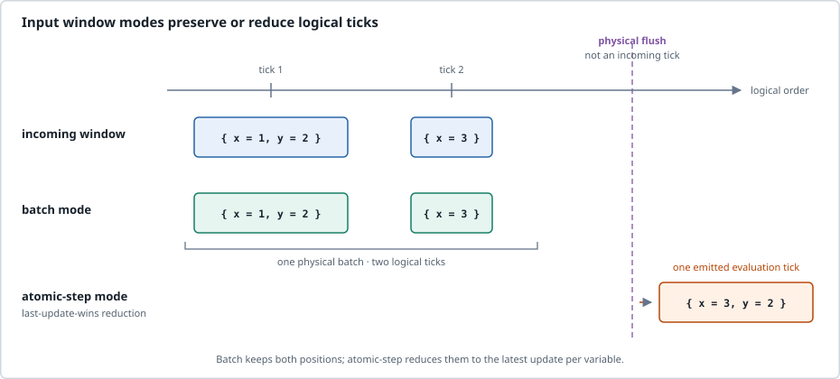

# Tutorial: monitor live MQTT input

Use MQTT when the checker should remain alive and react to messages published on input topics. This walkthrough adds the latest values received on topics `x` and `y`, publishes the result on topic `z`, and connects to a broker at `localhost:1883`.

## Prerequisites

- Run the commands from the repository root.
- Have a Rust toolchain, an MQTT broker, and the `mosquitto_pub` and
  `mosquitto_sub` clients available.
- The broker must accept local connections on port 1883. The project Compose
  file can start EMQX for this walkthrough:

  ```sh
  docker compose -f docker/docker-compose.yaml up -d emqx
  ```

  This command may pull the `emqx:latest` image. An independently managed broker
  can be used instead; do not run the Compose cleanup command for that broker.

The generic `--mqtt-input` mode maps model input names to topics by name, and
`--mqtt-output` maps output names to topics by name. Input payloads are JSON5
values; the output MQTT backend wraps a value in an object such as
`{"value":3}`.

These MQTT shortcuts use protocol `3.1.1` by default. Add
`--mqtt-protocol 5` to Terminal 1 to select MQTT 5 for both shortcuts.

## Add two values received through MQTT

The DSRV program declares the two topic-backed inputs and their sum:

```dsrv
in x
in y
out z
z = x + y
```

The repository stores this program as `examples/simple_add.dsrv`. Generic MQTT routing uses the DSRV names `x`, `y`, and `z` as topic names.

## Start three terminals

Keep the broker running and use the following terminals. Source and working directory setup is needed only once per shell.

**Terminal 1 — start the Trustworthiness Checker from the repository root:**

```sh
cargo run --quiet -- examples/simple_add.dsrv \
  --mqtt-input --mqtt-output \
  --mqtt-port 1883
```

This is a live process. It waits for MQTT messages and does not exit after one
calculation.

**Terminal 2 — subscribe before publishing:**

```sh
mosquitto_sub -h localhost -p 1883 -t z -v
```

**Terminal 3 — publish one logical pair of inputs:**

```sh
mosquitto_pub -h localhost -p 1883 -t x -m '1'
mosquitto_pub -h localhost -p 1883 -t y -m '2'
```

The subscriber should display a message with this topic and payload:

```text
z {"value":3}
```

The first input alone may not produce a visible result because `y` has no value
for that evaluation. After both values have been received, `z = x + y` is
published. Publish `x` and `y` again to observe another output, for example
`z {"value":7}` for `3` and `4`. The output block is representative of the
message framing; the broker/client adds no Trustworthiness Checker stdout line
because this run selects MQTT output rather than stdout.

There is no separate Trustworthiness Checker readiness endpoint. Broker
connectivity and topic visibility prove that the broker is reachable, not that
the monitor has subscribed and evaluated input. The first expected `z` message
is the useful end-to-end observation for this example.

## Input windows

If publishers send updates close together, an input window can change how those
updates become monitor ticks. For example, add these options to Terminal 1:

```sh
--input-window-ms 25 --input-window-mode batch
```

`batch` preserves logical ticks. `atomic-step` instead reduces updates observed
in a window with last-update-wins for each variable; it is a local reduction
window, not a broker transaction or a cross-source atomicity guarantee. A
window boundary can separate messages that arrive near its edge.



**Reading rule.** Cells sharing an x-position are one logical tick, and values grouped in a cell are simultaneous. In the atomic-step row, earlier positions are reduced into the single emitted evaluation tick; they are not pending ticks. The dashed flush guide is a physical window boundary, not another incoming logical tick.

## Stop and clean up

1. Press `Ctrl-C` in Terminal 1 to stop the foreground Trustworthiness Checker.
   The checker does not document a custom graceful-signal protocol; stop it as a
   foreground process.
2. Press `Ctrl-C` in Terminal 2. Terminal 3 commands exit after publishing.
3. If the project Compose broker was started for this walkthrough, remove its
   container with:

   ```sh
   docker compose -f docker/docker-compose.yaml down
   ```

   The Compose file's named EMQX volumes are not removed by this command. Keep
   them for another run or remove them separately only when their persisted
   broker state is no longer needed.
